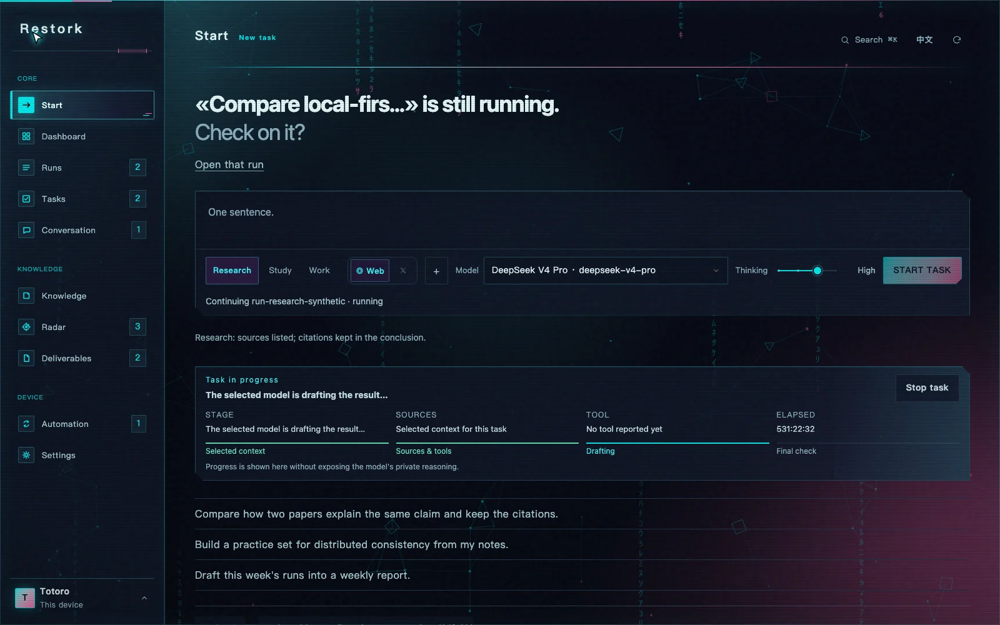
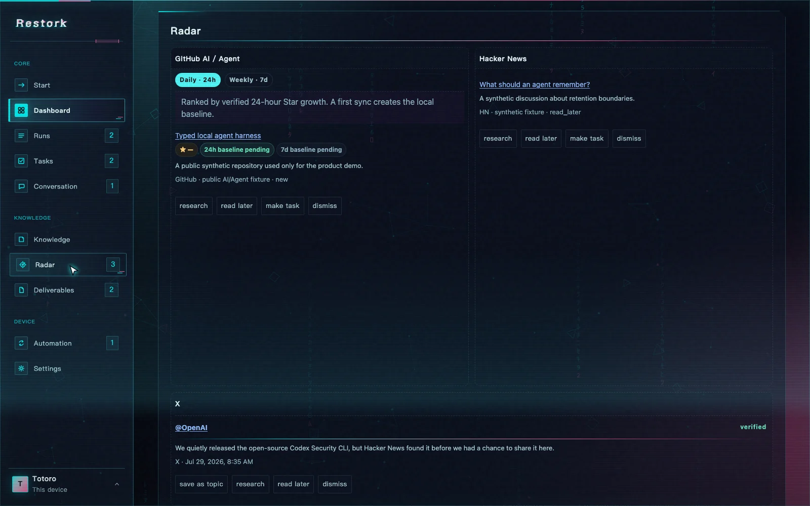
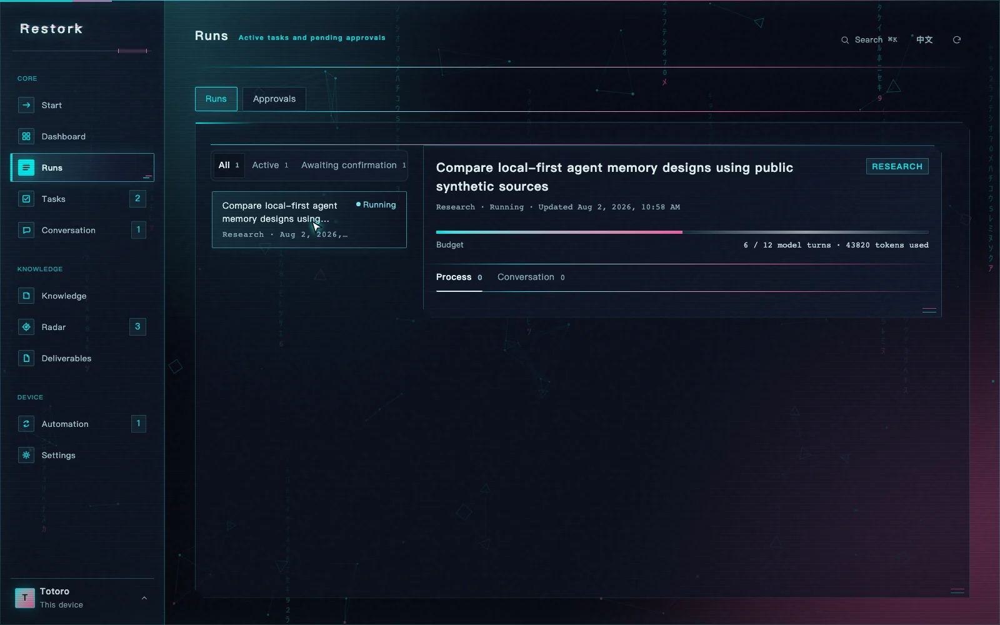
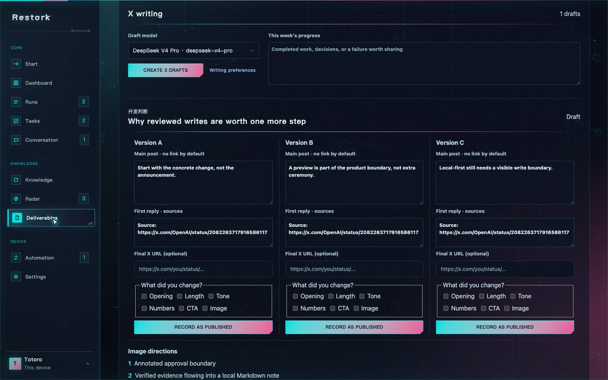
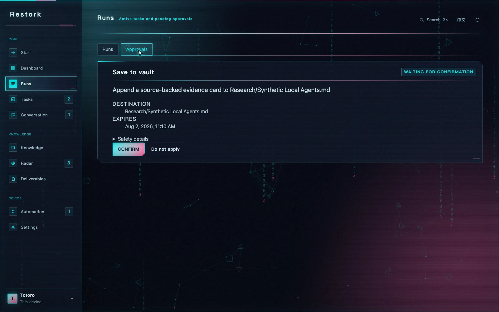
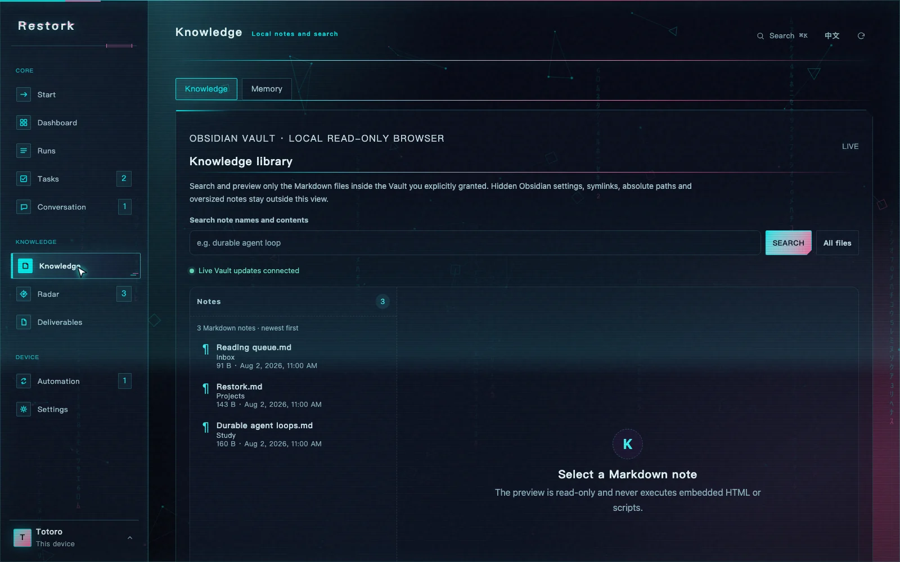

<p align="center">
  <strong>English</strong> · <a href="./README.zh-CN.md">简体中文</a>
</p>

<p align="center">
  <a href="https://totoro-qaq.github.io/restork/">Website</a> ·
  <a href="https://github.com/Totoro-qaq/restork/releases">Download</a> ·
  <a href="./docs/dashboard-usage.md">Guide</a> ·
  <a href="https://github.com/Totoro-qaq/restork/discussions">Discussions</a>
</p>

<p align="center">
  
</p>

<p align="center">
  <a href="https://github.com/Totoro-qaq/restork/actions/workflows/ci.yml"></a>
  <a href="https://github.com/Totoro-qaq/restork/releases"></a>
  <a href="LICENSE"></a>
  
</p>

<p align="center">
  <strong>A local-first desktop workspace for evidence-backed research, learning, and work.</strong><br>
  Verify public sources, choose the model and reasoning level, inspect every effect, and keep the result as ordinary Markdown.
</p>

## See one real workflow

<p align="center">
  <a href="./assets/readme/demo-poster.webp">
    <picture>
      <source media="(prefers-reduced-motion: no-preference)" srcset="./assets/readme/demo-hd.gif" type="image/gif">
      
    </picture>
  </a>
</p>

The loop above is the real Dashboard running on public synthetic data: open Radar, save independently
verified X evidence as a topic, review three editable drafts, and record the version you published
manually. It makes no private Vault read, live model request, or X write.

## The product, not a feature list

| Start with one clear task | See GitHub, Hacker News, and verified X evidence |
|---|---|
|  |  |
| **Follow the run without exposing private reasoning** | **Turn a verified topic into three editable drafts** |
|  |  |
| **Approve the exact effect** | **Keep the result as a normal local note** |
|  |  |

## One workspace for the way a day unfolds

| When you want to… | Restork helps you… |
|---|---|
| **Research a question** | Gather public and selected local sources, compare claims, keep citations, and preview the note before saving. |
| **Learn something properly** | Build a prerequisite-aware path from your Vault, practise without answer leakage, and review from your mistakes. |
| **Move work forward** | Turn a goal and the files you choose into a bounded plan, redacted handoff, and verifiable result manifest. |
| **Prepare something worth sharing** | Combine verified X evidence with public Restork runs or your weekly summary into at most three topics, each with three drafts and two image directions. |

These are modes inside one Rust Core—not separate agents competing for permissions or context.
They share the same budgets, event history, approval rules, recovery path, and local Dashboard.

## X intelligence without handing over your account

Restork adds X as one source inside the existing Radar. The default path uses your locally signed-in
Grok CLI account. Candidate posts do not appear until Restork independently verifies the public URL,
author, and post body. Model-written excerpts never become source evidence.

- The collector can search X; the organizer has no tools; the application layer resolves URLs from verified evidence IDs.
- Main-post drafts contain no link by default; the first reply carries the verified source.
- Restork records your final edit locally and learns only after three consistent changes.
- `x-voice.md` is an ordinary file, and every proposed update still goes through preview and approval.
- There is no X publishing, reply, like, follow, delete, or DM path in Restork Core.

OAuth means “use the current Grok Build / xAI account allowance,” not unlimited free usage. API-key
mode may create xAI API charges and therefore keeps scheduled X automation off by default. See the
[X co-creation specification](docs/specs/x-cocreation-agent.zh-CN.md) for the exact boundary.

## How the trust boundary works

<p align="center">
  
</p>

| Commitment | What it means in practice |
|---|---|
| **Your Markdown stays yours** | Obsidian notes and tasks remain ordinary local files; a private Vault is never copied into this repository. |
| **You see the effect first** | A write begins as an exact preview. Approval is single-use, expires, and is tied to those precise bytes. |
| **Memory is inspectable** | Working, Episodic, Semantic, and Profile memory can be reviewed, corrected, exported, and deleted. |
| **Connections are opt-in** | No Vault, model, weather, calendar, mail, playlist, web search, or X search is enabled merely because Restork started. |
| **Failures leave a trail** | Runs, retries, cancellations, approvals, scheduled drafts, and recoveries become durable events—not a spinner that forgets. |

Markdown is the durable home for notes and user tasks. SQLite stores operational state such as runs,
verified evidence, approvals, and events. Rebuildable indexes may be discarded and recreated. The
Dashboard and CLI never receive model credentials and cannot bypass Core policy.

## Download the desktop technical preview

Download the current package from [GitHub Releases](https://github.com/Totoro-qaq/restork/releases).
The installed app already contains the Rust Core and Dashboard; end users need no Node.js, Python,
Rust, package manager, or global CLI.

| Platform | Package | First launch |
|---|---|---|
| Apple Silicon macOS 13+ | `macOS-arm64-UNSIGNED-ALPHA.dmg` | Drag to Applications, then use the per-app **Open / Open Anyway** flow. |
| Windows 10/11 x64 | `Windows-x64-UNSIGNED-ALPHA-setup.exe` | Verify `SHA256SUMS`; SmartScreen may warn because the preview is unsigned. |
| Desktop Linux x64 | `.AppImage` or `.deb` | Make the AppImage executable, or install the DEB with the system package installer. |

These are visibly unsigned technical previews. Never disable a platform security feature globally.
Checksums, trust boundaries, updater behavior, install, launch, quit, and uninstall evidence live in
the [desktop guide](docs/desktop.md).

### Build from source

```bash
git clone https://github.com/Totoro-qaq/restork.git
cd restork
./scripts/quickstart.sh
```

Open the loopback Dashboard URL printed by Core and enter its one-time Web pairing code. Inspecting
the workspace needs no API key; model-backed conversations and runs need a provider you explicitly
configure in **Settings → Models**. See [providers](docs/providers.md) for supported reasoning levels,
native credential storage, endpoint policy, and model-specific diagnostics.

## Available today

| Area | Current capability |
|---|---|
| **Core workspace** | Bilingual loopback Dashboard and CLI, separate pairing, rotated sessions, durable runs, SSE replay, cancellation, retry, and bounded context compaction. |
| **Models** | DeepSeek, GLM, Kimi, Qwen, Ollama, OpenRouter, and compatible endpoints; model-specific reasoning controls; native secret storage; no silent fallback. |
| **Research / Study / Work** | Source-visible research and note previews; Vault-based learning paths and active recall; planning-only Work handoffs and imported-result verification. |
| **Radar + X co-creation** | Public GitHub AI/Agent discovery, Hacker News, independently verified X evidence, saved topics, three reviewable drafts, two image directions, manual publication records, and approval-bound writing preferences. |
| **Knowledge + memory** | Paginated safe Markdown preview, live file updates, local Todo with optional Vault sync, unified search, and four inspectable memory layers. |
| **Extensions** | Reviewed Skill/MCP/Plugin manifests, surface-aware Skills, layered permissions, immutable history, rollback, and sandboxed stdio MCP execution. |
| **Deliverables** | Daily/Weekly reports plus editable, macro-free PPTX/PDF/Markdown; real chart/table exhibit primitives and CJK-safe PDF text. |
| **Automation** | DST-aware local jobs, reviewable report drafts, daily verified X Radar, and weekly X drafts; model/network work requires explicit consent. |
| **Daily context** | Optional weather, local calendar, macOS unread count, and credential-free or private playlist sources—each enabled separately. |
| **Desktop** | Tauri supervises the bundled Core, owns process cleanup, and ships the same product boundary on macOS, Windows, and Linux. |

## Intentional limits

- Work prepares and checks a handoff; it does not take over an external coding process.
- Remote HTTPS MCP remains rejected until its transport policy lands; reviewed stdio MCP runs in the OS sandbox.
- Restork never publishes to X or derives strategy from early account metrics.
- A generated result is not “saved” until the reviewed local write actually succeeds.
- The technical preview is not yet covered by production publisher certificates or notarized stable-update gates.

## Guides

- [Dashboard and CLI](docs/dashboard-usage.md)
- [Providers and reasoning intensity](docs/providers.md)
- [Research](docs/research-workflow.md), [Study](docs/study.md), and [Work](docs/work.md)
- [Memory](docs/memory.md) and [Markdown tasks](docs/markdown-tasks.md)
- [Daily context and privacy](docs/daily-context.md)
- [Desktop install and trust](docs/desktop.md)
- [Privacy](docs/privacy.md) and [security model](docs/security/threat-model.md)

<details>
<summary><strong>Develop, verify, and contribute</strong></summary>

```bash
# Dashboard
npm --prefix dashboard ci
npm --prefix dashboard run lint
npm --prefix dashboard test
npm --prefix dashboard run build

# Rust Core
cargo fmt --manifest-path rust/Cargo.toml --all -- --check
cargo clippy --manifest-path rust/Cargo.toml --locked --all-targets -- -D warnings
cargo test --manifest-path rust/Cargo.toml --locked
cargo build --manifest-path rust/Cargo.toml --release --locked -p restorkd

# Desktop and public assets
node scripts/build-desktop-runtime.mjs
npm --prefix desktop test
npm --prefix desktop run build:macos
./scripts/smoke-desktop-app.sh 10
python3 scripts/audit_readme.py README.md README.zh-CN.md
./scripts/scan-public-artifacts.sh
```

Read [CONTRIBUTING.md](CONTRIBUTING.md) before opening a change. Operational backup, credentials,
private directories, and recovery are documented in [Operations](docs/operations.md). Release history
is in [CHANGELOG.md](CHANGELOG.md).

</details>

Restork is free and open source under the [MIT License](LICENSE). Read
[why Restork exists and what to expect](DISCLAIMER.md), the [security policy](SECURITY.md), and the
[support guide](SUPPORT.md).
