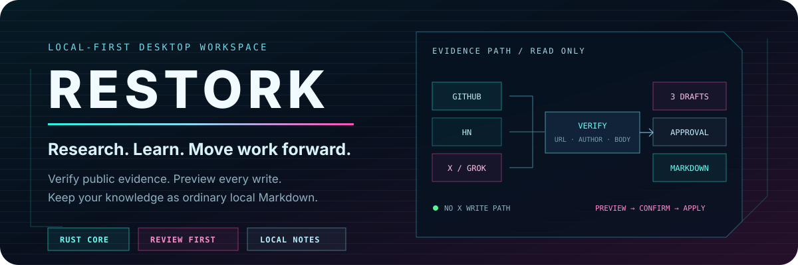
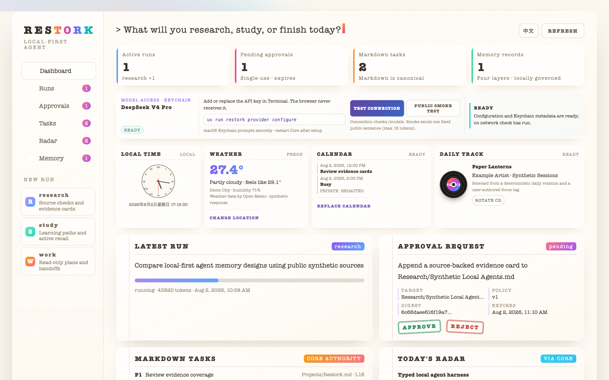
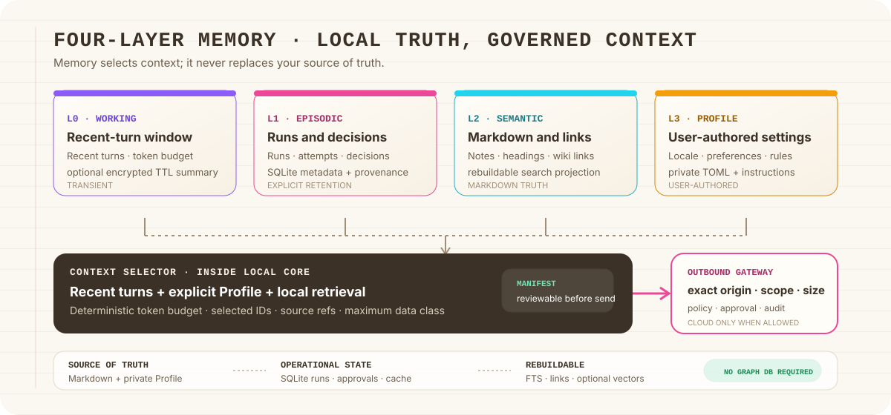

<p align="center">
  <strong>English</strong> · <a href="./README.zh-CN.md">简体中文</a>
</p>

<p align="center">
  
</p>

<p align="center">
  <a href="https://github.com/Totoro-qaq/restork/actions/workflows/ci.yml"></a>
  <a href="https://github.com/Totoro-qaq/restork/releases"></a>
  <a href="https://github.com/Totoro-qaq/restork/actions/workflows/release.yml"></a>
  <a href="LICENSE"></a>
  
  
  
  
</p>

<p align="center">
  <strong>Your private workspace for research, learning, and getting thoughtful work done.</strong><br>
  Restork brings your notes, tasks, and model-assisted workflows together locally—and asks before
  anything is written or sent beyond your machine.
</p>

## See Restork in action

<p align="center">
  <a href="./assets/readme/demo-poster.webp">
    
  </a>
</p>

This is the real Dashboard running on public synthetic data. You can see a task move through its
run, inspect an approval before it takes effect, work with Markdown tasks, revisit memory, and use
the daily context cards. The public demo is safe to explore: it reads no private Vault and makes no
live model request.

## One workspace for the way a day actually unfolds

| When you want to… | Restork helps you… |
|---|---|
| **Research a question** | Gather public sources, compare claims and conflicts, and prepare a cited Markdown note you can review before saving. |
| **Learn something properly** | Turn a topic or existing note into prerequisites, a learning path, answer-free practice, and review based on your mistakes. |
| **Move work forward** | Turn a goal and a bounded repository snapshot into a practical plan and a redacted handoff package. Restork does not execute the plan for you today. |

These are three modes inside one Core—not three agents competing for context or permissions. They
share the same budgets, event history, approvals, memory rules, and local Dashboard.

## Designed to stay understandable

| Promise | What it means in practice |
|---|---|
| **Your Markdown stays yours** | Obsidian notes and tasks remain ordinary local files. A private Vault is never copied into this repository. |
| **You see the effect first** | A write begins as an exact preview. Its approval is single-use, expires, and is tied to that precise content. |
| **Memory is inspectable** | Working, Episodic, Semantic, and Profile memory can be reviewed, corrected, exported, and deleted. A model guess does not silently become a preference. |
| **Connections are opt-in** | No weather, calendar, Vault, playlist, or model provider is enabled just because Restork started. |
| **Failures leave a trail** | Runs, retries, approvals, and recoveries are recorded as durable events instead of disappearing behind a spinner. |

## How it works

<p align="center">
  
</p>

```text
Private Vault + Profile
        │
        ▼
Working ─ Episodic ─ Semantic ─ Profile memory
        │ selected context
        ▼
Restork Core ─ Run policy ─ Preview ─ Approval ─ Event history
        │
        ├── Local Dashboard / CLI
        └── Outbound Gateway ──► DeepSeek V4 Pro / approved public services
```

Markdown is the durable home for notes and user tasks. SQLite stores operational state such as
runs, approvals, and events. Rebuildable indexes and link projections can be discarded and created
again. The Dashboard and CLI never receive the model credential or authority to bypass Core policy.

Restork needs no LangGraph, graph database, KAG, Valkey, Memory MCP, or Obsidian plugin for its base
workflow. The new runtime uses one bounded Rust Core loop; Python is reserved for optional,
short-lived capability workers when a scientific or document ecosystem materially needs it.

## Try it in five minutes

The complete V1 Research/Study/Work source workflow remains the supported quickstart while its
vertical slices move to Rust. You only need
[`uv`](https://docs.astral.sh/uv/getting-started/installation/); Node.js is required only when
changing Dashboard source.

```bash
git clone https://github.com/Totoro-qaq/restork.git
cd restork
./scripts/quickstart.sh
```

Already cloned?

```bash
./scripts/quickstart.sh
```

Restork starts on `http://127.0.0.1:7337` and prints a one-time Web pairing code. Open the local
address, enter the code, and you are in. The first launch does not need an API key, does not select
a Vault for you, and does not enable weather or any other optional connection. The offline Research
synthesizer lets you explore the product without sending a model request.

### Try the Rust-first workspace

The Step 12–17 alpha runs the native Core and the same embedded Dashboard. It needs Rust only when
started from source; desktop packages include the binary.

```bash
cargo run --manifest-path rust/Cargo.toml -p restorkd -- \
  serve --port 7337 --state-db ./build/restork-alpha.db
```

Open the `base_url` printed in the readiness record and enter its one-time pairing code. This alpha
contains personal daily context, global conversations, model/Profile/Prompt settings, the governed
Extension Center, report/deck drafts, checkpoints, bounded schedules, evaluation manifests, and
delegation contracts. The V1 Research/Study/Work execution routes are still being cut over, so use
`./scripts/quickstart.sh` when you need those complete workflows today.

### Desktop installers

The source now builds macOS, Windows, and Linux candidates. When a signed installer appears on the
[Releases page](https://github.com/Totoro-qaq/restork/releases), installing and launching it needs no
Python, Node.js, Rust, `uv`, or package manager. Unsigned CI candidates are for testing only; see the
[desktop guide](docs/desktop.md) for one-command builds and exact signing gates.

### Connect only what you want

| I want to… | What to do | What changes |
|---|---|---|
| Explore the Dashboard | Nothing else | No model call and no Vault access |
| Read my Obsidian Vault | `./scripts/quickstart.sh --vault-dir /absolute/private/vault` | Local read access; every write still needs a preview and approval |
| Use DeepSeek V4 Pro | `cargo run --manifest-path rust/Cargo.toml -p restorkd -- provider configure` | The key goes directly to native credential storage; direct DeepSeek conversations are public-only unless you create a stricter governed Profile |
| See weather | Enter a city in Weather settings, or press **Use current location** yourself | The feature stays off until enabled; there is no IP-based location lookup |
| Add calendar or music | Select one local ICS file or a private JSON/CSV playlist | Read-only local import; no account login |

Use a different local port without editing a file:

```bash
RESTORK_PORT=7444 ./scripts/quickstart.sh
```

### Add DeepSeek when you are ready

```bash
cargo run --manifest-path rust/Cargo.toml -p restorkd -- provider configure
```

The platform-native prompt writes the key to macOS Keychain, Windows Credential Manager, or Linux
Secret Service. The value never enters the browser, TOML, command arguments, environment variables,
shell history, Vault, SQLite, logs, or this repository.

Restart Restork, then choose how far you want the Rust check to go:

```bash
cargo run --manifest-path rust/Cargo.toml -p restorkd -- doctor
cargo run --manifest-path rust/Cargo.toml -p restorkd -- doctor --connect
cargo run --manifest-path rust/Cargo.toml -p restorkd -- doctor --smoke
```

The smoke check sends no Vault, memory, task, location, calendar, or playlist content and does not
print the model response. See [Operations](docs/operations.md) for private directories, backup,
restore, and credentials.

### Keep your personal data outside the checkout

```bash
uv run restork \
  --state-db /path/to/private/restork.db \
  --profile-dir /path/to/private-profile \
  --vault-dir /path/to/vault \
  serve --port 7337
```

For daily context, copy [the example profile](examples/profile.example.toml) to your private profile
directory and enable only the fields you want. Blank weather, calendar, and playlist settings stay
off. The formats and privacy behavior are documented in [Daily context](docs/daily-context.md).

## Available today

| Area | What you can use now |
|---|---|
| **Runs and approvals** | Persisted run state, budgets, explicit retries, recovery, single-use approvals, and replayable SSE updates |
| **Dashboard and local API** | Responsive English/Chinese UI, loopback-only `/v1` API, separate Web/CLI pairing, and short-lived sessions |
| **Knowledge and tasks** | Read-only Vault retrieval, deterministic wiki-link projection, journaled single-file writes, and preview/approve/apply Markdown tasks |
| **Research, Study, Work** | Evidence-backed research, guided study and practice, and planning-only repository handoffs |
| **Memory and daily context** | Four inspectable memory layers, optional weather, one local read-only ICS calendar, and private playlist import |
| **Rust-first workspace alpha** | Native storage/API/provider foundations; personal context; global conversations; Profiles and versioned Prompts; quarantined extensions and frozen tool discovery; report/deck drafts; schedules, recovery, evaluation, and bounded-delegation contracts |
| **Cross-platform desktop source** | Tauri packages `restorkd` and the Dashboard, owns Unix process groups or a Windows Job Object, and builds macOS, Windows, and Linux candidates without a target-machine runtime |

The Step 12–17 implementation batch has reached the Step 17 API/domain surface, but it is not being
mislabelled as a production release. Remaining exit gates include V1 route cutover, native calendar
onboarding, cancellable conversation SSE, full extension update/rollback/uninstall, approved
PPTX/PDF rendering, real file restore, packaged credential setup, clean-machine matrices, and
Windows/Linux signing. Current scope and evidence are tracked in the
[Steps 12–17 specification](specs/restork-steps12-17.md) and
[delivery plan](plans/restork-steps12-17.md).

## Guides

- [Dashboard and CLI](docs/dashboard-usage.md)
- [Memory](docs/memory.md)
- [Markdown tasks](docs/markdown-tasks.md)
- [Research](docs/research-workflow.md)
- [Study](docs/study.md)
- [Work](docs/work.md)
- [Cross-platform desktop alpha](docs/desktop.md)
- [Privacy](docs/privacy.md) and [security model](docs/security/threat-model.md)

<details>
<summary><strong>Develop and contribute</strong></summary>

```bash
# Core
uv run pytest
uv run ruff check .
uv run mypy src
uv run bandit -q -r src

# Rust-first runtime foundation
cargo fmt --manifest-path rust/Cargo.toml --all -- --check
cargo clippy --manifest-path rust/Cargo.toml --locked --all-targets -- -D warnings
cargo test --manifest-path rust/Cargo.toml --locked
cargo build --manifest-path rust/Cargo.toml --release --locked -p restorkd

# Dashboard
npm --prefix dashboard ci
npm --prefix dashboard run lint
npm --prefix dashboard test
npm --prefix dashboard run build

# Cross-platform desktop alpha (run the matching build command on each host OS)
npm --prefix desktop ci
npm --prefix desktop run fmt:check
./scripts/build-desktop-core.sh
npm --prefix desktop run clippy
npm --prefix desktop test
npm --prefix desktop run build:macos
npm --prefix desktop run build:windows
npm --prefix desktop run build:linux
node scripts/smoke-desktop-runtime.mjs
./scripts/smoke-desktop-app.sh 10
./scripts/smoke-desktop-faults.sh

# Public artifacts and release bundle
uv run python scripts/audit_readme.py README.md README.zh-CN.md
./scripts/scan-public-artifacts.sh
uv run python scripts/build_release.py --output dist/release
```

The provider-free [runtime benchmark](benchmarks/README.md) records readiness, idle memory, binary
size, and loopback latency without sending a prompt. The V1 source quickstart stays available until
each remaining execution route reaches compatibility and recovery parity in Rust.

Read [CONTRIBUTING.md](CONTRIBUTING.md) before opening a change. The implemented contract lives in
the [V1 specification](specs/restork-v1.md); the accepted future architecture lives in the
[Steps 12–17 specification](specs/restork-steps12-17.md). Release history is in
[CHANGELOG.md](CHANGELOG.md).

</details>

Restork is released under the [MIT License](LICENSE).
