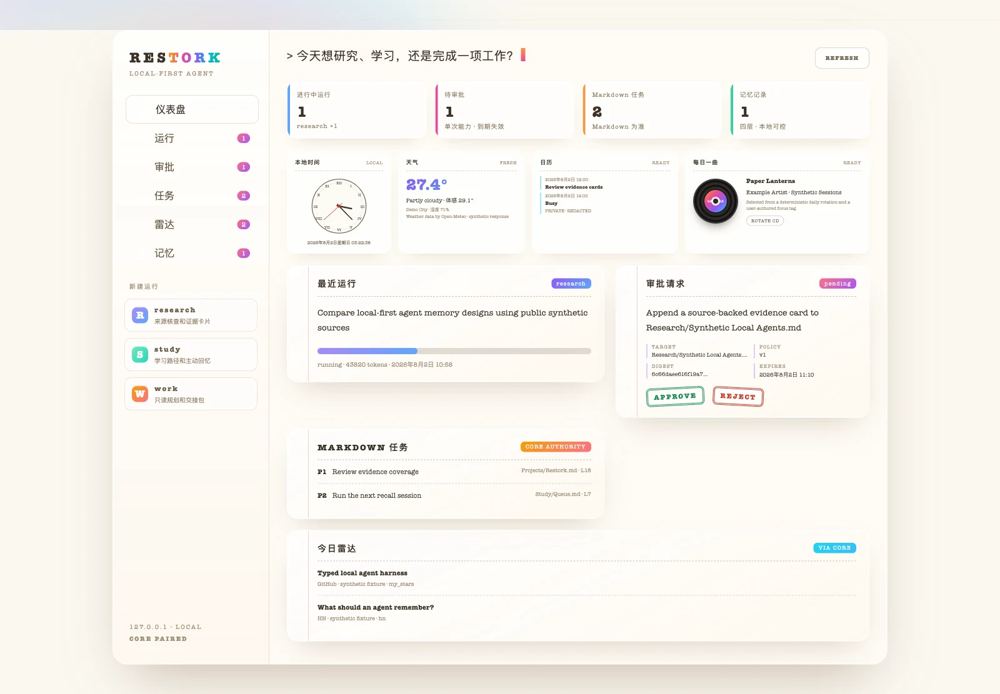

<p align="center">
  <strong>English</strong> · <a href="./README.zh-CN.md">简体中文</a>
</p>

<p align="center">
  <a href="https://totoro-qaq.github.io/restork/">Website</a> ·
  <a href="https://github.com/Totoro-qaq/restork/discussions">Discussions</a> ·
  <a href="https://github.com/Totoro-qaq/restork/releases">Releases</a>
</p>

<p align="center">
  
</p>

<p align="center">
  <a href="https://github.com/Totoro-qaq/restork/actions/workflows/ci.yml"></a>
  <a href="https://github.com/Totoro-qaq/restork/releases"></a>
  <a href="https://github.com/Totoro-qaq/restork/actions/workflows/release.yml"></a>
  <a href="./rust-toolchain.toml"></a>
  <a href="https://github.com/Totoro-qaq/restork/actions/workflows/ci.yml"></a>
  <a href="https://github.com/Totoro-qaq/restork/actions/workflows/ci.yml"></a>
  <a href="LICENSE"></a>
  
  
  
</p>

<p align="center">
  <strong>Research, learn, and get work done.</strong><br>
  Restork searches local Markdown with citations. Before it writes a note, you see the exact change
  and decide whether to save it. MCP tools run in OS-level sandboxes.<br>
  <sub>Free and open source for researchers, developers, and knowledge workers.</sub>
</p>

## See Restork in action

<p align="center">
  <a href="./assets/readme/demo-poster.webp">
    <picture>
      <source media="(prefers-reduced-motion: no-preference)" srcset="./assets/readme/demo-hd.gif" type="image/gif">
      
    </picture>
  </a>
</p>

This is the real Dashboard running on public synthetic data. You can see a task move through its
run, inspect an approval before it takes effect, work with Markdown tasks, revisit memory, and use
the daily context cards. The public demo is safe to explore: it reads no private Vault and makes no
live model request.

## One workspace for the way a day actually unfolds

| When you want to… | Restork helps you… |
|---|---|
| **Research a question** | Gather public sources, compare claims and conflicts, and prepare a cited Markdown note you can review before saving. |
| **Learn something properly** | Turn a topic or existing note into prerequisites, a learning path, answer-free practice, and review based on your mistakes. |
| **Move work forward** | Turn a goal and the files you choose into a practical plan and a redacted handoff package. Restork does not execute the plan for you today. |

These are three modes inside one Core—not three agents competing for context or permissions. They
share the same budgets, event history, approvals, memory rules, and local Dashboard.

## What stays in your hands

| What matters | What it means in practice |
|---|---|
| **Your Markdown stays yours** | Obsidian notes and tasks remain ordinary local files. A private Vault is never copied into this repository. |
| **You see the effect first** | A write begins as an exact preview. Its approval is single-use, expires, and is tied to that precise content. |
| **Memory is inspectable** | Working, Episodic, Semantic, and Profile memory can be reviewed, corrected, exported, and deleted. A model guess does not silently become a preference. |
| **Connections are opt-in** | No weather, calendar, Vault, playlist, or model provider is enabled just because Restork started. |
| **Failures leave a trail** | Runs, retries, approvals, and recoveries are recorded as durable events instead of disappearing behind a spinner. |

## How it works

<p align="center">
  
</p>

```text
Private Vault + Profile
        │
        ▼
Working ─ Episodic ─ Semantic ─ Profile memory
        │ selected context
        ▼
Restork Core ─ Run policy ─ Preview ─ Approval ─ Event history
        │
        ├── Local Dashboard / CLI
        └── Outbound Gateway ──► Selected model / approved public services
```

Markdown is the durable home for notes and user tasks. SQLite stores operational state such as
runs, approvals, and events. Rebuildable indexes and link projections can be discarded and created
again. The Dashboard and CLI never receive the model credential and cannot skip Core's checks.

Restork needs no LangGraph, graph database, KAG, Valkey, Memory MCP, or Obsidian plugin for its base
workflow. One Rust Core owns policy, storage, tools, recovery, and the embedded Dashboard, with
explicit limits on time, data, and side effects.
Small Python scripts in this repository are development helpers, not a product runtime or package.

## Download the desktop technical preview

Open [GitHub Releases](https://github.com/Totoro-qaq/restork/releases) and download one prebuilt
package. The target machine needs no Python, Node.js, Rust, MinGW, GTK development package, or
package manager.

| Platform | Download | First launch |
|---|---|---|
| Apple Silicon macOS 13+ | `macOS-arm64-UNSIGNED-ALPHA.dmg` | Drag to Applications, then use the per-app **Open / Open Anyway** flow. Never disable Gatekeeper globally. |
| Windows 10/11 x64 | `Windows-x64-UNSIGNED-ALPHA-setup.exe` | The preview is not Authenticode-signed, so SmartScreen may warn. Verify `SHA256SUMS`, then choose to run only if you intentionally downloaded it here. |
| Desktop Linux x64 | `Linux-x64-UNSIGNED-ALPHA.AppImage` or `.deb` | AppImage: `chmod +x` and open it. Debian/Ubuntu: install the DEB with the system package installer. |

All formats embed the same Rust Core and Dashboard and are tested for install, launch, quit, and
uninstall on clean runners. These are
visibly unsigned technical previews, not platform-signed stable releases. The macOS updater archive
has Restork's independent signature; Windows/Linux preview updates stay disabled until their
protected signing gates pass. See the [desktop guide](docs/desktop.md) for checksums and exact trust
boundaries.

Unsigned Alpha builds do not install updates in-app. Future signed builds keep the first launch
quiet, check at most daily from the second launch onward, and only notify—never silently download or
restart. Stable is the default, Beta is opt-in, and both the notice and automatic checks can be
disabled in Settings. Microsoft Store, Linux package managers, and Restork's updater each own only
their installation source, so end users never install a compiler toolchain just to update the app.

## Build from source (contributors)

Use this path only when changing Restork. Install Node.js 22 and the pinned Rust toolchain. Windows
uses `x86_64-pc-windows-msvc`; Restork deliberately rejects GNU/MinGW before compilation, so you
never need `as.exe` or `dlltool`.

macOS / Linux:
```bash
git clone https://github.com/Totoro-qaq/restork.git
cd restork
./scripts/quickstart.sh
```

Windows PowerShell:
```powershell
git clone https://github.com/Totoro-qaq/restork.git
Set-Location restork
./scripts/quickstart.ps1
```

Restork asks the operating system for a free loopback port and prints the exact local URL plus
separate one-time Web and CLI pairing codes. Open the URL, enter the Web code, and you are in. You
stay paired across refresh, sleep, and a transient disconnect through a protected local recovery
session; access tokens are never placed in Web Storage. You can inspect the local workspace without
an API key; model-backed conversations and runs require a
provider you explicitly configure. Restork does not select a Vault or enable weather, location, or
any other optional connection for you.

### Running the Core directly

```bash
cargo run --manifest-path rust/Cargo.toml --bin restorkd -- \
  serve --port 0 --state-db ./build/restork-alpha.db
```

Open the Dashboard URL printed by Core and enter its one-time Web pairing code. Add `--json` before
`serve` only when another program needs the readiness record.

### One Core, one set of rules

Only one program actually carries out work: `restorkd`. The Dashboard, CLI, desktop app, API,
agent loop, memory, tasks, Research, Study, Work, and Radar all use the same permissions, event
history, and recovery path. The retired Python Core and its build path are no longer present.

### Connect only what you want

| I want to… | What to do | What changes |
|---|---|---|
| Explore the Dashboard | Nothing else | No model call and no Vault access |
| Read my Obsidian Vault | `./scripts/quickstart.sh --vault-dir /absolute/private/vault` | Local read access; every write still needs a preview and approval |
| Use a cloud or local model | Open **Settings → Providers**; use the native credential command for a cloud key | Choose DeepSeek, GLM, Kimi, Qwen, Ollama, OpenRouter, or a compatible endpoint; only supported reasoning levels appear |
| See weather | Enter a city in Weather settings, or press **Use current location** yourself | The feature stays off until enabled; there is no IP-based location lookup |
| Add a calendar | Connect the system calendar when available, or select one local ICS file | Read-only access; the device date and time zone work without either |
| See unread mail | On macOS, open Mail and press **Connect Mail** in the top-bar indicator | Live aggregate count only; no sender, subject, body, account address, or model access |
| Get a daily track | Choose QQ Music, NetEase, Apple Music, or a private JSON/CSV playlist | Explicit read-only sync; no account passwords/cookies, audio, or lyrics; the UI says which sources are available and what could not be verified |

Open **Daily track → Connect playlist**, choose a source, paste its ordinary public playlist link,
and press **Connect & sync**. QQ Music and NetEase are experimental, credential-free, read-only
adapters. QQ Music can add current Hong Kong chart evidence; NetEase reports an evidence gap rather
than inventing why a song is hot. Apple Music uses the official catalog API and needs a developer
token in native credential storage first:

```bash
cargo run --manifest-path rust/Cargo.toml --bin restorkd -- music apple configure
cargo run --manifest-path rust/Cargo.toml --bin restorkd -- music apple status
```

The token is not your Apple ID password and never enters the Dashboard or SQLite. Refresh is always
manual, and disconnect removes only Restork's managed snapshot. See the
[daily-context privacy contract](docs/daily-context.md).

When a recommendation needs more context, press **Research online**. Restork sends only that selected
track's public metadata to DeepSeek V4 Flash, requires server-side web search, validates public HTTPS
sources, and returns bilingual song notes. It does not send the whole playlist or listening history.
Popularity stays an explicit evidence gap unless two independent current sources support it. The
paid action is manual, cached locally for 36 hours, and never retried automatically.

Mail awareness is a macOS Alpha capability and stays off until you connect it. Restork samples only
the aggregate unread number every 15 seconds and streams changes to the local Dashboard over SSE;
the value is never stored or sent to a model. Closing Mail pauses the indicator, and disconnecting
removes Restork's consent setting. Windows/Linux adapters remain unavailable rather than asking for
mail passwords. See the [daily-context privacy contract](docs/daily-context.md).

Use a different local port without editing a file:

```bash
RESTORK_PORT=7444 ./scripts/quickstart.sh
```

### Add a model when you are ready

Open **Settings → Providers** to choose an exact model and its supported reasoning intensity. Restork
ships definitions for DeepSeek, GLM, Kimi, Qwen, Ollama, OpenRouter, and OpenAI-compatible endpoints.
Profiles are model-specific, so you can use a quicker model for a small delegated task and a stronger
one for synthesis without a silent fallback. After saving, use **Test model** on that exact Provider
Profile card; non-DeepSeek selections are never tested through the built-in DeepSeek route. See the
[provider guide](docs/providers.md) for the capability table and endpoint rules.

Inside a conversation, **Use another model** creates a checked branch with only the recent context shown in the preview;
it never rewrites the original Profile or moves private messages into a narrower cloud boundary.

For a cloud key, use the provider-scoped native credential flow rather than a secret field in the
Dashboard. Omitting the kind keeps the built-in DeepSeek default:

```bash
cargo run --manifest-path rust/Cargo.toml --bin restorkd -- provider configure
cargo run --manifest-path rust/Cargo.toml --bin restorkd -- provider configure qwen
```

The platform-native prompt writes the key to macOS Keychain, Windows Credential Manager, or Linux
Secret Service. The value never enters the browser, TOML, command arguments, environment variables,
shell history, Vault, SQLite, logs, or this repository. Dashboard stores only a native secret
reference. Supported credential kinds are `deepseek`, `glm`, `kimi`, `qwen`, `openrouter`, and
`open_ai_compatible`; local Ollama needs no key.

Restart Restork, then choose how far you want the Rust check to go:

```bash
cargo run --manifest-path rust/Cargo.toml --bin restorkd -- doctor
cargo run --manifest-path rust/Cargo.toml --bin restorkd -- doctor --connect
cargo run --manifest-path rust/Cargo.toml --bin restorkd -- doctor --smoke
cargo run --manifest-path rust/Cargo.toml --bin restorkd -- doctor --web-search
```

`--connect` checks the shared key and model catalog, `--smoke` tests V4 Pro synthesis, and
`--web-search` tests V4 Flash plus server-side search. The smoke checks send no Vault, memory, task,
location, calendar, or playlist content and do not print the model response. See
[model providers](docs/providers.md) for exact routing and [Operations](docs/operations.md) for
private directories, backup, restore, and credentials.

### Keep your personal data outside the checkout

```bash
cargo run --manifest-path rust/Cargo.toml --bin restorkd -- \
  serve --port 0 \
  --state-db /path/to/private/restork.db \
  --vault-dir /path/to/vault
```

Configure daily context after pairing and enable only the fields you want. Blank weather, calendar,
and playlist settings stay off. The formats and privacy behavior are documented in
[Daily context](docs/daily-context.md).

## Available today

Measured against the Core that `./scripts/quickstart.sh` starts.

| Area | What you can use now |
|---|---|
| **Dashboard and local API** | Bilingual UI, loopback-only `/v1` API, separate Web/CLI pairing, short-lived sessions with rotation |
| **Conversation** | A separate conversation for each run, with fork, search, export, archive, cancellation, and SSE replay |
| **Models** | DeepSeek, GLM, Kimi, Qwen, Ollama, OpenRouter, and generic OpenAI-compatible endpoints; provider-scoped reasoning; native credential storage; versioned prompts and configuration profiles |
| **Agent runtime** | Durable model/tool loop with separate step, repair, token, cost, and wall-clock bounds; cancellation; approval pauses; event replay; visible context compaction |
| **Research, Study, Work** | Research with visible sources and note previews; Vault-based learning paths and active review; clear work plans, redacted handoffs, and result checks |
| **Local knowledge** | A paginated Obsidian Vault browser with safe Markdown previews and live file updates, four-layer inspectable memory, approval-bound Markdown tasks, unified search, and opt-in public GitHub AI/Agent + Hacker News Radar |
| **Extensions** | Checked manifests, layered permissions, version history with rollback, and sandboxed stdio MCP execution |
| **Daily context** | Optional weather, system date and month without a permission prompt, one local ICS calendar, macOS unread-mail count, and a daily track from QQ Music, NetEase, Apple Music, or a private playlist file |
| **Reports and presentations** | Write a Daily/Weekly report yourself or ask a selected model for a cited draft; turn your brief or an existing report into a slide outline, preview every slide, choose one of six built-in layouts, then download macro-free PPTX, PDF, or Markdown without installing Node, Python, LibreOffice, MCP, or an extra Skill |
| **Artifacts and recovery** | Exact file hashes, real-content checkpoints, and restore tied to the preview you approved |
| **Automation** | DST-aware local jobs plus provider-selectable Daily/Weekly report drafts; model schedules require explicit network consent, send only `public` run facts, and keep the resulting draft local for review |
| **Desktop** | Tauri packages `restorkd` and the Dashboard, owns Unix process groups or a Windows Job Object |

### What it does not do yet

| Area | What to expect today |
|---|---|
| Web search | Public HTTPS research goes through one checked network path; availability depends on the selected provider. |
| MCP | Reviewed stdio MCP executes in the platform sandbox. Remote HTTPS MCP is rejected until its transport policy lands. |
| Deliverable authoring | Restork builds checked Markdown, macro-free PPTX, and PDF from the content you provide; it does not quietly invent source claims. |
| Work execution | Work produces a plan and handoff for you to review, then checks the returned manifest. It does not take over an external coding process. |
| Native mail | Aggregate unread count is macOS-only; Windows/Linux expose an honest unavailable state. |

The desktop technical preview is intentionally outside Apple/Microsoft/Linux publisher trust; a
protected stable release still requires real Developer ID, Authenticode, Linux signatures,
notarization, signed updates, and clean-runner evidence.

## Guides

- [Dashboard and CLI](docs/dashboard-usage.md)
- [Providers and reasoning intensity](docs/providers.md)
- [Memory](docs/memory.md)
- [Markdown tasks](docs/markdown-tasks.md)
- [Research](docs/research-workflow.md)
- [Work](docs/work.md)
- [Cross-platform desktop alpha](docs/desktop.md)
- [Restork and Hermes Agent](docs/restork-vs-hermes.md)
- [Privacy](docs/privacy.md) and [security model](docs/security/threat-model.md)

<details>
<summary><strong>Develop and contribute</strong></summary>

```bash
# Rust Core and release gates
cargo fmt --manifest-path rust/Cargo.toml --all -- --check
cargo clippy --manifest-path rust/Cargo.toml --locked --all-targets -- -D warnings
cargo test --manifest-path rust/Cargo.toml --locked
cargo build --manifest-path rust/Cargo.toml --release --locked -p restorkd
cargo audit --file rust/Cargo.lock
cargo deny --manifest-path rust/Cargo.toml check advisories bans sources

# Dashboard
npm --prefix dashboard ci
npm --prefix dashboard run lint
npm --prefix dashboard test
npm --prefix dashboard run build

# Cross-platform desktop alpha (run the matching build command on each host OS)
npm --prefix desktop ci
npm --prefix desktop run fmt:check
node scripts/build-desktop-runtime.mjs
npm --prefix desktop run clippy
npm --prefix desktop test
npm --prefix desktop run build:macos
npm --prefix desktop run build:windows
npm --prefix desktop run build:linux
node scripts/smoke-desktop-runtime.mjs
./scripts/smoke-desktop-app.sh 10
./scripts/smoke-desktop-faults.sh

# Public artifacts and release bundle
python3 scripts/audit_readme.py README.md README.zh-CN.md
./scripts/scan-public-artifacts.sh
```

The provider-free [runtime benchmark](benchmarks/README.md) records readiness, idle memory, binary
size, and loopback latency without sending a prompt.

Read [CONTRIBUTING.md](CONTRIBUTING.md) before opening a change. The implemented product contracts
live in the [V1 specification](specs/restork-v1.md) and
[Steps 18–22 specification](specs/restork-steps18-22.md); the conversation model-branch and public
macOS Alpha boundary is frozen in the [Step 26 specification](specs/restork-step26-model-branch-and-public-alpha.md).
Cross-platform preview installation and contributor experience are specified in the
[Step 29 specification](specs/restork-step29-install-and-contributor-experience.md).
Release history is in
[CHANGELOG.md](CHANGELOG.md).

</details>

Restork is free and open source under the [MIT License](LICENSE). Read
[why Restork exists and what to expect](DISCLAIMER.md), the
[security policy](SECURITY.md), and [support guide](SUPPORT.md). Official support
never requires publishing a personal maintainer email.
