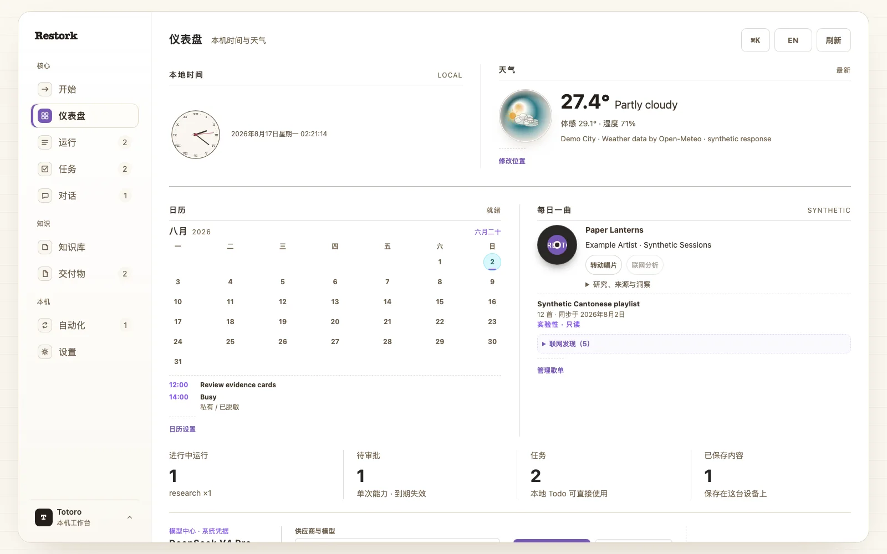

<p align="center">
  <a href="./README.md">English</a> · <strong>简体中文</strong>
</p>

<p align="center">
  <a href="https://totoro-qaq.github.io/restork/zh-CN.html">项目主页</a> ·
  <a href="https://github.com/Totoro-qaq/restork/discussions">Discussions</a> ·
  <a href="https://github.com/Totoro-qaq/restork/releases">Releases</a>
</p>

<p align="center">
  
</p>

<p align="center">
  <a href="https://github.com/Totoro-qaq/restork/actions/workflows/ci.yml"></a>
  <a href="https://github.com/Totoro-qaq/restork/releases"></a>
  <a href="https://github.com/Totoro-qaq/restork/actions/workflows/release.yml"></a>
  <a href="./rust-toolchain.toml"></a>
  <a href="https://github.com/Totoro-qaq/restork/actions/workflows/ci.yml"></a>
  <a href="https://github.com/Totoro-qaq/restork/actions/workflows/ci.yml"></a>
  <a href="LICENSE"></a>
  
  
  
</p>

<p align="center">
  <strong>查资料，学知识，推进工作。</strong><br>
  Restork 可以检索本地 Markdown 并附上出处；需要写回时，会先把具体改动给你看。
  MCP 工具运行在操作系统沙箱里。<br>
  <sub>免费、开源，写给研究者、开发者和每天要跟资料打交道的人。</sub>
</p>

## 看看 Restork 怎么工作

<p align="center">
  <a href="./assets/readme/demo-poster.zh-CN.webp">
    <picture>
      <source media="(prefers-reduced-motion: no-preference)" srcset="./assets/readme/demo-hd.zh-CN.gif" type="image/gif">
      
    </picture>
  </a>
</p>

这是真实 Dashboard 在公开合成数据上的运行画面。你可以看到任务怎样推进、在操作生效前检查
审批、管理 Markdown 任务、回看记忆，以及使用每日上下文卡片。公开演示可以放心体验：它不读取
私人 Vault，也不会调用真实模型。

## 一天里的研究、学习和工作，本来就会交织在一起

| 当你想…… | Restork 可以帮你…… |
|---|---|
| **研究一个问题** | 收集公开来源、比较不同说法和矛盾，并整理成带出处的 Markdown 笔记；保存前由你过目。 |
| **真正学会一个主题** | 从主题或已有笔记出发，梳理前置知识、学习路径、无答案练习，并根据错误安排复习。 |
| **把工作往前推进** | 把目标和你选中的文件整理成可执行计划与脱敏交接包；当前版本不会替你执行计划。 |

它们是同一个 Core 里的三种模式，不是三个争抢上下文和权限的 Agent。三种模式共用预算、
事件记录、审批、记忆规则和本地 Dashboard。

## 重要的东西，仍由你掌握

| 你关心的事 | Restork 会怎么做 |
|---|---|
| **你的 Markdown 仍然属于你** | Obsidian 笔记和任务仍是普通本地文件；私人 Vault 不会被复制进本仓库。 |
| **写入前预览，再决定要不要保存** | Restork 会展示具体内容；一次确认只对应当前版本，并会按时失效。 |
| **记忆随时可以检查** | 当前对话、运行记录、你的笔记和个人设置都能查看、纠正、导出和删除；模型猜测不会自动变成你的偏好。 |
| **所有连接都由你开启** | Restork 启动并不等于启用天气、日历、Vault、歌单或模型 Provider。 |
| **失败也会留下清楚记录** | 运行、重试、审批和恢复都会成为持久事件，而不是消失在一个一直转动的加载图标后面。 |

## 它是怎么工作的

<p align="center">
  
</p>

```text
私有 Vault + Profile
        │
        ▼
工作记忆 ─ 情景记忆 ─ 语义记忆 ─ 用户画像
        │ 已选择的上下文
        ▼
Restork Core ─ 运行策略 ─ 预览 ─ 审批 ─ 事件记录
        │
        ├── 本地 Dashboard / CLI
        └── 联网检查 ──► 已选择的模型 / 已批准的公开服务
```

Markdown 是笔记和用户任务的持久载体；SQLite 保存运行、审批和事件等操作状态。索引与链接投影
都是可以删除后重新生成的缓存。Dashboard 与 CLI 既拿不到模型密钥，也不能绕过 Core 策略。

Restork 的基础工作流不需要 LangGraph、图数据库、KAG、Valkey、Memory MCP 或 Obsidian
插件。一个 Rust Core 统一负责策略、存储、工具、恢复和内嵌 Dashboard，并明确限制每次操作的
时间、数据范围和副作用。本仓库中的少量
Python 脚本只用于开发辅助，不是产品运行时或可安装包。

## 下载桌面技术预览

打开 [GitHub Releases](https://github.com/Totoro-qaq/restork/releases)，按平台下载一个预编译包。
目标电脑不需要 Python、Node.js、Rust、MinGW、GTK 开发包或其他编译工具。

| 平台 | 下载文件 | 首次启动 |
|---|---|---|
| Apple Silicon macOS 13+ | `macOS-arm64-UNSIGNED-ALPHA.dmg` | 拖入“应用程序”，再使用单个应用的**打开 / 仍要打开**；不要全局关闭 Gatekeeper。 |
| Windows 10/11 x64 | `Windows-x64-UNSIGNED-ALPHA-setup.exe` | 技术预览尚无 Authenticode，SmartScreen 可能提示；校验 `SHA256SUMS` 后，只在确认来自本仓库时运行。 |
| 桌面 Linux x64 | `Linux-x64-UNSIGNED-ALPHA.AppImage` 或 `.deb` | AppImage 赋予执行权限后打开；Debian/Ubuntu 可用系统安装器安装 DEB。 |

三种平台都内置同一份 Rust Core 与 Dashboard，并在干净环境中测试安装、启动、退出和卸载。它们
是明确标注的未签名技术预览，不是平台签名正式版。macOS 更新包另有 Restork 独立签名；正式签名
和公证完成前，Windows/Linux 预览版不会开启自动更新。如何校验下载文件、各平台当前的签名状态，
见[桌面端指南](docs/desktop.zh-CN.md)。

未签名 Alpha 不会应用内安装更新。未来签名版首次启动不检查，从第二次启动开始最多每天检查一次；
只提醒，不静默下载或重启。Stable 默认开启，Beta 由用户主动选择；提醒和自动检查都可以在设置中
关闭。Microsoft Store、Linux 软件包管理器和 Restork 自身更新器各管自己的安装来源，不会互相
覆盖。普通用户始终不需要为更新安装编译工具链。

## 从源码运行（贡献者）

只有修改 Restork 时才走这里。请安装 Node.js 22 与仓库固定的 Rust 工具链。Windows 必须使用
`x86_64-pc-windows-msvc`；Restork 会在编译前拒绝 GNU/MinGW，因此完全不需要追着安装
`as.exe` 或 `dlltool`。

macOS / Linux：
```bash
git clone https://github.com/Totoro-qaq/restork.git
cd restork
./scripts/quickstart.sh
```

Windows PowerShell：
```powershell
git clone https://github.com/Totoro-qaq/restork.git
Set-Location restork
./scripts/quickstart.ps1
```

Restork 会让系统自动选择一个空闲 loopback 端口，并打印准确的本地 URL，以及彼此独立的一次性
Web/CLI 配对码。打开 URL，输入 Web 配对码就能进入本地工作台；查看界面不需要 API Key，真正的
刷新页面、设备休眠或短暂断线后，本地恢复会话会自动续期，访问 Token 不会写进 Web Storage。
模型对话和运行需要你明确配置 Provider。Restork 不会擅自选择 Vault，也不会自动开启天气、
定位或其他可选连接。

### 直接运行 Core

```bash
cargo run --manifest-path rust/Cargo.toml --bin restorkd -- \
  serve --port 0 --state-db ./build/restork-alpha.db
```

打开 Core 打印的 Dashboard URL，输入一次性 Web 配对码。只有程序需要读取 readiness 记录时，
才在 `serve` 前增加 `--json`。

### 一个 Core，一套规则

真正负责执行的只有 `restorkd`。Dashboard、CLI、桌面应用、API、Agent 循环、记忆、任务、
Research、Study、Work 与 Radar 都使用同一套权限、记录和恢复方式。旧 Python Core 及其构建
路径已经移除。

### 只连接你真正需要的东西

| 我想…… | 怎么做 | 会发生什么 |
|---|---|---|
| 先看看 Dashboard | 不用额外配置 | 不调用模型，也不读取 Vault |
| 读取我的 Obsidian Vault | `./scripts/quickstart.sh --vault-dir /absolute/private/vault` | 仅在本地读取；任何写入仍要先预览并审批 |
| 使用云端或本地模型 | 打开**设置 → 模型供应商**；云端 Key 使用原生凭据命令 | 可选 DeepSeek、GLM、Kimi、Qwen、Ollama、OpenRouter 或兼容端点；只显示真正支持的思考档位 |
| 查看天气 | 在天气设置中输入城市，或自己点击**使用当前位置** | 启用前始终关闭；不会通过 IP 猜测位置 |
| 加入日历 | 可用时连接系统日历，或选择一个本地 ICS 文件 | 只读访问；即使不连接，日期和时区也会跟随设备 |
| 查看未读邮件 | 在 macOS 中先打开系统邮件，再从顶部邮件入口点击**连接邮件** | 只实时显示未读总数；不读取发件人、主题、正文、账户地址，也不交给模型 |
| 使用每日一曲 | 选择 QQ 音乐、网易云、Apple Music 或私有 JSON/CSV 歌单 | 只有你点连接才会读取；不接收账号密码/Cookie，不下载音频和歌词；没有足够依据时会直说 |

打开**每日一曲 → 连接歌单**，选择来源，粘贴普通的公开歌单分享链接，再点**连接并同步**。
QQ 音乐与网易云是无需凭据的实验性只读适配；QQ 音乐可以附上香港榜单证据，网易云没有经过
核验的当前榜单证据时会明确说不知道，不会编造“为什么火”。Apple Music 只走官方 Catalog
API，需要先把 developer token 放进系统凭据库：

```bash
cargo run --manifest-path rust/Cargo.toml --bin restorkd -- music apple configure
cargo run --manifest-path rust/Cargo.toml --bin restorkd -- music apple status
```

这里需要的不是 Apple ID 密码，token 也不会进入 Dashboard 或 SQLite。刷新始终由你手动触发；
断开连接只会删除 Restork 管理的快照。完整边界见[每日上下文隐私说明](docs/daily-context.md)。

如果推荐歌曲还需要更多背景，点击**联网分析**即可。Restork 只会把这一首歌的公开元数据交给
DeepSeek V4 Flash，强制执行服务端联网搜索，校验公网 HTTPS 来源，再返回中英文解读；完整歌单和
收听历史不会发送。除非至少两个相互独立、且足够时新的来源支持，否则“为什么火”仍会明确显示为
证据缺口。这个付费动作只能手动触发，结果在本地缓存 36 小时，并且不会自动重试。

邮件提醒是 macOS Alpha 的可选能力，连接前始终关闭。Restork 每 15 秒只在本机采样一次未读总数，
再通过 SSE 把变化推给本地 Dashboard；这个数字不会被保存，也不会发送给模型。关闭系统邮件后
入口会暂停，断开后会删除 Restork 的授权设置。Windows/Linux 暂不提供适配器，也不会改为索取
邮箱密码。完整边界见[每日上下文隐私说明](docs/daily-context.md)。

想换一个本地端口，不用改配置文件：

```bash
RESTORK_PORT=7444 ./scripts/quickstart.sh
```

### 准备好后再接入模型

打开**设置 → 模型供应商**，选择精确模型和它支持的思考强度。Restork 内置 DeepSeek、GLM、
Kimi、Qwen、Ollama、OpenRouter 和 OpenAI-compatible 定义。Profile 与具体模型绑定，因此小型
委派任务可以用更快的模型、综合任务可以用更强模型，同时不会发生隐藏回退。保存后直接在对应
Provider Profile 卡片点击**测试模型**；选择的不是 DeepSeek 时，测试也绝不会绕到内置 DeepSeek
链路。能力表与端点规则见[模型供应商指南](docs/providers.zh-CN.md)。

在对话中点击**换一个模型继续**会创建新分支，只带上预览里列出的近期上下文；它不会改写原
Profile，也不会把私有消息交给权限范围不合适的云端模型。

云端 Key 使用按供应商区分的原生凭据流程，不在 Dashboard 放明文 Key 输入框；省略类型时仍默认
配置内置 DeepSeek：

```bash
cargo run --manifest-path rust/Cargo.toml --bin restorkd -- provider configure
cargo run --manifest-path rust/Cargo.toml --bin restorkd -- provider configure qwen
```

系统原生提示会把 Key 写入 macOS Keychain、Windows Credential Manager 或 Linux Secret
Service。Key 不会进入浏览器、TOML、命令行参数、环境变量、shell history、Vault、SQLite、
日志或本仓库；Dashboard 只保存原生密钥引用。
可配置的类型包括 `deepseek`、`glm`、`kimi`、`qwen`、`openrouter` 与
`open_ai_compatible`；本地 Ollama 无需 Key。

重启 Restork 后，可以自己决定检查到哪一步：

```bash
cargo run --manifest-path rust/Cargo.toml --bin restorkd -- doctor
cargo run --manifest-path rust/Cargo.toml --bin restorkd -- doctor --connect
cargo run --manifest-path rust/Cargo.toml --bin restorkd -- doctor --smoke
cargo run --manifest-path rust/Cargo.toml --bin restorkd -- doctor --web-search
```

`--connect` 检查共享 Key 与模型目录，`--smoke` 测试 V4 Pro 综合，`--web-search` 测试 V4
Flash 与服务端联网搜索。短句测试不会发送 Vault、记忆、任务、位置、日历或歌单内容，也不会打印
模型响应正文。精确分工见[模型供应商指南](docs/providers.zh-CN.md)，私有目录、备份、恢复和凭据
规则见 [`Operations`](docs/operations.md)。

### 让个人数据留在仓库之外

```bash
cargo run --manifest-path rust/Cargo.toml --bin restorkd -- \
  serve --port 0 \
  --state-db /path/to/private/restork.db \
  --vault-dir /path/to/vault
```

每日上下文在配对后的设置中配置，只开启你真正需要的字段。天气、日历和歌单留空就保持关闭；
格式和隐私行为见[每日上下文](docs/daily-context.md)。

## 现在可以使用的能力

以下对照 `./scripts/quickstart.sh` 实际启动的那个 Core。

| 区域 | 当前可以做什么 |
|---|---|
| **Dashboard 与本地 API** | 中英文界面、仅监听 loopback 的 `/v1` API、独立 Web/CLI 配对、可轮转的短期会话 |
| **对话** | 每次运行都有自己的会话，支持分支、搜索、导出、归档、取消操作与 SSE 续传 |
| **模型** | DeepSeek、GLM、Kimi、Qwen、Ollama、OpenRouter 与通用 OpenAI 兼容端点；只显示该模型真正支持的思考强度；原生凭据存储；可追溯的 Prompt 与配置版本 |
| **Agent 运行时** | 持久化模型/工具循环，分别约束步骤、修复、Token、费用与总耗时；支持取消、审批暂停、事件重放和可见的上下文压缩 |
| **Research、Study、Work** | 带来源的资料研究与写入前预览；基于 Vault 的学习路径和主动复习；清晰的工作计划、脱敏交接与结果核对 |
| **本地知识** | 带分页、安全 Markdown 预览和文件实时更新的 Obsidian Vault 浏览器，可检查的记忆、写入前预览的 Markdown 任务、统一搜索，以及可选的 GitHub 公开 AI/Agent 项目与 Hacker News Radar |
| **扩展** | 安装前检查清单、分层权限、版本回退，以及在沙箱里执行 stdio MCP |
| **每日上下文** | 可选天气、无需权限的系统日期与月历、一个本地 ICS 日历、macOS 未读邮件计数，以及来自 QQ 音乐、网易云、Apple Music 或私有歌单文件的每日单曲 |
| **报告与演示文稿** | 日报、周报既可以自己写，也可以选择模型起草；演示文稿可直接填写要求或参考已有报告，逐页预览后从六套内置版式中选择，并下载无宏 PPTX、PDF 或 Markdown。无需另装 Node、Python、LibreOffice、MCP 或基础 Skill |
| **产物与恢复** | 记录文件哈希、保存带真实内容的检查点，并只恢复你预览过的版本 |
| **自动化** | 感知夏令时的本地任务，以及可选择模型的日报/周报草稿；模型自动化需明确同意联网，只发送标记为 `public` 的运行事实，草稿留在本地等你过目 |
| **桌面** | Tauri 打包 `restorkd` 与 Dashboard，使用 Unix 进程组或 Windows Job Object 管理生命周期 |

### 现在还不会做的事

| 区域 | 当前情况 |
|---|---|
| 联网搜索 | 公开 HTTPS Research 都从同一个检查入口联网；能否使用取决于所选模型供应商。 |
| MCP | 已审批的 stdio MCP 在平台沙箱中执行；Remote HTTPS MCP 在传输策略完成前会直接拒绝。 |
| 交付物创作 | Restork 用你提供的内容生成并检查 Markdown、无宏 PPTX 与 PDF，不会偷偷编造有出处的说法。 |
| Work 执行 | Work 生成计划和交接包供你过目，再核对返回的结果清单；不会接管外部编码进程。 |
| 原生邮件 | 未读总数适配仅支持 macOS；Windows/Linux 会如实显示不可用。 |

桌面技术预览尚未使用 Apple、Microsoft 或 Linux 发布者证书签名。正式版仍需完成 Developer ID、
Authenticode、Linux 签名、Apple 公证、更新签名和干净机器安装测试。

## 使用指南

- [Dashboard 与 CLI](docs/dashboard-usage.md)
- [模型供应商与思考强度](docs/providers.zh-CN.md)
- [记忆](docs/memory.md)
- [Markdown 任务](docs/markdown-tasks.md)
- [Research](docs/research-workflow.md)
- [Work](docs/work.md)
- [跨平台桌面端内测版](docs/desktop.zh-CN.md)
- [Restork 与 Hermes Agent](docs/restork-vs-hermes.zh-CN.md)
- [隐私](docs/privacy.md)与[安全模型](docs/security/threat-model.md)

<details>
<summary><strong>开发与贡献</strong></summary>

```bash
# 开发检查与发布准备
cargo fmt --manifest-path rust/Cargo.toml --all -- --check
cargo clippy --manifest-path rust/Cargo.toml --locked --all-targets -- -D warnings
cargo test --manifest-path rust/Cargo.toml --locked
cargo build --manifest-path rust/Cargo.toml --release --locked -p restorkd
cargo audit --file rust/Cargo.lock
cargo deny --manifest-path rust/Cargo.toml check advisories bans sources

# Dashboard
npm --prefix dashboard ci
npm --prefix dashboard run lint
npm --prefix dashboard test
npm --prefix dashboard run build

# 跨平台桌面端内测版（在对应操作系统上运行匹配命令）
npm --prefix desktop ci
npm --prefix desktop run fmt:check
node scripts/build-desktop-runtime.mjs
npm --prefix desktop run clippy
npm --prefix desktop test
npm --prefix desktop run build:macos
npm --prefix desktop run build:windows
npm --prefix desktop run build:linux
node scripts/smoke-desktop-runtime.mjs
./scripts/smoke-desktop-app.sh 10
./scripts/smoke-desktop-faults.sh

# 公开资产与发布包
python3 scripts/audit_readme.py README.md README.zh-CN.md
./scripts/scan-public-artifacts.sh
```

不调用 Provider 的[运行时基准](benchmarks/README.md)会记录 readiness、空闲内存、二进制大小与
loopback 延迟，全程不发送 Prompt。

提交改动前请阅读 [`CONTRIBUTING.md`](CONTRIBUTING.md)。已实现的产品契约位于
[`V1 规格`](specs/restork-v1.md)与[Steps 18–22 规格](specs/restork-steps18-22.md)；对话模型分支与公开
macOS Alpha 的功能范围见 [Step 26 规格](specs/restork-step26-model-branch-and-public-alpha.md)，
三平台预览安装与贡献者体验由 [Step 29 规格](specs/restork-step29-install-and-contributor-experience.md)
约束。发布历史记录在 [`CHANGELOG.md`](CHANGELOG.md)。

</details>

Restork 是免费、开源的社区项目，基于 [MIT License](LICENSE) 发布。请同时阅读
[为什么做 Restork，以及使用时需要知道的事](DISCLAIMER.zh-CN.md)、
[安全政策](SECURITY.zh-CN.md)与[支持说明](SUPPORT.zh-CN.md)；官方支持不要求公开维护者的
个人邮箱。
