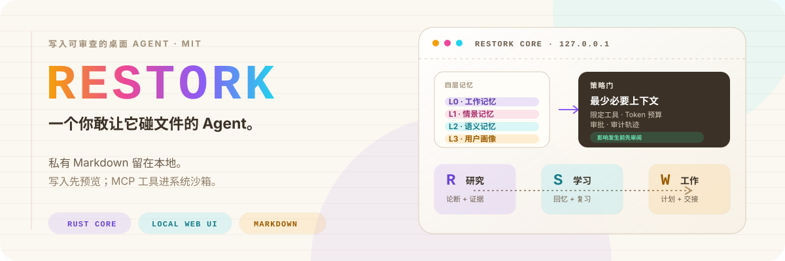
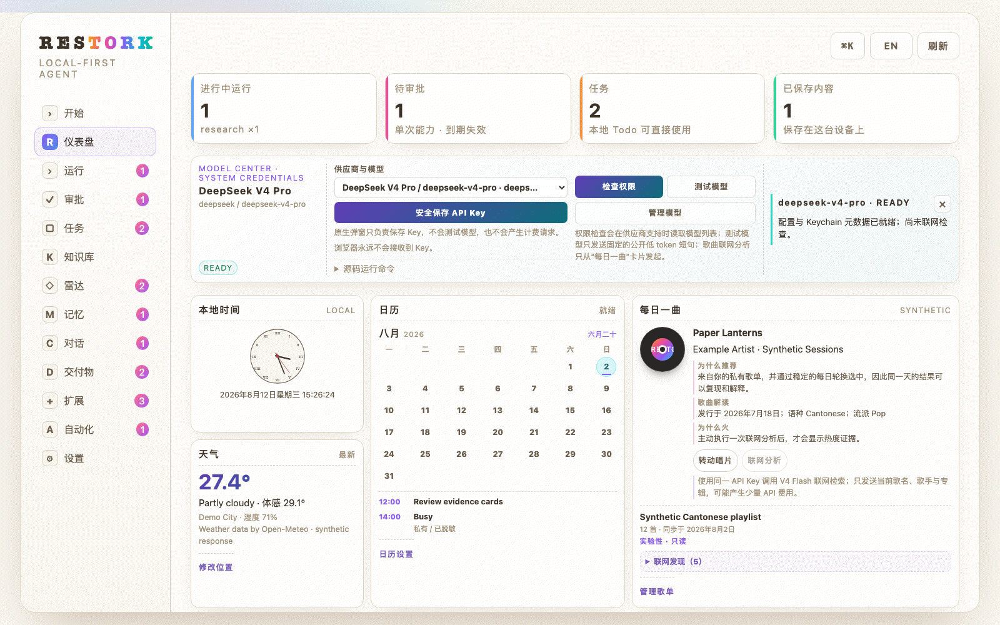
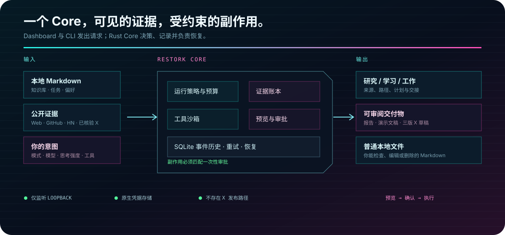

<p align="center">
  <a href="./README.md">English</a> · <strong>简体中文</strong>
</p>

<p align="center">
  <a href="https://totoro-qaq.github.io/restork/zh-CN.html">项目主页</a> ·
  <a href="https://github.com/Totoro-qaq/restork/discussions">Discussions</a> ·
  <a href="https://github.com/Totoro-qaq/restork/releases">Releases</a>
</p>

<p align="center">
  
</p>

<p align="center">
  <a href="https://github.com/Totoro-qaq/restork/actions/workflows/ci.yml"></a>
  <a href="https://github.com/Totoro-qaq/restork/releases"></a>
  <a href="https://github.com/Totoro-qaq/restork/actions/workflows/release.yml"></a>
  <a href="LICENSE"></a>
  
  
  
  
</p>

<p align="center">
  <strong>把研究、学习和手头的工作，放进一个真正属于你的本地工作台。</strong><br>
  Restork 把笔记、任务与模型能力连接起来；写入文件或把内容发送到设备之外前，先让你看清并确认。
</p>

## 看看 Restork 怎么工作

<p align="center">
  <a href="./assets/readme/demo-poster.zh-CN.webp">
    
  </a>
</p>

这是真实 Dashboard 在公开合成数据上的运行画面。你可以看到任务怎样推进、在操作生效前检查
审批、管理 Markdown 任务、回看记忆，以及使用每日上下文卡片。公开演示可以放心体验：它不读取
私人 Vault，也不会调用真实模型。

## 一天里的研究、学习和工作，本来就会交织在一起

| 当你想…… | Restork 可以帮你…… |
|---|---|
| **研究一个问题** | 收集公开来源、比较论断和冲突，并整理成带引用的 Markdown 笔记；保存前由你审阅。 |
| **真正学会一个主题** | 从主题或已有笔记出发，梳理前置知识、学习路径、无答案练习，并根据错误安排复习。 |
| **把工作往前推进** | 把目标和有限范围的仓库快照变成可执行计划与脱敏交接包；当前版本不会替你执行计划。 |

它们是同一个 Core 里的三种模式，不是三个争抢上下文和权限的 Agent。三种模式共用预算、
事件记录、审批、记忆规则和本地 Dashboard。

## 我们希望它始终容易理解

| 承诺 | 在产品里意味着什么 |
|---|---|
| **你的 Markdown 仍然属于你** | Obsidian 笔记和任务仍是普通本地文件；私人 Vault 不会被复制进本仓库。 |
| **先看到影响，再决定是否继续** | 写入先生成精确预览；审批只使用一次、会过期，并绑定这一次的具体内容。 |
| **记忆随时可以检查** | Working、Episodic、Semantic、Profile 四层记忆都能查看、纠正、导出和删除；模型猜测不会自动变成你的偏好。 |
| **所有连接都由你开启** | Restork 启动并不等于启用天气、日历、Vault、歌单或模型 Provider。 |
| **失败也会留下清楚记录** | 运行、重试、审批和恢复都会成为持久事件，而不是消失在一个一直转动的加载图标后面。 |

## 它是怎么工作的

<p align="center">
  
</p>

```text
私有 Vault + Profile
        │
        ▼
工作记忆 ─ 情景记忆 ─ 语义记忆 ─ 用户画像
        │ 已选择的上下文
        ▼
Restork Core ─ 运行策略 ─ 预览 ─ 审批 ─ 事件记录
        │
        ├── 本地 Dashboard / CLI
        └── 出站网关 ──► DeepSeek V4 Pro / 已批准的公开服务
```

Markdown 是笔记和用户任务的持久载体；SQLite 保存运行、审批和事件等操作状态。索引与链接投影
都是可以删除后重新生成的缓存。Dashboard 与 CLI 既拿不到模型密钥，也不能绕过 Core 策略。

Restork 的基础工作流不需要 LangGraph、图数据库、KAG、Valkey、Memory MCP 或 Obsidian
插件。新运行时使用一个有界 Rust Core 循环；只有科学计算或文档生态确实需要时，才会按需启动
短生命周期的可选 Python 能力 Worker。

## 五分钟开始使用

一条命令构建 Dashboard 和原生 Core 并启动它。你需要 [Rust 工具链](https://rustup.rs)
和 Node.js。

```bash
git clone https://github.com/Totoro-qaq/restork.git
cd restork
./scripts/quickstart.sh
```

已经下载过仓库？以后只需：

```bash
./scripts/quickstart.sh
```

Restork 会在 `http://127.0.0.1:7337` 启动，并在终端打印一次性 Web 配对码。打开这个本地地址，
输入配对码就能开始。首次启动不需要 API Key，不会擅自选择 Vault，也不会自动开启天气或其他
连接；离线 Research synthesizer 可以让你在不发送模型请求的情况下先体验产品。

### 直接运行 Core

```bash
cargo run --manifest-path rust/Cargo.toml -p restorkd -- \
  serve --port 7337 --state-db ./build/restork-alpha.db
```

打开 readiness 记录中的 `base_url`，输入其中的一次性配对码。

### 关于 Python 包

`src/restork/` 是一个已弃用的第二 Core。它不在任何分发产物中，桌面应用不会启动它，仅作为
迁移期的移植参考保留，直到
[单核收敛规格](specs/restork-single-core-consolidation.md)完成。它仍持有的能力域——运行、
审批、任务、记忆、Radar 与 Work——在 Dashboard 中会明确标注「当前 Core 未提供」，而不是显示为空。

### 桌面安装包

[Releases 页面](https://github.com/Totoro-qaq/restork/releases)现在支持公开的 Apple Silicon
macOS Alpha。下载文件名明确带有 `UNSIGNED-ALPHA` 的 DMG，目标 Mac 不需要 Python、Node.js、
Rust、`uv` 或包管理器。这个早期版本使用 ad-hoc 签名，另有独立更新签名、校验和、SBOM、
provenance 与干净机器生命周期测试，但它**没有 Apple Developer ID 签名，也没有经过公证**。
首次启动请使用单个应用的**打开 / 仍要打开**，不要全局关闭 Gatekeeper。

受保护正式通道仍保持独立：macOS Developer ID/公证、Windows Authenticode、Linux 包签名与
完整干净机器矩阵都通过后，才能称为正式版本。精确信任边界、安装步骤与贡献者构建方式见
[桌面端指南](docs/desktop.zh-CN.md)。

### 只连接你真正需要的东西

| 我想…… | 怎么做 | 会发生什么 |
|---|---|---|
| 先看看 Dashboard | 不用额外配置 | 不调用模型，也不读取 Vault |
| 读取我的 Obsidian Vault | `./scripts/quickstart.sh --vault-dir /absolute/private/vault` | 仅在本地读取；任何写入仍要先预览并审批 |
| 使用云端或本地模型 | 打开**设置 → 模型供应商**；云端 Key 使用原生凭据命令 | 可选 DeepSeek、GLM、Kimi、Qwen、Ollama、OpenRouter 或兼容端点；只显示真正支持的思考档位 |
| 查看天气 | 在天气设置中输入城市，或自己点击**使用当前位置** | 启用前始终关闭；不会通过 IP 猜测位置 |
| 加入日历 | 可用时连接系统日历，或选择一个本地 ICS 文件 | 只读访问；即使不连接，日期和时区也会跟随设备 |
| 查看未读邮件 | 在 macOS 中先打开系统邮件，再从顶部邮件入口点击**连接邮件** | 只实时显示未读总数；不读取发件人、主题、正文、账户地址，也不交给模型 |
| 使用每日一曲 | 选择 QQ 音乐、网易云、Apple Music 或私有 JSON/CSV 歌单 | 显式只读同步；不接收账号密码/Cookie，不下载音频和歌词；来源能力与证据缺口始终可见 |

打开**每日一曲 → 连接歌单**，选择来源，粘贴普通的公开歌单分享链接，再点**连接并同步**。
QQ 音乐与网易云是无需凭据的实验性只读适配；QQ 音乐可以附上香港榜单证据，网易云没有经过
核验的当前榜单证据时会明确说不知道，不会编造“为什么火”。Apple Music 只走官方 Catalog
API，需要先把 developer token 放进系统凭据库：

```bash
cargo run --manifest-path rust/Cargo.toml -p restorkd -- music apple configure
cargo run --manifest-path rust/Cargo.toml -p restorkd -- music apple status
```

这里需要的不是 Apple ID 密码，token 也不会进入 Dashboard 或 SQLite。刷新始终由你手动触发；
断开连接只会删除 Restork 管理的快照。完整边界见[每日上下文隐私说明](docs/daily-context.md)。

如果推荐歌曲还需要更多背景，点击**联网分析**即可。Restork 只会把这一首歌的公开元数据交给
DeepSeek V4 Flash，强制执行服务端联网搜索，校验公网 HTTPS 来源，再返回中英文解读；完整歌单和
收听历史不会发送。除非至少两个相互独立、且足够时新的来源支持，否则“为什么火”仍会明确显示为
证据缺口。这个付费动作只能手动触发，结果在本地缓存 36 小时，并且不会自动重试。

邮件提醒是 macOS Alpha 的可选能力，连接前始终关闭。Restork 每 15 秒只在本机采样一次未读总数，
再通过 SSE 把变化推给本地 Dashboard；这个数字不会被保存，也不会发送给模型。关闭系统邮件后
入口会暂停，断开后会删除 Restork 的授权设置。Windows/Linux 暂不提供适配器，也不会改为索取
邮箱密码。完整边界见[每日上下文隐私说明](docs/daily-context.md)。

想换一个本地端口，不用改配置文件：

```bash
RESTORK_PORT=7444 ./scripts/quickstart.sh
```

### 准备好后再接入模型

打开**设置 → 模型供应商**，选择精确模型和它支持的思考强度。Restork 内置 DeepSeek、GLM、
Kimi、Qwen、Ollama、OpenRouter 和 OpenAI-compatible 定义。Profile 与具体模型绑定，因此有界
子任务可以用更快的模型、综合任务可以用更强模型，同时不会发生隐藏回退。保存后直接在对应
Provider Profile 卡片点击**测试模型**；选择的不是 DeepSeek 时，测试也绝不会绕到内置 DeepSeek
链路。能力表与端点规则见[模型供应商指南](docs/providers.zh-CN.md)。

在对话中点击**换一个模型继续**会创建带有界近期上下文的新分支；它不会改写原 Profile，也不会
把私有消息带进数据边界更窄的云端模型。

云端 Key 使用按供应商区分的原生凭据流程，不在 Dashboard 放明文 Key 输入框；省略类型时仍默认
配置内置 DeepSeek：

```bash
cargo run --manifest-path rust/Cargo.toml -p restorkd -- provider configure
cargo run --manifest-path rust/Cargo.toml -p restorkd -- provider configure qwen
```

系统原生提示会把 Key 写入 macOS Keychain、Windows Credential Manager 或 Linux Secret
Service。Key 不会进入浏览器、TOML、命令行参数、环境变量、shell history、Vault、SQLite、
日志或本仓库；Dashboard 只保存原生密钥引用。
可配置的类型包括 `deepseek`、`glm`、`kimi`、`qwen`、`openrouter` 与
`open_ai_compatible`；本地 Ollama 无需 Key。

重启 Restork 后，可以自己决定检查到哪一步：

```bash
cargo run --manifest-path rust/Cargo.toml -p restorkd -- doctor
cargo run --manifest-path rust/Cargo.toml -p restorkd -- doctor --connect
cargo run --manifest-path rust/Cargo.toml -p restorkd -- doctor --smoke
cargo run --manifest-path rust/Cargo.toml -p restorkd -- doctor --web-search
```

`--connect` 检查共享 Key 与模型目录，`--smoke` 测试 V4 Pro 综合，`--web-search` 测试 V4
Flash 与服务端联网搜索。短句测试不会发送 Vault、记忆、任务、位置、日历或歌单内容，也不会打印
模型响应正文。精确分工见[模型供应商指南](docs/providers.zh-CN.md)，私有目录、备份、恢复和凭据
规则见 [`Operations`](docs/operations.md)。

### 让个人数据留在仓库之外

```bash
uv run restork \
  --state-db /path/to/private/restork.db \
  --profile-dir /path/to/private-profile \
  --vault-dir /path/to/vault \
  serve --port 7337
```

如需每日上下文，把[示例 Profile](examples/profile.example.toml)复制到你的私有 Profile 目录，只开启
想使用的字段。天气、日历和歌单留空就保持关闭；格式和隐私行为见[每日上下文](docs/daily-context.md)。

## 现在可以使用的能力

以下对照 `./scripts/quickstart.sh` 实际启动的那个 Core。

| 区域 | 当前可以做什么 |
|---|---|
| **Dashboard 与本地 API** | 中英文界面、仅监听 loopback 的 `/v1` API、独立 Web/CLI 配对、可轮转的短期会话 |
| **对话** | 运行范围内的会话，支持分支、搜索、导出、归档、可取消操作与 SSE 重放 |
| **模型** | DeepSeek、GLM、Kimi、Qwen、Ollama、OpenRouter 与通用 OpenAI 兼容端点；供应商范围内思考强度；原生凭据存储；版本化 Prompt 与配置 Profile |
| **扩展** | 清单校验、权限格、不可变修订与回滚，以及沙箱化的 stdio MCP 执行 |
| **每日上下文** | 可选天气、无需权限的系统日期与月历、一个本地 ICS 日历、macOS 未读邮件计数，以及来自 QQ 音乐、网易云、Apple Music 或私有歌单文件的每日单曲 |
| **产物与恢复** | 确定性无宏 PPTX/PDF、精确产物哈希、包含真实内容的检查点、绑定预览的文件恢复 |
| **自动化** | 感知夏令时的重复调度与幂等周期键 |
| **桌面** | Tauri 打包 `restorkd` 与 Dashboard，使用 Unix 进程组或 Windows Job Object 管理生命周期 |

### 正在移植

以下能力实现在已弃用的 Python 包中，上述 Core **无法**访问。Dashboard 会将它们标注为
「当前 Core 未提供」，而不是显示为空列表。

| 区域 | 状态 |
|---|---|
| 运行、审批、预算、副作用恢复 | 随 agent 运行时一起在 Rust 落地 |
| Markdown 任务与日志化写入 | 计划移植 |
| 四层记忆 | 计划移植 |
| Research 证据与引用笔记 | 计划移植 |
| Work 校验与脱敏交接 | 计划移植；三步固定规划器不再保留 |
| Radar | 保留，但需要真实摄取——它从未有过数据 |
| Study | 已删除；将基于 agent loop 并以你的 Vault 为基础重建 |

两个 Core 目前都还没有工具调用的 agent loop。排期、契约与验收门见
[单核收敛规格](specs/restork-single-core-consolidation.md)。

公开 macOS Alpha 明确不在 Apple Developer ID 信任范围内；受保护正式版仍要求真实
Developer ID、Authenticode、Linux GPG、公证与干净 runner 证据。

## 使用指南

- [Dashboard 与 CLI](docs/dashboard-usage.md)
- [模型供应商与思考强度](docs/providers.zh-CN.md)
- [记忆](docs/memory.md)
- [Markdown 任务](docs/markdown-tasks.md)
- [Research](docs/research-workflow.md)
- [Work](docs/work.md)
- [跨平台桌面端内测版](docs/desktop.zh-CN.md)
- [Restork 与 Hermes Agent](docs/restork-vs-hermes.zh-CN.md)
- [隐私](docs/privacy.md)与[安全模型](docs/security/threat-model.md)

<details>
<summary><strong>开发与贡献</strong></summary>

```bash
# Core
uv run pytest
uv run ruff check .
uv run mypy src
uv run bandit -q -r src

# Rust-first 运行时基础
cargo fmt --manifest-path rust/Cargo.toml --all -- --check
cargo clippy --manifest-path rust/Cargo.toml --locked --all-targets -- -D warnings
cargo test --manifest-path rust/Cargo.toml --locked
cargo build --manifest-path rust/Cargo.toml --release --locked -p restorkd

# Dashboard
npm --prefix dashboard ci
npm --prefix dashboard run lint
npm --prefix dashboard test
npm --prefix dashboard run build

# 跨平台桌面端内测版（在对应操作系统上运行匹配命令）
npm --prefix desktop ci
npm --prefix desktop run fmt:check
node scripts/build-desktop-runtime.mjs
npm --prefix desktop run clippy
npm --prefix desktop test
npm --prefix desktop run build:macos
npm --prefix desktop run build:windows
npm --prefix desktop run build:linux
node scripts/smoke-desktop-runtime.mjs
./scripts/smoke-desktop-app.sh 10
./scripts/smoke-desktop-faults.sh

# 公开资产与发布包
uv run python scripts/audit_readme.py README.md README.zh-CN.md
./scripts/scan-public-artifacts.sh
uv run python scripts/build_release.py --output dist/release
```

不调用 Provider 的[运行时基准](benchmarks/README.md)会记录 readiness、空闲内存、二进制大小与
loopback 延迟，全程不发送 Prompt。在剩余执行路由达到 Rust 兼容与恢复对等之前，V1 源码快速
启动会继续保留。

提交改动前请阅读 [`CONTRIBUTING.md`](CONTRIBUTING.md)。已实现的产品契约位于
[`V1 规格`](specs/restork-v1.md)与[Steps 18–22 规格](specs/restork-steps18-22.md)；对话模型分支与公开
macOS Alpha 的边界冻结在 [Step 26 规格](specs/restork-step26-model-branch-and-public-alpha.md)。发布历史记录在
[`CHANGELOG.md`](CHANGELOG.md)。

</details>

Restork 基于 [MIT License](LICENSE) 发布。
