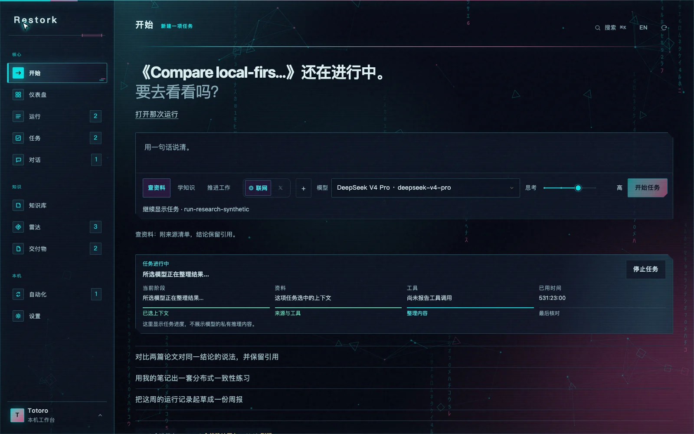
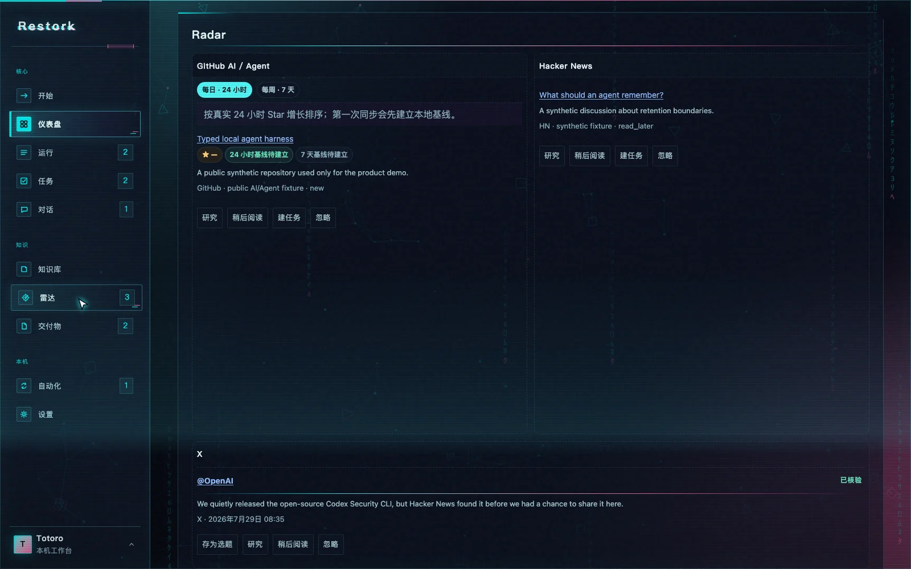
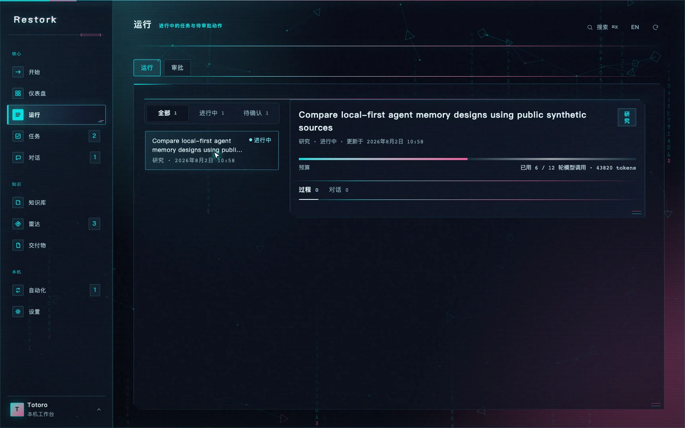
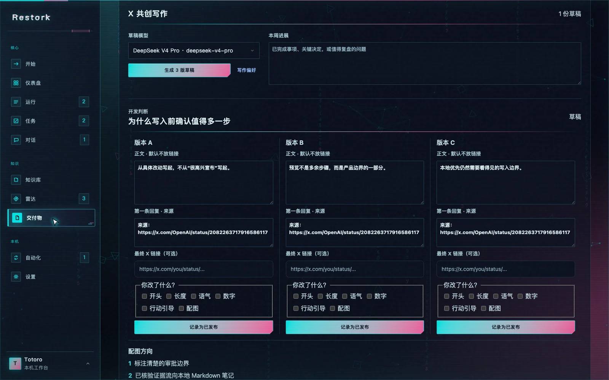
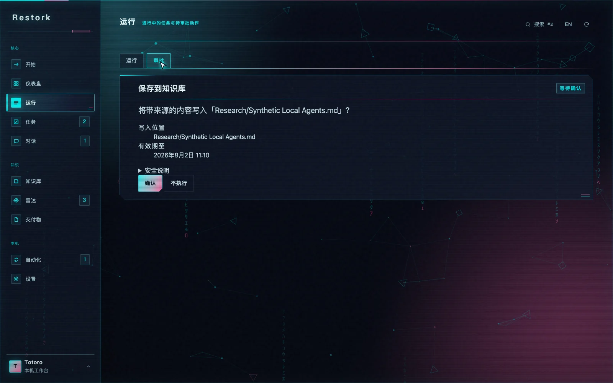
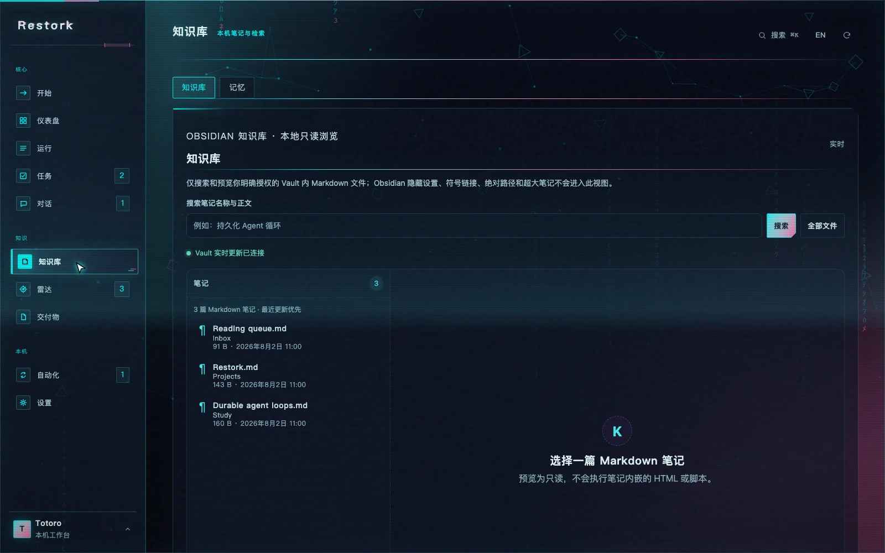

<p align="center">
  <a href="./README.md">English</a> · <strong>简体中文</strong>
</p>

<p align="center">
  <a href="https://totoro-qaq.github.io/restork/">官网</a> ·
  <a href="https://github.com/Totoro-qaq/restork/releases">下载</a> ·
  <a href="./docs/dashboard-usage.md">使用指南</a> ·
  <a href="https://github.com/Totoro-qaq/restork/discussions">讨论</a>
</p>

<p align="center">
  
</p>

<p align="center">
  <a href="https://github.com/Totoro-qaq/restork/actions/workflows/ci.yml"></a>
  <a href="https://github.com/Totoro-qaq/restork/releases"></a>
  <a href="LICENSE"></a>
  
</p>

<p align="center">
  <strong>一个面向有证据研究、学习和工作的本地优先桌面工作台。</strong><br>
  核验公开来源，选择模型和思考强度，看清每次副作用，再把结果保留为普通 Markdown。
</p>

## 看一遍真实流程

<p align="center">
  <a href="./assets/readme/demo-poster.zh-CN.webp">
    <picture>
      <source media="(prefers-reduced-motion: no-preference)" srcset="./assets/readme/demo-hd.zh-CN.gif" type="image/gif">
      
    </picture>
  </a>
</p>

上面的循环来自真实 Dashboard，但使用公开合成数据：打开 Radar，把独立核验的 X 证据存为
选题，检查三版可编辑草稿，再手动记录最终发布版本。它不会读取私有 Vault、调用真实模型或写入 X。

## 看产品，不看功能堆砌

| 从一句清楚的任务开始 | 同时查看 GitHub、Hacker News 与已核验 X 证据 |
|---|---|
|  |  |
| **跟着运行过程走，不展示模型私有推理** | **把一个已核验选题整理成三版草稿** |
|  |  |
| **确认精确副作用** | **把结果保留为普通本地笔记** |
|  |  |

## 一天里的研究、学习和工作，本来就会交织在一起

| 当你想要…… | Restork 会帮你…… |
|---|---|
| **研究一个问题** | 汇总公开来源与明确选择的本地资料，比较说法，保留引用，并在保存前预览笔记。 |
| **真正学会一个主题** | 根据 Vault 构建包含前置知识的路径，不泄露答案地练习，再从错误开始复习。 |
| **把工作往前推** | 把目标和你选择的文件整理成受限计划、脱敏交接包和可核对的结果清单。 |
| **准备一份值得发出去的内容** | 用已核验 X 证据，加上公开 Restork 运行或你的周摘要，生成最多 3 个选题；每个选题有 3 版草稿与 2 个配图方向。 |

它们是同一个 Rust Core 里的不同模式，不是几个互相争抢权限和上下文的 Agent。预算、事件历史、
审批规则、恢复路径和本地 Dashboard 始终是同一套。

## 看 X，但不把账号交给 Agent

Restork 把 X 作为现有 Radar 的一个来源。默认链路使用你在本机登录的 Grok CLI。候选帖子只有在
公开 URL、作者和正文都被独立核验后才会出现；模型生成的摘要永远不能冒充来源证据。

- 收集器可以搜索 X；整理器没有工具；应用层只根据已核验 `evidence_id` 解析链接。
- 正文默认不放链接，第一条回复保留已核验来源。
- 最终修改只记录在本机；同一方向累计修改 3 次后才会提出写作偏好。
- `x-voice.md` 是普通文件，每次更新仍需先看差异再确认。
- Restork Core 里不存在 X 发布、回复、点赞、关注、删除或私信路径。

OAuth 表示“使用当前 Grok Build / xAI 账户额度”，不表示永久免费或无限额度。API key 模式可能产生
xAI API 费用，因此默认关闭 X 定时自动化。完整边界见
[X 共创写作 Spec](docs/specs/x-cocreation-agent.zh-CN.md)。

## 信任边界怎么工作

<p align="center">
  
</p>

| 承诺 | 实际含义 |
|---|---|
| **Markdown 仍然属于你** | Obsidian 笔记与任务始终是普通本地文件；私有 Vault 不会被复制进仓库。 |
| **先看效果，再决定是否执行** | 写入从精确预览开始；审批只能用一次、有有效期，并绑定到具体字节。 |
| **记忆可以检查** | Working、Episodic、Semantic 与 Profile 记忆都能查看、纠正、导出和删除。 |
| **连接必须主动开启** | Vault、模型、天气、日历、邮件、歌单、联网搜索和 X 搜索都不会因为启动 Restork 自动启用。 |
| **失败必须留下记录** | 运行、重试、取消、审批、定时草稿与恢复都变成持久事件，而不是一个会遗忘的转圈。 |

Markdown 是笔记和用户任务的长期归宿；SQLite 保存运行、已核验证据、审批与事件等操作状态。索引可以
丢弃重建。Dashboard 与 CLI 都拿不到模型凭据，也不能绕过 Core 的策略。

## 下载桌面技术预览

从 [GitHub Releases](https://github.com/Totoro-qaq/restork/releases) 下载当前安装包。桌面包已经包含
Rust Core 与 Dashboard；普通用户无需安装 Node.js、Python、Rust、包管理器或全局 CLI。

| 平台 | 安装包 | 首次启动 |
|---|---|---|
| Apple Silicon macOS 13+ | `macOS-arm64-UNSIGNED-ALPHA.dmg` | 拖到 Applications，再使用单应用 **Open / Open Anyway**。 |
| Windows 10/11 x64 | `Windows-x64-UNSIGNED-ALPHA-setup.exe` | 先核对 `SHA256SUMS`；未签名预览可能触发 SmartScreen。 |
| 桌面 Linux x64 | `.AppImage` 或 `.deb` | 给 AppImage 执行权限，或用系统安装器安装 DEB。 |

这些包会明确标注“未签名技术预览”。不要全局关闭操作系统安全功能。校验和、信任边界、更新器行为
以及安装/启动/退出/卸载证据见[桌面指南](docs/desktop.zh-CN.md)。

### 从源码运行

```bash
git clone https://github.com/Totoro-qaq/restork.git
cd restork
./scripts/quickstart.sh
```

打开 Core 打印的 loopback Dashboard 地址，输入一次性 Web 配对码。浏览本地工作区不需要 API Key；
模型对话和运行只使用你在**设置 → 模型**里主动配置的供应商。支持的思考强度、原生凭据存储、
端点策略和精确模型测试见[模型供应商指南](docs/providers.zh-CN.md)。

## 现在可以使用

| 区域 | 当前能力 |
|---|---|
| **Core 工作区** | 中英文 loopback Dashboard 与 CLI、独立配对、短期会话轮转、持久运行、SSE 续传、取消、重试和受限上下文压缩。 |
| **模型** | DeepSeek、GLM、Kimi、Qwen、Ollama、OpenRouter 与兼容端点；按模型显示思考强度；原生密钥存储；不做隐藏回退。 |
| **Research / Study / Work** | 来源可见的研究和写入前预览；基于 Vault 的学习路径与主动回忆；只负责计划的 Work 交接和导入结果核对。 |
| **Radar + X 共创** | GitHub 公开 AI/Agent 发现、Hacker News、独立核验 X 证据、选题状态、三版草稿、两个配图方向、手动发布记录和审批后写入的偏好档案。 |
| **知识与记忆** | 分页安全 Markdown 预览、文件实时更新、本地 Todo 与可选 Vault 同步、统一搜索和四层可检查记忆。 |
| **扩展** | 经过审阅的 Skill/MCP/Plugin 清单、按界面归类的 Skills、分层权限、不可变历史、回退和沙箱 stdio MCP。 |
| **交付物** | 日报/周报，以及可编辑、无宏的 PPTX/PDF/Markdown；真实图表/表格 exhibit 原语和 CJK 安全 PDF 文本。 |
| **自动化** | 感知夏令时的本地任务、可审阅报告草稿、每日已核验 X Radar 与每周 X 草稿；模型/联网任务必须明确同意。 |
| **每日上下文** | 可选天气、本地日历、macOS 未读数，以及免凭据或私有歌单来源；每一项都单独开启。 |
| **桌面端** | Tauri 监督内嵌 Core、负责进程清理，并在 macOS、Windows、Linux 保持相同产品边界。 |

## 有意保留的限制

- Work 负责准备和核对交接，不接管外部编码进程。
- Remote HTTPS MCP 在传输策略落地前直接拒绝；已审阅 stdio MCP 在系统沙箱中运行。
- Restork 永远不会代替你发布 X，也不会从新账号早期指标推导运营策略。
- 生成了结果不等于“已保存”；只有审批后的本地写入成功才算落盘。
- 技术预览尚未覆盖生产发布者证书、公证和稳定更新门禁。

## 使用指南

- [Dashboard 与 CLI](docs/dashboard-usage.md)
- [模型供应商与思考强度](docs/providers.zh-CN.md)
- [Research](docs/research-workflow.md)、[Study](docs/study.md) 与 [Work](docs/work.md)
- [记忆](docs/memory.md)与 [Markdown 任务](docs/markdown-tasks.md)
- [每日上下文与隐私](docs/daily-context.md)
- [桌面安装与信任边界](docs/desktop.zh-CN.md)
- [隐私](docs/privacy.md)与[安全模型](docs/security/threat-model.md)

<details>
<summary><strong>开发、验证与贡献</strong></summary>

```bash
# Dashboard
npm --prefix dashboard ci
npm --prefix dashboard run lint
npm --prefix dashboard test
npm --prefix dashboard run build

# Rust Core
cargo fmt --manifest-path rust/Cargo.toml --all -- --check
cargo clippy --manifest-path rust/Cargo.toml --locked --all-targets -- -D warnings
cargo test --manifest-path rust/Cargo.toml --locked
cargo build --manifest-path rust/Cargo.toml --release --locked -p restorkd

# 桌面端与公开资产
node scripts/build-desktop-runtime.mjs
npm --prefix desktop test
npm --prefix desktop run build:macos
./scripts/smoke-desktop-app.sh 10
python3 scripts/audit_readme.py README.md README.zh-CN.md
./scripts/scan-public-artifacts.sh
```

提交前请阅读 [CONTRIBUTING.md](CONTRIBUTING.md)。备份、凭据、私有目录与恢复流程见
[Operations](docs/operations.md)，发布记录见 [CHANGELOG.md](CHANGELOG.md)。

</details>

Restork 是基于 [MIT License](LICENSE) 发布的免费开源项目。请阅读
[为什么做 Restork，以及使用时需要知道的事](DISCLAIMER.zh-CN.md)、
[安全政策](SECURITY.zh-CN.md)与[支持说明](SUPPORT.zh-CN.md)。
