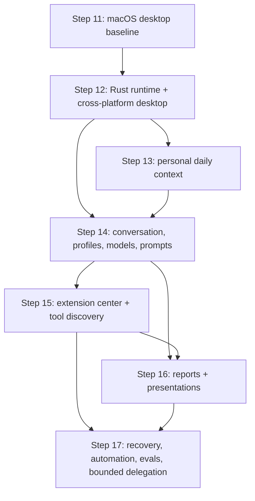

# Restork Rust-first Delivery Plan — Steps 12–17

> Status: Approved — implementation in progress after Gate 1 and ADR 0002 acceptance
>
> Version: 0.1 | Date: 2026-08-02
>
> Governing specification: [Steps 12–17 Specification](../specs/restork-steps12-17.md)

## 1. Delivery rule

The roadmap uses one governed Rust Core, bounded agent loops, and optional bounded delegation. It
does not create three permanent agents and does not add LangGraph. Each slice is test-first, changes
one trust boundary at a time, and reaches its own rollback point before the next slice begins.

Gate 1 approved this plan and ADR 0002 on 2026-08-02. No commit or push occurs until Gate 2 reviews
the final diff, tests, benchmarks, security findings, and remaining external release gates.

## 2. Dependency graph

## 3. Step 12 — Rust Runtime Foundation and Cross-platform Desktop

### 12A — Decision and performance baseline

- Draft ADR 0002 to supersede ADR 0001: Rust-first Core with optional Python workers.
- Record current Python Core and Tauri metrics on named reference machines.
- Freeze `/v1`, bootstrap, event, artifact, approval, SQLite, and public-fixture compatibility sets.
- Define failure injection, migration backup, rollback, and performance-regression thresholds.

Exit gate: ADR approved; reproducible baseline report and fixtures exist.

Implementation evidence: ADR 0002 was approved on 2026-08-02; the first provider-free macOS arm64
measurement is recorded in
[`benchmarks/2026-08-02-macos-arm64-foundation.md`](../benchmarks/2026-08-02-macos-arm64-foundation.md).
SSE, SQLite pagination, and WebView-interactive baselines remain attached to the vertical slices that
introduce their Rust implementations rather than being inferred from the compatibility shell.

### 12B — Rust workspace and compatibility shell

- Add a small Cargo workspace with Core domain, storage, API, platform, and binary boundaries.
- Start `restorkd` on loopback, implement readiness/auth/session/SSE skeletons, and reuse the current
  Dashboard without feature behavior.
- Generate or share schemas instead of manually maintaining Python, Rust, and TypeScript shapes.
- Keep the current Python Core as the only production implementation during this slice.

Exit gate: Rust skeleton passes transport/security fixtures and does not receive real effects.

Implementation evidence as of 2026-08-02: the workspace now contains `restork-core`, `restork-api`,
and `restorkd`; the bounded state machine, loopback readiness/health, local-origin policy, one-time
Web/CLI pairing, scoped short-lived sessions, empty replay/SSE transport contract, automatic port,
desktop bootstrap, parent-death lease, and signal shutdown are test-covered. Rust opens no V1
database and receives no effects. Durable event replay and generated cross-language schemas remain
required before the 12B exit gate can close.

### 12C — Storage, events, and Harness cutover

- Port migrations, run/event state, budgets, approvals, idempotency, intents, checkpoints, and
  pagination in vertical slices.
- Back up before schema migration and prove upgrade plus recovery from the current release.
- Give each migrated domain exactly one writer and remove the Python production path after parity.

Exit gate: crash, replay, stale approval, concurrent request, malformed database, and migration tests
pass with Rust as owner.

### 12D — Provider and knowledge runtime cutover

- Port outbound policy, DeepSeek/OpenAI-compatible transport, Ollama loopback transport, prompt
  manifests, conversation, memory, task, Radar, Research, Study, and Work orchestration.
- Separate network/model time from local overhead in events and metrics.
- Preserve every artifact validator and public evaluation fixture before removing the Python path.

Exit gate: the existing V1 behavior and privacy suites pass against `restorkd`.

### 12E — Optional capability worker protocol

- Define framed request/response schemas, capability manifests, sandbox policy, limits, cancellation,
  and process-tree cleanup.
- Provide a synthetic worker fixture before integrating any scientific, fine-tuning, or presentation
  dependency.
- Prove that workers cannot access SQLite, secrets, arbitrary paths, or network without a grant.

Exit gate: timeout, crash, oversized output, malformed response, orphan, and permission tests pass.

### 12F — macOS, Windows, and Linux delivery

- Update the Tauri host to supervise `restorkd` and optional workers.
- Implement native Keychain, Credential Manager, and Secret Service adapters.
- Implement macOS/Linux process groups and race-safe Windows Job Object ownership.
- Produce native signed/notarized package candidates, updater artifacts, SBOM, provenance, and
  bilingual install/diagnostic/uninstall guides.

Exit gate: clean-machine install, ten cold starts, crash recovery, update rejection/recovery, Unicode
paths, sleep/resume, and uninstall-preservation pass on every declared platform.

## 4. Step 13 — Personal Daily Context

### 13A — Local profile and greeting

- Add optional display name, locale, time zone, week start, and appearance preferences.
- Return semantic time bands from Rust; keep natural English/Chinese strings in the UI catalog.
- Add first-run skip, edit, clear, export, and delete tests; never send the display name to a model
  by default.

### 13B — Clock and calendar

- Make local month/date work from system time with no setup.
- Add explicit native-calendar permission flows and local read-only ICS fallback.
- Cache the minimum selected fields and purge them when access is revoked.

### 13C — Optional weather and music

- Geocode only a user-entered place, or request one-shot native location after a button press.
- Make the entire weather feature disableable and location-free when unused.
- Import a private playlist format into runtime data and render a generic recommendation interface;
  public fixtures contain only synthetic tracks and artwork.

Exit gate: the Dashboard works with every optional source disabled and collects no implicit
location, calendar, playlist, or personal-name data.

## 5. Step 14 — Conversation Workspace, Profiles, Models, and Prompts

### 14A — Information architecture and onboarding

- Reorganize navigation into Workspace, Activity, Knowledge/Deliverables, and Settings.
- Add the personalized home header, responsive layouts, complete bilingual copy, keyboard paths,
  reduced motion, useful empty states, and actionable error recovery.

### 14B — Intake sessions and bounded loop

- Add global session/turn tables and migration from run-scoped conversations.
- Implement tool-free intake, structured `RunProposal`, confirmation, frozen run manifest, bounded
  model/tool loop, cancellation, durable phase SSE, and artifact cards.
- Register termination and repair-budget tests; no hidden pass is permitted.

### 14C — Session recall and explicit context

- Add FTS5 discovery, lineage-aware deduplication, match windows, bookends, scroll, recent browse,
  pagination, retention, export, and delete.
- Add previewed `@` references for notes, files, folders, diffs, URLs, and artifacts.
- Prove conversation text cannot become grounded evidence without an explicit typed conversion.

### 14D — Profiles and model center

- Add Local Private, Research Cloud, Work Restricted, Presentation, Safe Mode, and custom profiles.
- Add DeepSeek, Ollama, and OpenAI-compatible provider profiles, capability inspection, diagnostics,
  native secret prompts, and explicit fallback policy.
- Freeze provider/model/config version per Run and prohibit silent local-to-cloud fallback.

### 14E — Prompt Studio

- Implement immutable policy, versioned Skill prompt, private personal instructions, and per-run
  context manifests.
- Add diff, preview, test, activate, roll back, restore-default, optimistic-concurrency, injection,
  and regression gates.

### 14F — Doctor and local analytics

- Add structured health checks plus a human-readable fix action for each failure.
- Add local performance, token, cost, cache, retry, tool, worker, and error analytics.
- Export redacted diagnostics and prove secrets/private content cannot enter metrics or bundles.

Exit gate: a new user can configure, diagnose, converse, inspect context, start a governed run, and
recover from common failures without editing a file or opening a terminal.

## 6. Step 15 — Extension Center and Progressive Tool Discovery

### 15A — Skill contract and catalog

- Add declarative Skill manifests, schemas, prompt/template refs, required capability sets, versions,
  source hashes, licenses, compatibility, and profile enablement.
- Ship reviewed Research, Study, and Work built-ins; a Skill can only narrow Core authority.

### 15B — MCP management

- Add stdio and remote HTTPS definitions, connection tests, tool enumeration, secret references,
  per-tool grants, sandbox policy, status, logs, disable, and removal.
- Reject shell interpolation, unpinned bootstrap commands, unexpected environment inheritance, and
  permission expansion without review.

### 15C — Plugin package contract

- Package declarative Skills, MCP definitions, adapters, and declarative UI contributions.
- Add install preview, license/source/signature/hash verification, quarantine, enable, update diff,
  rollback, uninstall, and artifact-preservation behavior.

### 15D — Tool Search

- Implement session-scoped BM25/literal discovery, schema-on-demand, and invocation bridges.
- Keep built-in safety-critical tools eager and only defer already-authorized extension tools.
- Record and approve the real underlying tool; test capability non-escalation and catalog refresh.

### 15E — Last 30 Days and Skill improvement

- Integrate a pinned, audited, opt-in Last 30 Days Research adapter with source/date evidence.
- Disable browser-cookie import and broad shell/file permissions by default.
- Let successful Runs propose a Skill diff; require tests and explicit installation/activation.

Exit gate: installing an extension never grants hidden authority, adds secret exposure, or changes a
running session's frozen tool manifest.

## 7. Step 16 — Evidence-backed Reports and Presentations

### 16A — Evidence ledger and report contracts

- Add period queries, timestamped task history, typed facts, source snapshots, ReportArtifact,
  validation, templates, revisions, and pagination.
- Implement Daily and Weekly reports with manual source selection and unverified-item markers.

### 16B — Markdown delivery

- Preview and diff report Markdown, then use the existing journal/approval contract for Vault writes.
- Test stale previews, retries, concurrent edits, crash recovery, and duplicate submission.

### 16C — Presentation specification and preview

- Add DeckSpec, themes, user-template intake, outline approval, slide preview, citations, speaker
  notes, alt text, overflow warnings, and revisions.
- Choose the default renderer only after a pinned license, package-size, startup, CJK, formula,
  editability, and cross-viewer spike.

### 16D — Controlled export

- Run the selected renderer as a constrained optional worker where necessary.
- Validate OOXML/ZIP safety and render golden decks on supported platforms.
- Require final approval for PPTX/PDF output and retain an export hash plus reproducibility manifest.

Exit gate: reports and decks contain no unsupported factual claim, unsafe template content, silent
network fetch, or unapproved durable write.

## 8. Step 17 — Recovery, Automation, Evaluation, and Bounded Delegation

### 17A — Checkpoints and rollback

- Snapshot only explicit effect roots, preview diffs, restore one file or a full checkpoint, and
  coordinate restored files with run/session lineage.
- Enforce file, repository, retention, and total-size limits plus a pre-rollback snapshot.

### 17B — Scheduler

- Add one-shot and limited recurrence with time-zone/DST rules, missed-run policy, unique period keys,
  pause/resume/edit/run/remove, and desktop wake/restart recovery.
- Implement no-model jobs separately; model jobs create drafts by default and never silently send or
  write externally.

### 17C — Bounded delegation

- Add immutable SubtaskSpec, parent/child lineage, subset scopes, source and budget caps, global
  concurrency, cancellation propagation, structured artifacts, and parent validation.
- Keep recursive delegation, child effects, child approvals, and child memory writes disabled.

### 17D — Batch evaluation and private trace export

- Run synthetic evaluation matrices with frozen model/prompt/skill/tool/policy versions.
- Add user-previewed redaction and approval before exporting any private trace for analysis or
  fine-tuning.

Exit gate: recovery and scheduled/parallel work remain bounded, inspectable, idempotent, cancellable,
and unable to expand authority.

## 9. Required cross-cutting tests

- Rust/Python/TypeScript contract generation and compatibility fixtures.
- SQL injection, malformed migration, concurrency, lock, corruption, backup, and restore tests.
- Prompt injection and tool-description injection tests across Web, notes, calendar, MCP, Skills,
  model output, and document templates.
- Auth, replay, origin, CSRF-equivalent, secret redaction, data-class, outbound, and approval tests.
- Loop exhaustion, cancellation, retry, timeout, crash, orphan, duplicate effect, and restart tests.
- 390, 768, 1024, 1440, 2048, and 2560 CSS-pixel UI checks in English and Chinese.
- macOS, Windows, and Linux clean-machine installation plus cold/warm performance regression tests.
- Public artifact scan using synthetic fixtures only.

## 10. Gate 2 evidence

Before any implementation batch is committed, report:

- files and trust boundaries changed;
- migration and rollback behavior;
- unit, property, contract, integration, E2E, accessibility, security, and privacy results;
- cold/warm startup, RSS, API, SSE, database, worker, package-size, and model-overhead measurements;
- platform build/install evidence and external signing/notarization blockers;
- known limitations and explicitly deferred slices.
