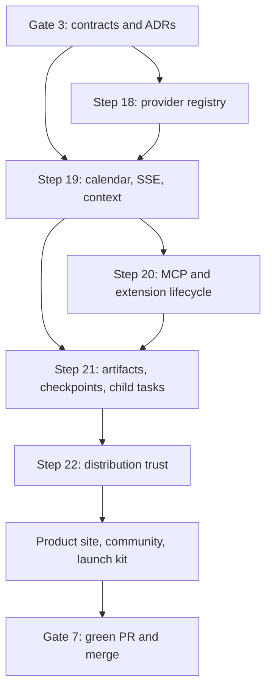

# Restork Production Completion Plan — Steps 18–22

> Status: Source implementation complete; protected release evidence pending
>
> Version: 0.1 | Date: 2026-08-03
>
> Governing specification: [Steps 18–22 Specification](../specs/restork-steps18-22.md)

## 1. Objective and delivery rule

This batch closes the production boundaries recorded at the Steps 12–17 alpha gate. It keeps one
Rust Core, one policy authority, and bounded child execution. It does not add LangGraph, silent
provider fallback, ambient calendar/location access, unrestricted MCP processes, or a second source
of truth beside the local database and approved artifacts.

Every slice follows the same rule:

1. freeze a typed contract and an adversarial fixture;
2. implement the smallest end-to-end path behind an explicit capability state;
3. test cancellation, timeout, replay, recovery, permission denial, and redaction;
4. expose the real state in the bilingual Dashboard and Doctor;
5. retain a rollback point before expanding authority.

“Implemented” means code, migrations, tests, user path, diagnostics, and documentation exist.
“Release-verified” additionally requires protected CI with real signing identities and clean target
machines. Credentials are never generated, committed, or substituted by test identities.

## 2. Dependency graph



## 3. Gate map

| Gate | Required evidence | Rollback point |
|---|---|---|
| 3 — Design | Plan, specification, ADR 0003–0005, threat/permission matrix | Documentation-only commit |
| 4 — Interactive Core | Provider registry; cancellable durable SSE; context preview; native-calendar capability states | Registry/calendar/conversation migrations can be disabled without data loss |
| 5 — Governed execution | Real MCP calls; extension versions/rollback; renderers; journaled file checkpoints; bounded child executor | Disable executable extensions/renderers/children; preserve artifacts |
| 6 — Distribution | Signed-release definitions, updater verification/rollback, clean-machine jobs, SBOM/provenance, site/community assets | Keep prior signed channel and prior updater manifest |
| 7 — Integration | Full Rust/TypeScript/security/docs/e2e gates green; PR reviewed and merged | Revert squash merge; released artifacts remain immutable |

## 4. Step 18 — Provider Registry and multi-model support

### 18A — Registry contract

- Introduce a data-driven `ProviderDefinition` with stable id, protocol, base URL policy, secret
  kind, model-discovery mode, capability flags, request adapter, and documentation link.
- Ship reviewed definitions for DeepSeek, GLM, Kimi, Qwen, Ollama, OpenAI-compatible, and
  OpenRouter. User-defined endpoints remain generic and never inherit a vendor adapter by name.
- Persist only provider configuration and native-secret references; never persist API keys.

### 18B — Transport and capability negotiation

- Remove DeepSeek-only request fields from the shared OpenAI transport.
- Normalize chat-completions responses and streaming usage while allowing reviewed vendor request
  transforms.
- Add model listing where supported and manual model entry where discovery is unavailable.
- Expose one typed reasoning policy (`auto`, `none`, supported effort levels, and an optional token
  budget) and map it only through the selected provider adapter. Unsupported combinations fail
  before save instead of being silently downgraded.
- Freeze provider, endpoint, model, adapter version, capabilities, and reasoning policy in each run
  manifest. Reasoning intensity is configuration metadata; private chain-of-thought is neither
  requested for display nor retained by Restork.

### 18C — Settings and Doctor

- Let users choose a built-in or generic provider, configure endpoint/model, save a credential to
  the native store, select only that provider's supported reasoning levels, test access, and see
  actionable compatibility results.
- Prohibit automatic local-to-cloud or vendor-to-vendor fallback.
- Add bilingual copy, keyboard operation, secret-redacted errors, and provider fixture tests.

Exit gate: all bundled providers pass deterministic request-shape tests; public-network smoke tests
remain opt-in and secret-gated.

## 5. Step 19 — Native calendar, cancellable SSE conversation, and context preview

### 19A — Calendar adapters

- Keep system date/month available without configuration.
- Implement a platform capability boundary: EventKit on macOS, Windows appointment capability, and
  Linux desktop calendar capability when available; retain local read-only ICS as a universal
  fallback.
- Request access only after the user presses Connect, report unsupported/denied/restricted states,
  allow disconnect, and purge cached event data and permission-derived selections.
- Default to time/busy fields. Event title, location, attendees, and notes require an explicit
  detail scope.

### 19B — Durable cancellable turns

- Model a turn as `queued -> preparing -> streaming -> validating -> completed`, with
  `cancel_requested`, `cancelled`, and `failed` terminal paths.
- Persist the turn and sequence-numbered events before returning its operation id.
- Stream replayable SSE with heartbeat, phase, text delta, usage, artifact, warning, and terminal
  events; cancellation uses an authenticated idempotent endpoint and a Rust cancellation token.
- The Dashboard owns one `AbortController`, a visible Stop action, reconnect-from-sequence, an
  accessible waiting animation, and a scrollable transcript that does not jump away from a user's
  reading position.

### 19C — Explicit context preview

- Resolve only user-selected `@` references into typed context candidates.
- Show source, resolved path/origin, data class, estimated tokens/bytes, redactions, tool/network
  implications, and excluded items before send.
- Bind the approved preview hash to the turn; changed or stale context requires a new preview.

Exit gate: disconnect/reconnect/cancel/race/stale-preview tests pass without duplicate model calls or
post-cancel effects; optional calendar access remains truly optional.

## 6. Step 20 — Real MCP execution and extension lifecycle

### 20A — Protocol client

- Implement MCP initialization, protocol negotiation, tool listing, tool calls, structured errors,
  and shutdown for exact-argv stdio. Keep Streamable HTTP manifests quarantined and fail closed
  until the Rust egress/DNS/OAuth boundary is complete; never route remote MCP through browser code.
- Never invoke a shell. Stdio receives a minimal environment, owned process group/job, deadlines,
  input/output caps, and cancellation.

### 20B — Frozen authority and output handling

- Bind every call to the installed package hash, extension version, session tool catalog, schema,
  profile grants, approval, timeout, and data classification.
- Treat tool descriptions and results as untrusted data. They cannot modify policy, install an
  extension, approve an effect, or become evidence without validation.
- Persist redacted audit events and provide a connection test that performs initialization/listing,
  not an arbitrary tool call.

### 20C — Update, rollback, and uninstall

- Store immutable extension versions and active-version pointers.
- Preview manifest, authority, executable, host, secret, schema, license, and hash changes before an
  update. Permission expansion requires fresh approval.
- Support atomic activation, rollback to an installed verified version, disable, and uninstall
  while preserving user-created artifacts and audit records.

Exit gate: malicious-server, process-leak, oversized-output, schema-drift, update-escalation, and
rollback-after-crash suites pass.

## 7. Step 21 — Formal rendering, file checkpoints, and bounded child execution

### 21A — PPTX/PDF pipeline

- Keep `DeckSpec`, evidence validation, and rendering in Rust.
- Render editable macro-free PPTX and CJK-capable PDF through one deterministic local crate; the
  renderer receives no network, process, or secret-store access.
- Validate archive structure, paths, relationship targets, macros/OLE, size/ratio limits,
  citations, overflow diagnostics, fonts, and output hashes.
- Journal output to a temporary sibling, fsync, atomically replace only after approval, and record a
  reproducibility manifest. Cancellation leaves no partial destination.

### 21B — Real file checkpoints

- Snapshot explicit effect roots into a content-addressed application-data store with normalized
  paths, file metadata, hashes, lineage, and a manifest commit marker.
- Preview and perform single-file or full restore with a mandatory pre-restore checkpoint and
  conflict detection.
- Apply retention by count/age/bytes without deleting referenced checkpoints; GC is crash-safe.

### 21C — Sub-agent executor

- Execute immutable `SubtaskSpec` records through the existing supervised worker/provider boundary.
- Enforce source/tool/data/budget subsets, global and parent concurrency caps, cancellation, output
  validation, and no recursive delegation, approvals, durable-memory writes, or direct effects.
- Parent synthesis consumes only validated `SubtaskResult` artifacts and records provenance.

Exit gate: golden deck/report fixtures, killed-renderer recovery, restore conflicts, GC interruption,
child timeout/cancel/escalation, and deterministic parent-synthesis tests pass.

## 8. Step 22 — Signed distribution, updater rollback, and clean-machine acceptance

### 22A — Protected release pipeline

- Build from annotated tags on pinned runners/actions with Cargo/npm locks.
- macOS: Developer ID signing, hardened runtime, notarization, stapling, and Gatekeeper assessment.
- Windows: Authenticode signing of executable/installer and signature verification.
- Linux: signed repository/package metadata and checksummed AppImage/deb/rpm artifacts according to
  the published channel.
- Generate SBOM, checksums, provenance attestations, and immutable release notes.

### 22B — Verified updater and recovery

- Sign updater artifacts with a dedicated offline-controlled Tauri updater key.
- Publish platform/architecture manifests only after all required artifacts verify.
- Stage rollout channels (`alpha`, later `stable`), reject downgrade/replay/wrong-platform/wrong-key
  metadata, retain the previous installer, and expose a user-visible rollback/recovery path.

### 22C — Clean-machine matrix

- Exercise install, first launch, Core readiness, secret save/read, browser/desktop auth, update,
  interrupted update, crash recovery, uninstall with data-preservation choice, Unicode paths, and
  offline launch on fresh macOS, Windows, and Linux runners/VMs.
- Normal PR CI builds unsigned candidates and verifies release configuration. Protected tag jobs
  are the only jobs allowed to claim real signing/notarization.

Exit gate: workflows and unsigned clean-machine gates are reproducible in the repository; the
public signed-release claim remains blocked until the repository owner supplies protected signing
identities and the protected matrix passes.

## 9. Productization and distribution

- Rework separate English and Chinese READMEs around the product promise, one-command developer
  start, downloadable desktop start, configuration, privacy model, proof, roadmap, and contribution.
- Add a responsive project site, bilingual social preview, architecture proof, 30–60 second demo,
  comparison page (`Restork vs Hermes`), Discussions, issue forms, PR template, support/security
  policies, and good-first-issue labels/issues.
- Set homepage and accurate English GitHub Topics: `rust`, `tauri`, `desktop-app`, `mcp`,
  `ai-assistant`, `local-first`, `obsidian`, `knowledge-management`, `research`, `productivity`.
- Prepare platform-specific Chinese and English launch posts for Hacker News, LocalLLaMA, Obsidian,
  V2EX, Zhihu, and Juejin. Publishing under the owner's identity is a separate explicit action.

## 10. Verification commands

```bash
cargo fmt --all -- --check
cargo clippy --workspace --all-targets --all-features -- -D warnings
cargo test --workspace --all-features
npm --prefix dashboard ci
npm --prefix dashboard run lint
npm --prefix dashboard test
npm --prefix dashboard run build
npm --prefix desktop run fmt:check
npm --prefix desktop run clippy
npm --prefix desktop test
python3 scripts/audit_readme.py README.md README.zh-CN.md
python3 -m pytest tests/desktop/test_desktop_release.py tests/release/test_sbom.py
./scripts/scan-public-artifacts.sh
```

Platform release and clean-machine workflows supplement these local gates.

## 11. Adversarial review

- **Could a provider alias silently redirect data?** No: endpoint origin and adapter version are
  shown, frozen, and included in the manifest.
- **Could cancel merely hide the UI while work continues?** No: the operation token propagates to
  transport, tool, worker, renderer, and terminal state; post-cancel effects are rejected.
- **Could context or MCP text grant authority through prompt injection?** No: policy and grants are
  typed outside prompts; outputs are untrusted and effects still cross approval gates.
- **Could an extension update expand permission unnoticed?** No: immutable versions and authority
  diffs require fresh approval before the active pointer changes.
- **Could restore or render destroy user work?** No: explicit roots, pre-restore snapshots,
  conflict checks, journaled writes, and atomic replacement are mandatory.
- **Could release automation overstate trust?** No: unsigned PR candidates and protected signed
  releases have distinct names, jobs, and documentation.
- **Could growth work become spam?** No: repository-owned discovery surfaces are configured, while
  third-party posts are delivered as owner-reviewable launch material.

## 12. Final completion criteria

The batch may merge only when all local and CI gates are green, generated artifacts contain no
private Vault/API data, documentation matches implemented capability states, and the PR has no
unresolved blocking review. Real public signing and third-party publishing remain clearly named
owner-controlled release actions if their credentials/identity are not available during the batch.
