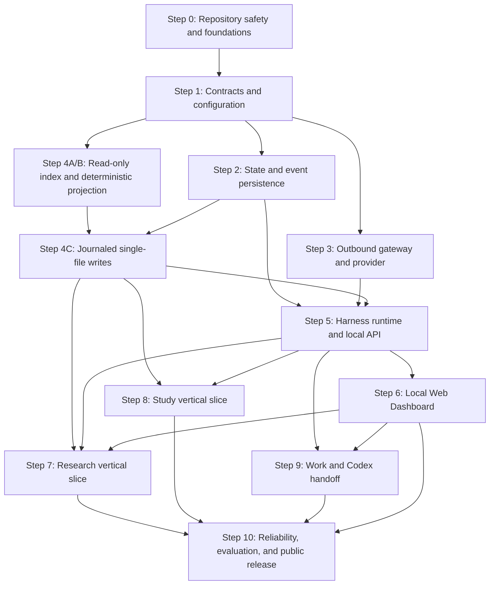

# Restork V1 Implementation Blueprint

> Status: In progress — Step 0 completed locally | Version: 0.4 | Date: 2026-08-01
>
> Objective: Build a public-ready, local-first personal agent for Research, Study, and Work without exposing private runtime data.
>
> Review: independent adversarial architecture pass completed; blocking findings incorporated
> Governing specification: [specs/restork-v1.md](../specs/restork-v1.md)

## 1. Repository preflight

Current public-safe repository facts at plan creation:

- Repository root: `<repo-root>`
- Initial implementation baseline: Step 0 foundation created locally; not yet committed or published
- Private machine paths, accounts, authentication state, vault inventory, and migration incidents are intentionally excluded from this tracked plan.

Execution mode:

- Documentation work is direct-mode until the initial repository baseline exists.
- Implementation milestones should use the branch prefixes proposed below after repository hosting is configured.
- No step may copy the private Obsidian vault or an existing plugin directory wholesale into Git.

## 2. Plan outcome

At V1 completion, the repository will provide:

- a Python 3.12 Restork Core;
- a reimplemented TypeScript local Web Dashboard as the primary UI;
- an optional TypeScript Obsidian context bridge;
- one shared Harness with Research, Study, and Work profiles;
- a persisted explicit state machine with uncertain-effect recovery;
- the official DeepSeek API behind an interface, defaulting to `deepseek-v4-pro` over OpenAI Chat Completions;
- local vault retrieval and a disposable wiki-link graph projection;
- canonical Markdown tasks;
- preview-and-approval writes;
- one outbound gateway for model, Web, GitHub, paper, feed, and future executor traffic;
- local metadata-only observability;
- synthetic fixtures and privacy tests;
- an MIT-licensed open-source-ready release without private runtime data.

## 3. Global invariants

Every step must preserve these invariants:

1. **Markdown truth**: Obsidian Markdown owns durable notes and user tasks.
2. **Operational truth**: SQLite owns run, step, approval, and event state.
3. **Thin UI clients**: the local Web Dashboard and optional Obsidian plugin never own model credentials, run truth, or general shell execution.
4. **Single outbound path**: no Core-initiated or managed-child outbound request bypasses `OutboundGateway`; network connectors receive single-purpose capabilities and future executor processes are network-denied by default.
5. **Code-gated tools**: prompts cannot grant permissions.
6. **Read-only default**: vault writes require policy and single-use approval; Work V1 prepares handoffs but launches no shell, Git mutation, deployment, message, or executor.
7. **No hidden LLM passes**: retries, repair, fallback, and delegation are explicit events.
8. **Public/private separation**: real vaults, profiles, credentials, traces, and indexes stay outside Git.
9. **No framework creep**: LangGraph, graph servers, KAG, Go, and Rust remain outside V1 unless the specification is deliberately revised.
10. **Synthetic CI**: public tests never depend on the owner's files or credentials.

## 4. Dependency graph



## 5. Parallel execution map

| Wave | Steps | Parallelism |
|---|---|---|
| 0 | Step 0 | Serial foundation |
| 1 | Step 1 | Serial contract gate |
| 2 | Step 2, Step 3, and Step 4A/4B | Can run in parallel after Step 1; Step 4C begins after Step 2 approval/intent contracts |
| 3 | Step 5 | Integration gate; serial |
| 4 | Steps 6 and 8 | Can run in parallel after Step 5; Step 7 starts after the Step 6 client contract is available |
| 5 | Steps 7 and 9A | Research integration and Work planning/handoff can proceed in parallel; neither launches code execution |
| 6 | Step 10 | Final integration and release gate |

## 6. Delivery checkpoints

| Checkpoint | Completed steps | User-visible outcome |
|---|---|---|
| Foundation | 0–1 | Public-ready repository skeleton and versioned contract baseline |
| Read-only engine | 2–5 | Local API can run and recover policy-controlled read-only tasks |
| First useful alpha | 6–7 | The local Web Dashboard can launch and inspect a source-backed Research run |
| Knowledge-work beta | 8 | Study workflow and Markdown task integration are usable |
| Controlled work beta | 9 | Work plans and bounded handoff packages are reviewable; Restork does not launch executors |
| V1 release candidate | 10 | Privacy, recovery, evaluation, and release requirements pass |

## 7. Required PR slicing

The numbered steps are delivery milestones, not single pull requests. Each slice below is a separate `codex/...` branch and review. A slice must build from a clean checkout, preserve additive schema compatibility, include its own tests and rollback note, and avoid crossing more than one new trust boundary.

| Milestone | Required review slices |
|---|---|
| 0 | `0A` MIT/public/security docs and ignore policy; `0B` Python Core plus Web Dashboard skeleton, lockfiles, and clean-checkout CI |
| 1 | `1A` domain/event schemas; `1B` external config, secret references, and generated TypeScript schemas |
| 2 | `2A` migrations and transition table; `2B` durable intents, approval lifecycle, snapshot/cursor, and crash recovery |
| 3 | `3A` OutboundGateway and network-policy tests; `3B` provider adapter and model-specific policy |
| 4 | `4A` read-only parser/index; `4B` deterministic link/task projection; `4C` journaled single-file mutation and recovery |
| 5 | `5A` runtime, budgets, and tool policy; `5B` local API/auth/SSE; `5C` CLI and recovery integration |
| 6 | `6A` local Web shell and paired transport/event client; `6B` run/approval views; `6C` Markdown task and generic Radar actions; optional non-blocking `6D` Obsidian bridge |
| 7 | `7A` source/evidence adapters; `7B` research workflow/artifacts/evals; `7C` Dashboard/Radar integration |
| 8 | `8A` diagnostic/path/practice workflow; `8B` review state and evals |
| 9 | `9A` read-only repository context and handoff contract; `9B` imported-result verification; `9C` Dashboard/CLI integration |
| 10 | `10A` automated privacy/recovery/security gates; `10B` release artifacts, docs, and final audit |

Step 1 establishes a versioned baseline; it does not permanently freeze contracts. Later changes are additive by default. A breaking change requires a Spec update, compatibility fixtures, and an explicit migration before dependent work.

## 8. Step specifications

## Step 0 — Repository safety and foundations

### Context brief

This repository is intended for public MIT release. The private legacy Dashboard is product/design reference only: no legacy source, settings, caches, assets, or configuration are imported. Any local credential audit and rotation remains a private prerequisite.

### Goal

Establish a safe, reproducible, public-ready repository before functional implementation begins.

### Dependencies

- None.

### Suggested branch

`codex/restork-foundation`

### Recommended model tier

Strongest available: security and repository boundaries are expensive to correct later.

### Estimated effort

1–2 engineering days.

### Expected files

```text
README.md
LICENSE                       # MIT
SECURITY.md
CONTRIBUTING.md
.gitignore
.editorconfig
.pre-commit-config.yaml
pyproject.toml
uv.lock
dashboard/package.json
dashboard/package-lock.json
dashboard/index.html
dashboard/tsconfig.json
dashboard/vite.config.ts
dashboard/eslint.config.js
dashboard/src/main.ts
dashboard/src/styles.css
dashboard/tests/smoke.test.ts
src/restork/__init__.py
src/restork/cli.py
src/restork/web/                # generated local Dashboard bundle included in wheel
tests/fixtures/synthetic-vault/
tests/fixtures/synthetic-repo/
tests/test_cli.py
tests/test_public_artifact_scan.py
docs/security/threat-model.md
scripts/scan-public-artifacts.sh
.github/workflows/ci.yml
```

### Tasks

1. Add the MIT license and confirm the project name.
2. Create the Python Core and TypeScript local Web Dashboard skeletons without feature logic.
3. Configure `uv`, Python 3.12, Pydantic v2, pytest, ruff, mypy, bandit, wheel metadata, bundled-package-data rules, and the `restork` console entry point.
4. Configure TypeScript formatting, linting, tests, and build output.
5. Add `.gitignore` rules for secrets, `.env`, plugin `data.json`, vault files, SQLite, indexes, logs, caches, artifacts, and local profiles.
6. Create fully synthetic vault and repository fixtures with canary secrets.
7. Add local and CI secret scanning.
8. Add GitHub Actions with least-privilege permissions and no fork-PR secrets.
9. Document the public/private boundary; record credential-audit completion only in an untracked private migration checklist.
10. Import no legacy Dashboard source in any step; implement the new design from approved tokens and information architecture only.

### Verification

```bash
uv sync
uv run pytest
uv run ruff check .
uv run mypy src
uv run restork --help
uv build --no-sources
npm --prefix dashboard ci
npm --prefix dashboard test
npm --prefix dashboard run lint
npm --prefix dashboard run build
git status --short
```

Run the selected secret scanner over both the working tree and Git history.
Run the exact command block in a clean-checkout CI job, not only in the developer checkout.

### Exit criteria

- A clean checkout can run all empty/skeleton tests without private configuration.
- Canary secrets are detected by the scanner.
- No absolute personal path or real vault content is tracked.
- CI permissions are read-only unless a release job explicitly needs more.
- Any credential found during the private migration audit is revoked/rotated before migration; neither its value nor private incident metadata appears in the repository.

### Rollback

Revert the foundation commit. Do not reuse any copied legacy directory; reconstruct from reviewed source files only.

## Step 1 — Contracts and runtime configuration

### Context brief

All later work depends on stable boundaries for tasks, runs, tools, artifacts, approvals, provider calls, data classification, and events. Contract drift is the main source of parallel-work conflicts.

### Goal

Implement a versioned V1 contract baseline and configuration loading without running an agent; preserve additive evolution and compatibility fixtures.

### Dependencies

- Step 0.

### Suggested branch

`codex/restork-contracts`

### Recommended model tier

Strongest available: this is the architectural seam for all workstreams.

### Estimated effort

2–3 engineering days.

### Expected files

```text
src/restork/contracts/task.py
src/restork/contracts/run.py
src/restork/contracts/tool.py
src/restork/contracts/artifact.py
src/restork/contracts/approval.py
src/restork/contracts/event.py
src/restork/contracts/outbound.py
src/restork/config/models.py
src/restork/config/loader.py
src/restork/paths.py
schemas/
tests/contracts/
tests/config/
```

### Tasks

1. Implement the Spec contracts as strict Pydantic models.
2. Version serialized envelopes.
3. Reject unknown fields at security-sensitive boundaries.
4. Define `ModeProfile`, `DataClass`, `RiskClass`, `StopReason`, and state enums.
5. Implement platform-appropriate config, data, and cache directory resolution.
6. Load non-secret configuration from external TOML files.
7. Represent secrets only as references such as `keychain:restork/provider`.
8. Define interfaces for `ModelProvider`, `WorkflowRuntime`, `Tool`, `EventStore`, `KnowledgeStore`, `OutboundGateway`, and the Work handoff exporter/importer.
9. Generate JSON Schemas consumed by the TypeScript client.
10. Add compatibility tests for schema versioning and rejected invalid input.

### Verification

```bash
uv run pytest tests/contracts tests/config
uv run ruff check src tests
uv run mypy src
```

Validate generated JSON Schemas with representative valid and invalid fixtures.

### Exit criteria

- Every boundary object is serializable and versioned.
- Secret values cannot be represented in repository configuration models.
- Python and TypeScript can consume the same event and approval schemas.
- No provider, LangGraph, vault, or UI implementation leaks into the domain layer.
- Future additive contract versions can coexist with the V1 fixtures; breaking changes require a Spec update and migration plan.

### Rollback

Revert the contract commit. If later work has started, make schema changes additive and update the Spec before implementation.

## Step 2 — State machine, event store, and recovery

### Context brief

Restork needs explicit, restart-safe operational state before model and tool execution. SQLite is the local source of truth for runs and events; Markdown must not carry execution state.

### Goal

Implement the persisted transition table, append-only sequenced event store, single-use approvals, durable effect intents, snapshots/cursors, and restart recovery semantics.

### Dependencies

- Step 1.

### Suggested branch

`codex/restork-state-store`

### Recommended model tier

Strongest available: persistence and idempotency failures can duplicate side effects.

### Estimated effort

3–4 engineering days.

### Expected files

```text
src/restork/storage/database.py
src/restork/storage/migrations/
src/restork/storage/runs.py
src/restork/storage/events.py
src/restork/storage/approvals.py
src/restork/storage/transient_blobs.py
src/restork/runtime/state_machine.py
tests/storage/
tests/runtime/test_recovery.py
```

### Tasks

1. Create schema migrations for runs, steps, events, approvals, artifacts, tool calls, and usage.
2. Implement the Spec transition matrix, terminal-state rule, state-version compare-and-swap, and cancel races.
3. Append immutable events with a unique `(run_id, seq)` and implement snapshot-plus-cursor replay.
4. Store durable effect intents with `prepared`, `started`, `committed`, `failed`, and `unknown` outcomes and a per-tool retry contract.
5. Implement approval action digests, canonical scope/resource/policy versions, nonce, expiry, and atomic `approved -> consumed` transition.
6. Implement optimistic concurrency or transaction locking for run and approval updates.
7. Implement cancel, fail, complete, approval-wait, and `user_action_required` recovery.
8. Reconstruct a run from a snapshot and ordered events without persisting message/document bodies.
9. Implement a local encrypted transient-blob interface with OS-key reference, TTL, deletion-on-resolution/expiry, and a hard prohibition on `secret` payloads; SQLite stores only blob IDs and hashes.
10. Model reconciliation interfaces with fakes; defer concrete provider, filesystem, and integrated runtime crash proof to Steps 3B, 4C, and 5C.

### Verification

```bash
uv run pytest tests/storage tests/runtime/test_recovery.py
uv run ruff check src tests
uv run mypy src
```

Run fault-injection tests at every state transition and transaction boundary. Test approval replay, concurrent consumption, expiry, stale policy/resource versions, and restart. Test SSE cursor replay for loss and duplication.

### Exit criteria

- Valid state transitions match the Spec.
- Invalid transitions fail deterministically.
- Approval waits survive a process restart and approval capabilities are single-use.
- A fake effect reconciles to a known outcome or `user_action_required`; no unknown effect is automatically retried.
- Snapshot/cursor replay returns each logical event once in sequence.
- Event records contain metadata only by default.

### Rollback

Revert the step and its migration before real user state exists. After private alpha begins, use forward migrations rather than destructive rollback.

## Step 3 — OutboundGateway and model provider

### Context brief

The system uses the official DeepSeek API and public-source connectors but must not let adapters or tools send arbitrary local context. V1 uses `deepseek-v4-pro` through OpenAI Chat Completions at the exact origin `https://api.deepseek.com`; it does not assume a V4 Pro Responses API. All external networking shares one policy boundary, and hosted tracing/content logging are disabled or replaced by local metadata-only telemetry.

### Goal

Implement `OutboundGateway`, its capability/policy layer, and `DeepSeekChatCompletionsProvider`. No provider, connector, updater, tool, or future executor may make a direct external request.

### Dependencies

- Step 1.

### Suggested branch

`codex/restork-outbound-provider`

### Recommended model tier

Strongest available for policy and redaction; default tier for adapter mechanics.

### Estimated effort

3–5 engineering days.

### Expected files

```text
src/restork/providers/base.py
src/restork/providers/deepseek_chat_completions.py
src/restork/network/gateway.py
src/restork/network/capability.py
src/restork/network/destination_policy.py
src/restork/privacy/classifier.py
src/restork/privacy/redactor.py
src/restork/secrets/store.py
src/restork/observability/usage.py
docs/security/outbound-network.md
tests/providers/
tests/privacy/
```

### Tasks

1. Ship the default non-secret provider profile: base URL `https://api.deepseek.com`, model `deepseek-v4-pro`, protocol OpenAI Chat Completions; reject retired aliases and accidental origin changes.
2. Implement typed streaming Chat Completions, JSON output, and tool-call adaptation behind the gateway; do not depend on a Responses API or beta strict-tool endpoint.
3. Load credentials from the OS keychain or process injection; inject them inside reviewed adapters, never in URLs or logs.
4. Propagate public, personal, confidential, and secret labels from source root/path/field into chunks, summaries, artifacts, URLs, and requests; treat transport credentials as a separate adapter-only class.
5. Implement single-use capabilities bound to destination host, resolved address class, method, redirect policy, maximum bytes, data class, expiry, and nonce.
6. Deny loopback, private, link-local, metadata-service, unsafe redirect, DNS-rebinding, query-credential, and payload-bearing URL cases unless an explicit connector policy requires a narrowly scoped exception.
7. Add pattern redaction for known secrets, identifiers, absolute paths, and configurable terms as defense in depth; fail closed on classification or policy error.
8. Persist only the metadata `OutboundEnvelope`; keep selected payload ephemeral or in an encrypted TTL blob when restart is required.
9. Add scoped approval records for confidential payloads and delete transient blobs on resolution/expiry.
10. Default thinking mode to enabled with effort `high`; permit `max` only through an explicit ModeProfile/budget setting and do not send sampling parameters that are ineffective in thinking mode.
11. Preserve required `reasoning_content` exactly across thinking-mode tool-call turns using the encrypted TTL transient store; never place it in logs/traces and delete it after the run.
12. Treat empty or schema-invalid JSON output as an explicit failed attempt, subject to normal retry budgets; it cannot drive tools or state.
13. Normalize 429/rate-limit and stream interruption behavior and test retry/backoff without hidden calls.
14. Disable hosted content tracing by default and track model, tokens, cost, duration, destination, and status locally without bodies.
15. Enforce an architecture rule that direct HTTP clients, sockets, and provider SDK initialization exist only in the gateway/adapters; future executor processes are network-denied by default.

### Verification

```bash
uv run pytest tests/providers tests/privacy
uv run ruff check src tests
uv run mypy src
```

Run `SEC-NET-001` and `PRIV-LABEL-001`: inspect captured raw bytes and test encoded, chunked, Unicode, archive, derived-summary, redirect, DNS-rebinding, local/private-address, URL-query, and direct-client bypass cases. Provider contract cases cover streaming, thinking on/off, high/max mapping, tool-call `reasoning_content` replay, JSON-empty/schema-invalid responses, 429, and rejection of Responses-only or retired-model configuration.

### Exit criteria

- The fake and `DeepSeekChatCompletionsProvider` pass the same provider-neutral contract tests.
- The shipped provider profile resolves to `deepseek-v4-pro` at the exact official origin and never depends on retired aliases.
- Source-labeled secret data and its tested transformations are always denied.
- Confidential data requires a scoped policy or approval.
- Providers and synthetic connectors have no direct path around `OutboundGateway`.
- Default traces and logs contain no model or tool content.

### Rollback

Disable the real provider adapter and retain the fake. No private data migration is required.

## Step 4 — Vault adapter, local index, Markdown tasks, and graph projection

### Context brief

Obsidian Markdown is the durable source of truth. V1 starts with deterministic local retrieval rather than a vector or graph database. Existing wiki links become a rebuildable local graph projection with provenance.

### Goal

Build read-only vault indexing first, then deterministic task/note previews and a journaled single-file apply/recovery protocol.

### Dependencies

- Step 1 for slices 4A and 4B.
- Step 2 approval and intent contracts for slice 4C.

### Suggested branch

`codex/restork-knowledge-adapter`

### Recommended model tier

Strongest available for note identity and write safety; default tier for index mechanics.

### Estimated effort

4–6 engineering days.

### Expected files

```text
src/restork/knowledge/vault.py
src/restork/knowledge/identity.py
src/restork/knowledge/search.py
src/restork/knowledge/links.py
src/restork/knowledge/graph_projection.py
src/restork/knowledge/write_plan.py
src/restork/knowledge/write_journal.py
src/restork/tasks/markdown.py
src/restork/tasks/inbox.py
tests/knowledge/
tests/tasks/
tests/fixtures/synthetic-vault/
```

### Tasks

1. Resolve separate Obsidian application root and knowledge root settings.
2. Deny `.obsidian`, `.git`, secrets, caches, and unsupported paths by default.
3. Build note/chunk identity from relative path, normalized title/aliases, heading/block anchor, and content hash; handle Unicode normalization and duplicate headings.
4. Implement title, heading, body, and wiki-link local search plus incremental create/change/rename/delete/tombstone handling.
5. Parse only explicit wiki links, tags, containment, tasks, and user-authored metadata into the deterministic graph projection.
6. Retain source location and assertion provenance; do not generate model-inferred edges in this milestone.
7. Implement the canonical grammar: standard checkbox and text, required `#todo` plus lowercase `^restork-...` block ID for Restork-created tasks, and optional `due`, `priority`, `project`, `source`, and `completed` inline fields. Identify legacy tasks by path, normalized text, and context hash, using line number only as a locator; preserve unknown metadata.
8. Implement a Markdown task inbox without creating a second task store.
9. Implement duplicate checks and confirmed backlink suggestions.
10. Implement approval-bound previews covering canonical target, source hash, policy/resource versions, exact action digest, and nonce.
11. Limit V1 to one-file transactions: write a durable intent and preimage, stage on the same filesystem, flush, rename, flush the directory, validate, and commit the journal. Restore the preimage only if the current hash is still the transaction's written hash; otherwise enter `user_action_required`.
12. Rebuild all indexes and the deterministic graph projection from source Markdown; source purge removes chunks, edges, embeddings, caches, artifact bodies/references, transient blobs, and debug captures, leaving only an unlinkable audit tombstone where required.

### Verification

```bash
uv run pytest tests/knowledge tests/tasks
uv run ruff check src tests
uv run mypy src
```

Benchmark search on a generated 1,000-note fixture. Run canonical/bare/completed Todo parsing, `P0`–`P3`, ISO-date, wiki-link project, stable-task-ID, unknown-metadata preservation, path-traversal, symlink-escape/swap, stale-hash, rename/delete, Unicode, duplicate-heading/title, and source-purge tests. For `REL-WRITE-001`, inject failure at journal, stage, flush, rename, validation, recovery, and approval-consumption boundaries.

### Exit criteria

- Search meets the Spec response target on the reference fixture.
- Markdown tasks are discovered and can be previewed without plugin JSON state.
- Graph projection answers related-note queries without a graph server.
- All writes require an unexpired single-use approved action; replay and stale inputs fail safely.
- Every injected single-file crash recovers to the preimage, the exact approved new image, or `user_action_required`; no silent partial state remains.
- Index deletion and rebuild does not alter Markdown.

### Rollback

Delete rebuildable indexes and disable mutation. A committed Markdown transaction may be restored from its preimage only when the postimage hash still matches; otherwise show a recovery diff for explicit user action.

## Step 5 — Harness runtime, local API, and CLI

### Context brief

This is the integration step for contracts, persistence, provider policy, and knowledge tools. The Harness is the product's governance layer; it is not a prompt collection and not LangGraph.

### Goal

Implement a minimal, testable Agent Loop with code-gated tools, budgets, approvals, artifacts, verification, SSE, and CLI control.

### Dependencies

- Steps 2, 3, and 4.

### Suggested branch

`codex/restork-harness`

### Recommended model tier

Strongest available: this step controls high-impact behavior.

### Estimated effort

5–7 engineering days.

### Expected files

```text
src/restork/runtime/runner.py
src/restork/runtime/budget.py
src/restork/runtime/stopping.py
src/restork/runtime/retry.py
src/restork/modes/base.py
src/restork/modes/research.py
src/restork/modes/study.py
src/restork/modes/work.py
src/restork/tools/registry.py
src/restork/tools/policy.py
src/restork/artifacts/verification.py
src/restork/api/app.py
src/restork/api/routes/
src/restork/api/sse.py
src/restork/cli.py
docs/security/local-api.md
tests/runtime/
tests/api/
```

### Tasks

1. Implement mode profiles with non-overlapping default tool policies.
2. Implement the explicit persisted run loop and stop reasons.
3. Enforce step, tool, token, cost, wall-time, retry, and child-task budgets.
4. Validate tools before exposure and immediately before execution; atomically consume approval only after action digest, canonical scope, resource/policy versions, expiry, and nonce still match.
5. Produce sequenced events for model, tool, approval, retry, fallback, verification, unknown effect, and user-action-required transitions.
6. Require artifacts and verification before completion; retrieved notes/webpages/repositories/papers and all model/tool output remain untrusted data that cannot change policy.
7. Implement loopback-only FastAPI endpoints and snapshot/cursor SSE with `Last-Event-ID` replay and de-duplication.
8. Implement interactive single-use pairing, audience/scope/TTL-bound tokens, rotation/revocation, Authorization-header-only transport, strict CORS/content types, browser/plugin Origin checks, separately scoped CLI authentication, and idempotency keys on mutation endpoints.
9. Implement CLI create, inspect, stream, approve, reject, cancel, resume, and resolve-unknown commands.
10. Store sensitive restart payloads only in the encrypted TTL blob store and delete them on completion, rejection, expiry, or source purge; `secret` is never eligible.
11. Add fault injection for provider timeout, tool timeout, invalid schema, restart, cancellation, approval replay/concurrency, and unknown effect reconciliation.
12. Keep LangGraph out while preserving the `WorkflowRuntime` interface.

### Verification

```bash
uv run pytest tests/runtime tests/api
uv run ruff check src tests
uv run mypy src
```

Run a synthetic end-to-end task through create, model call, tool request, single-use approval, verification, completion, cancellation, and restart recovery. Run `SEC-APPROVAL-001`, `SEC-AUTH-001`, `REC-EFFECT-001`, and `REL-EVENT-001`, including hostile Origin, wrong audience, SSE query-token, approval replay, concurrent approve, and crash-before/after-effect cases.

### Exit criteria

- Mode policy prevents a Study run from changing mode or obtaining Work capabilities; handoff creates a separately evaluated child run.
- A model cannot skip required verification and still complete.
- Every retry and fallback is visible in ordered events.
- Every API/SSE endpoint enforces its wire-level authentication contract; hostile web origins and unauthorized local clients fail.
- A paused run survives process restart; cursor reconnect loses and duplicates no logical event.
- An unknown effect is never retried automatically and requires reconciliation or user action.
- No LangGraph import or framework-specific state leaks into contracts.

### Rollback

Disable agent execution and retain read-only API capabilities. Persisted schema remains compatible with Step 2.

## Step 6 — Local Web Dashboard and optional Obsidian bridge

### Context brief

The primary UI is a new local Web Dashboard served by Core. The private legacy Dashboard is reference for approved information architecture and design direction only; no source, settings, cache, backup, credential, or asset is migrated. Restork must work without Obsidian running, while an optional thin plugin may add current-note context and navigation.

### Goal

Deliver the local Web control center for mode selection, runs, approvals, Markdown tasks, and Radar without moving runtime authority into the browser. Add the Obsidian bridge only as a non-blocking integration slice.

### Dependencies

- Step 5.

### Suggested branch

`codex/restork-web-dashboard`

### Recommended model tier

Default tier for implementation; strongest tier for security review and transport contracts.

### Estimated effort

5–7 engineering days for the required Dashboard, plus 1–2 optional days for the thin Obsidian bridge.

### Expected files

```text
dashboard/src/main.tsx
dashboard/src/api/client.ts
dashboard/src/api/events.ts
dashboard/src/views/dashboard.tsx
dashboard/src/views/run-detail.tsx
dashboard/src/views/approval.tsx
dashboard/src/views/tasks.tsx
dashboard/src/views/radar.tsx
dashboard/src/styles/
dashboard/tests/
src/restork/web/static/          # generated release assets
plugin/                          # optional 6D bridge only
```

### Tasks

1. Reimplement the approved warm-forest design direction using new design tokens, components, and original or legally distributable assets; copy no legacy source.
2. Add explicit Research, Study, and Work entrances.
3. Serve the production Dashboard from Core on loopback. Pair each browser profile with an interactive one-time code and rotate scoped session material.
4. Render snapshot/cursor SSE events with event-ID de-duplication without reparsing or rewriting final artifacts.
5. Show active runs, budgets, sources, tools, artifacts, and verification.
6. Implement approval review with the resolved action preview, canonical target, resource/policy versions, expiry, and diff/effect; never expose a secret or persist the body in browser storage.
7. Render Core-backed Markdown aggregation; the browser owns no canonical task state.
8. Split Radar into `My Stars`, `Trending`, and `HN` lanes; all fetches originate in Core connectors through `OutboundGateway`, never directly in the browser.
9. Add `dismiss`, `read later`, `research`, and `make task` actions.
10. Keep provider credentials, durable state, and shell execution out of Dashboard code and browser storage.
11. Build reproducible static assets into the Python wheel and verify that runtime installation needs no Node.js.
12. Optional slice 6D: add an Obsidian plugin limited to `Open Restork`, current-note/selection handoff, note/heading/block navigation, and lightweight notifications. It must not duplicate the Dashboard.

### Verification

```bash
npm --prefix dashboard test
npm --prefix dashboard run lint
npm --prefix dashboard run build
uv run pytest tests/api
uv build --no-sources
```

Run automated transport/auth tests for cursor reconnect, hostile Origin, missing/wrong-audience token, query-token rejection, and approval replay. Install the built wheel in a clean environment and open its bundled Dashboard. Perform manual browser QA only for focus, keyboard navigation, reduced motion, visual streaming, disconnect/reconnect, approval comprehension, and Markdown task presentation. If 6D is built, run its separate build/auth/navigation checks.

### Exit criteria

- Dashboard works when Obsidian and Node.js are not running.
- Dashboard assets, browser storage, and optional plugin contain no provider or GitHub token value.
- Browser/plugin data is non-sensitive and non-canonical.
- Run events and final artifacts render consistently with CLI output.
- Completing a Dashboard task updates its source Markdown.
- The wheel installs and serves only reviewed public static assets; no legacy source, `data.json`, or private asset is packaged.

### Rollback

Disable Dashboard serving and retain Core/Markdown access through CLI. The optional Obsidian bridge can be uninstalled independently and owns no state.

## Step 7 — Research vertical slice

### Context brief

Research is the first useful end-to-end slice because it exercises local knowledge retrieval, public-source collection, provenance, model synthesis, artifact validation, and note preview without requiring repository mutation.

### Goal

Deliver evidence-backed research for a public URL, GitHub repository, or paper.

### Dependencies

- Steps 4, 5, and the Step 6 client/action contract.

### Suggested branch

`codex/restork-research-mode`

### Recommended model tier

Strongest available for workflow and evidence design; default tier for connectors.

### Estimated effort

4–6 engineering days.

### Expected files

```text
src/restork/research/sources.py
src/restork/research/github.py
src/restork/research/papers.py
src/restork/research/evidence.py
src/restork/research/workflow.py
src/restork/artifacts/research.py
tests/research/
tests/evals/research_cases.yaml
```

### Tasks

1. Define source-card and claim-evidence schemas.
2. Implement public URL, GitHub, and paper-source adapters through `OutboundGateway`, using primary sources where possible and enforcing destination/redirect/size/content-type policy.
3. Scan existing notes before external synthesis.
4. Deduplicate sources and distinguish primary from secondary evidence; treat every fetched instruction as untrusted source text.
5. Require every grounded claim to reference evidence.
6. Produce unresolved questions and recommended experiments.
7. Preview append versus create with validated backlinks.
8. Connect the generic Step 6 Radar action contract to the Research workflow.
9. Add a small golden evaluation set for source support and duplicate avoidance.
10. Keep KAG and graph databases out; use local link projection only for related-note context.

### Verification

```bash
uv run pytest tests/research tests/evals
uv run ruff check src tests
uv run mypy src
```

Run one synthetic GitHub case, one synthetic paper case, one duplicate-note case, and one source-conflict case plus redirect/SSRF/prompt-injection cases through a fake outbound transport.

### Exit criteria

- Unsupported claims fail artifact validation or are labeled as inference.
- Primary-source ratio and citation correctness are measurable.
- Research never writes a note before approval.
- Existing related notes are found on the evaluation set.
- A Dashboard feed item can launch a Research run and return a preview.

### Rollback

Disable the Research profile while retaining source adapters for manual CLI testing.

## Step 8 — Study vertical slice

### Context brief

Study mode must create active learning behavior rather than another summarizer. It uses existing notes and research artifacts while keeping temporary progress out of long-term memory.

### Goal

Deliver prerequisite-aware learning paths, practice, error tracking, and review actions.

### Dependencies

- Steps 4 and 5.
- Can run in parallel with Steps 6 and 7 after contracts stabilize.

### Suggested branch

`codex/restork-study-mode`

### Recommended model tier

Default tier with strongest-tier review of pedagogy and state boundaries.

### Estimated effort

3–5 engineering days.

### Expected files

```text
src/restork/study/diagnostic.py
src/restork/study/path.py
src/restork/study/practice.py
src/restork/study/review.py
src/restork/study/workflow.py
src/restork/artifacts/study.py
tests/study/
tests/evals/study_cases.yaml
```

### Tasks

1. Define learning objective, prerequisite, exercise, attempt, error, and review schemas.
2. Use the local link projection to identify explicit prerequisites and related notes.
3. Generate a diagnostic before producing a long path.
4. Produce examples, exercises, and active-recall questions.
5. Record attempts and errors in operational state.
6. Propose durable learning-record updates only after meaningful activity.
7. Avoid converting agent assertions into mastery state.
8. Add evaluation cases for prerequisite accuracy, answer leakage, and repeated-error tracking.

### Verification

```bash
uv run pytest tests/study tests/evals
uv run ruff check src tests
uv run mypy src
```

Run synthetic concept, coding, and mathematical-modeling learning cases.

### Exit criteria

- Every learning path states its target outcome and prerequisites.
- Practice is generated without exposing answers prematurely.
- Incorrect attempts affect the next review action.
- Temporary progress does not enter curated long-term memory automatically.
- Study has no repository-write or unrestricted shell capability.

### Rollback

Disable durable study updates and keep the mode read-only. Existing operational attempts can be deleted without changing the vault.

## Step 9 — Work profile and bounded Codex handoff

### Context brief

Launching a coding executor safely requires OS-enforced filesystem, network, environment, and child-process isolation; a prompt, command allowlist, or approval label is not a sandbox. V1 therefore keeps Restork read-only over work repositories and produces a local handoff package that the user may pass to Codex independently.

### Goal

Deliver repository-aware planning, a privacy-reviewed local handoff package, and read-only verification of an imported result manifest. Restork launches no executor or shell in V1.

### Dependencies

- Step 5 for slices 9A and 9B.
- Step 6 for slice 9C UI integration only.
- Research and Study artifacts may be accepted as inputs but are not hard dependencies.

### Suggested branch

`codex/restork-work-mode`

### Recommended model tier

Strongest available: this step packages potentially private repository context for a separate execution system.

### Estimated effort

3–5 engineering days.

### Expected files

```text
src/restork/work/workspace.py
src/restork/work/instructions.py
src/restork/work/planning.py
src/restork/work/handoff.py
src/restork/work/verification.py
src/restork/tools/repository.py
tests/work/
tests/security/test_workspace_escape.py
```

### Tasks

1. Resolve and freeze one canonical read-only workspace scope per run; reject traversal and symlink escape.
2. Read repository instructions and constraints as untrusted content without copying them into the public repository or allowing them to alter policy.
3. Produce a structured plan with scope, non-goals, target files, constraints, completion criteria, and proposed verification.
4. A Research/Study handoff creates a new Work child run; mode and permissions never upgrade in place.
5. Define a local handoff envelope with task goal, relative workspace identity, allowed context manifest, target files, constraints, non-goals, and verification commands for the external user/executor to consider.
6. Show the exact context manifest, classifications, and redactions before exporting the package. Never include credentials, absolute personal paths, excluded files, or unapproved confidential content.
7. Write the package only to Restork's private artifact directory; do not send it over the network or launch another process.
8. Import an optional result manifest containing claimed commands, exit codes, changed-file hashes, and artifacts. Compare claims with read-only filesystem/Git evidence where possible; label unverifiable claims rather than treating them as completed.
9. Propose Markdown task updates only after the configured evidence criteria pass.
10. Add an architecture test proving no executor/subprocess/shell path exists in Work V1, plus workspace escape, prompt-injection, excluded-file, handoff leakage, stale manifest, and mismatched-result cases.

### Verification

```bash
uv run pytest tests/work tests/security/test_workspace_escape.py
uv run ruff check src tests
uv run mypy src
```

Run all integration tests against a synthetic Git repository in a temporary directory. No test invokes a real shell or external executor through Restork.

### Exit criteria

- Workspace traversal and symlink escape tests fail closed.
- Work has no subprocess, shell, Git mutation, deployment, message, or executor-launch capability.
- Handoff export is local-only and contains only the reviewed context manifest.
- Imported completion claims are checked against read-only evidence where possible and otherwise remain explicitly unverified.
- Failed verification prevents task completion.
- Markdown updates are previews tied to the verified run.

### Rollback

Disable the Work profile. Because Restork never mutates the work repository in V1, no repository rollback is required; private handoff artifacts can be TTL-deleted.

## Step 10 — Reliability, evaluation, and public release candidate

### Context brief

Feature completion is insufficient for release. Restork must prove privacy, recovery, policy enforcement, rendering integrity, and public/private separation with synthetic tests and a controlled private evaluation suite.

### Goal

Produce a release candidate that meets every V1 acceptance scenario and can be published without private data.

### Dependencies

- Steps 6, 7, 8, and 9.

### Suggested branch

`codex/restork-v1-hardening`

### Recommended model tier

Strongest available for adversarial review; default tier for mechanical coverage.

### Estimated effort

4–6 engineering days.

### Expected files

```text
tests/e2e/
tests/privacy/
tests/recovery/
tests/rendering/
tests/evals/
docs/operations.md
docs/privacy.md
docs/dashboard-usage.md
docs/obsidian-bridge.md          # only if optional slice 6D ships
docs/release-checklist.md
.github/workflows/release.yml
CHANGELOG.md
```

### Tasks

1. Implement every release-blocking Spec test ID as an automated CI gate. Manual checks may cover only UI usability, platform integration, and visual inspection and cannot waive a security/privacy invariant.
2. Add source-label leakage checks across raw outbound bytes, URLs, requests, encrypted transient blobs, logs, traces, snapshots, packages, screenshots, diagnostics, and CI artifacts, including encoded/chunked/Unicode/archive/derived variants.
3. Add restart, timeout, cancellation, effect reconciliation, approval replay/expiry/concurrency, policy/resource staleness, and crash-before/after-effect tests.
4. Compare CLI and Dashboard outputs to detect transport/rendering mutation; include the optional plugin only if slice 6D ships.
5. Add golden Research, Study, and planning-only Work/handoff cases.
6. Measure retrieval, citation, cost, latency, retry, and verification metrics.
7. Run a complete repository and Git-history secret scan.
8. Confirm no private path, username, incident metadata, asset, profile, note, database, transient blob, screenshot, diagnostic bundle, or log is included.
9. Document Keychain setup, local directories, DeepSeek provider settings, Dashboard usage, optional plugin installation, backup, and recovery.
10. Produce signed or reproducible release artifacts where practical.
11. Complete a final adversarial architecture and security review.

### Verification

```bash
uv run pytest
uv run ruff check .
uv run mypy src
uv run bandit -r src
npm --prefix dashboard test
npm --prefix dashboard run lint
npm --prefix dashboard run build
uv build --no-sources
git status --short
```

Run the selected secret scanner over the working tree and full Git history. Inspect release artifacts in a clean temporary directory.
Run `SEC-NET-001`, `SEC-APPROVAL-001`, `SEC-AUTH-001`, `PRIV-LABEL-001`, `REC-EFFECT-001`, `REL-WRITE-001`, `REL-EVENT-001`, and `OSS-CLEAN-001` as blocking jobs.

### Exit criteria

- All Spec acceptance scenarios and mandatory automated gate IDs pass.
- Canary leakage count is zero.
- A clean public checkout passes CI with synthetic data only.
- Private alpha configuration provides the owner's complete feature set without a private code fork.
- Release artifacts contain only documented public files.
- Known critical and high adversarial-review findings are resolved.

### Rollback

Do not publish. Keep the release candidate private, disable affected capabilities, and insert remediation steps using the mutation protocol below.

## 9. Verification matrix

| Concern | Unit | Integration | End-to-end |
|---|---:|---:|---:|
| Contract validation | Yes | Yes | Indirect |
| State transitions | Yes | Yes | Yes |
| Restart recovery | Yes | Yes | Yes |
| Provider adaptation | Yes | Yes with fake | Optional live smoke |
| Outbound policy/isolation | Yes | Yes | `SEC-NET-001` |
| Vault identity/search | Yes | Yes | Dashboard-to-Obsidian journey |
| Markdown write recovery | Yes | Yes | `REL-WRITE-001` |
| Tool policy | Yes | Yes | Mode-isolation journey |
| Approval replay/concurrency | Yes | Yes | `SEC-APPROVAL-001` |
| Local API/SSE auth | Yes | Yes | `SEC-AUTH-001` |
| Event cursor recovery | Yes | Yes | `REL-EVENT-001` |
| Research evidence | Yes | Golden cases | Public-source journey |
| Study progression | Yes | Golden cases | Learning journey |
| Work planning/handoff verification | Yes | Synthetic repo | Local handoff journey |
| Rendering integrity | Snapshot | Transport comparison | CLI/Dashboard comparison; optional plugin if shipped |
| Secret leakage | Scanner | Canary | Release-artifact inspection |

## 10. Deferred technology decision gates

These are evaluation tasks, not scheduled implementation steps.

### 10.1 LangGraph gate

The project owner measures 30 eligible runs or four weeks, whichever is longer. Run a one-week isolated spike only when at least two Spec triggers are observed, including at least two confirmed custom-recovery defects or measurable duplication across workflows. Pre-register representative workflows, recovery cases, current runtime LOC/maintenance baseline, and p95. Adoption requires every recovery/security gate to remain green, p95 overhead no greater than 10%, and a measured reduction in duplicated orchestration code or maintenance effort. Record adopt/defer/reject in an ADR; never run both runtimes in production.

### 10.2 KAG and graph-database gate

Do not graphify the entire personal vault. The project owner selects one stable vertical domain and pre-registers 30–50 grounded questions with a held-out subset. Compare `B0` full text, `B1` full text plus explicit links, optional local hybrid `B2`, and graph/KAG `C1` using the same model/profile. Require a 10 percentage-point multi-hop gain or 15% relative weighted-quality gain over `B1`, no more than 2-point regression in single-hop accuracy or citation precision, p95 at most 2x, index/update cost at most 3x, and no new plaintext or unauthorized outbound transfer. Report variance and human maintenance time. A pass authorizes a separate post-V1 RFC only.

### 10.3 Go gate

Run a Go sidecar spike only when profiling identifies the Python component as a top-two latency/throughput bottleneck. Pre-register the workload and require at least 2x p95 throughput or half the measured distribution/operations effort without weakening policy tests. No Go rewrite of research, study, or modeling logic.

### 10.4 Rust gate

Run a Rust indexer spike only when profiling attributes at least 20% of end-to-end local latency or memory to it. Require at least 2x improvement in the registered metric without weakening portability or policy tests. Rust does not replace OS-level sandboxing.

### 10.5 Managed-executor gate

Restork V1 is planning-and-handoff only. A post-V1 executor RFC must define OS-enforced read-only/read-write mounts, network denial/capabilities, environment filtering, resource limits, child-process/interpreter policy, Git hook handling, and platform support. It must pass interpreter, hook, redirection, environment-injection, child-process, symlink-swap, and network-bypass tests. Approval and command allowlists alone do not satisfy this gate.

## 11. Risk register

| Severity | Risk | Preventive control | Detection |
|---|---|---|---|
| Critical | Source-secret or unapproved confidential data leaves through any network path | OutboundGateway, label propagation, fail-closed capabilities | `SEC-NET-001`, `PRIV-LABEL-001` |
| Critical | Approval is replayed or scope changes before apply | Action digest, versions, nonce, CAS consume | `SEC-APPROVAL-001` |
| Critical | Work execution escapes policy | No executor/shell path in V1; post-V1 OS sandbox gate | Architecture and adversarial tests |
| Critical | Credential enters Git | Keychain, ignore rules, pre-commit scan | GitHub Push Protection and history scan |
| High | Side effect repeats after restart | Durable intent, per-tool reconcile, unknown outcome state | `REC-EFFECT-001` |
| High | Model self-report is accepted as truth | Artifact and verification gates | Synthetic mismatch tests |
| High | Plugin bypasses Core | Thin client and loopback API | Source and integration audit |
| High | Workspace path escapes scope | Realpath allowlist and symlink checks | Security property tests |
| High | Hostile local page/API client controls Core | Scoped pairing tokens, strict CORS/Origin/content types | `SEC-AUTH-001` |
| Medium | Three profiles drift | Shared contracts and tool registry | Profile-diff tests |
| Medium | Streaming mutates output | Typed event envelopes | CLI/Dashboard comparison; optional plugin if shipped |
| Medium | Graph projection becomes stale truth | Rebuildable derived index | Rebuild equivalence test |
| Medium | Framework or language creep | Explicit adoption gates | Dependency and architecture review |

## 12. Plan mutation protocol

This plan is expected to evolve. Mutations must be explicit.

### Status values

- `pending`
- `in_progress`
- `blocked`
- `completed`
- `skipped`
- `abandoned`

### Rules

1. Update the governing Spec before changing a product invariant or contract.
2. Record the reason, author, date, affected dependencies, and migration impact.
3. Each milestone must use the predeclared PR slices in Section 7; split a slice again before implementation when it crosses another trust boundary or cannot be independently reviewed and rolled back.
4. An inserted step receives an identifier such as `4A` to preserve references.
5. A step may be reordered only after recalculating the dependency graph.
6. A step may be skipped only when its exit criteria are already satisfied by evidence.
7. A step is blocked only by a named external decision or unavailable dependency.
8. Abandoning a step requires documenting what replaces its promised outcome.
9. Critical review findings insert remediation before dependent work continues.
10. No near-complete budget or schedule is grounds for declaring a step complete.

### Change log template

```text
Date:
Change:
Reason:
Affected steps:
Spec change:
Migration/rollback impact:
Decision owner:
```

## 13. Adversarial review gate

Before each integration checkpoint, a reviewer not responsible for the implementation must test these questions:

1. Can the model skip a required tool or verification and still complete?
2. Can any provider, connector, updater, tool, plugin, raw socket, redirect, or future process bypass `OutboundGateway`?
3. Can old session or agent-authored content enter curated memory as fact?
4. Can hidden fallback or repair calls alter the output?
5. Can a retry duplicate an effect, or can an unknown effect be retried without reconciliation?
6. Can the plugin or browser access Core without pairing and Origin checks?
7. Can a workspace path or approval escape through traversal, symlink swap, alias, replay, concurrency, stale policy, or stale resource version?
8. Do CLI, event store, and plugin show the same final artifact?
9. Does any test, log, screenshot, fixture, cache, or release artifact contain private data?
10. Has a deferred technology been introduced without meeting its adoption gate?

Critical and high findings block the dependent checkpoint.

## 14. Effort and sequencing estimate

The following is an engineering-effort estimate, not a calendar commitment:

| Scope | Estimated effort |
|---|---:|
| Steps 0–5: safe read-only Core | 18–27 days |
| Steps 6–8: Dashboard, Research, Study | 12–18 days, plus 1–2 optional plugin days |
| Step 9: planning-only Work | 3–5 days |
| Step 10: hardening and release | 4–6 days |
| Total V1 | 37–56 mandatory engineering days, plus 1–2 optional plugin days |

For one experienced full-stack developer using agent assistance:

- full-time private alpha: approximately 5–8 weeks;
- part-time development: approximately 10–16 weeks;
- first useful Research slice should arrive before the full V1 release.

Schedule should be updated after Step 1 contracts and Step 5 integration reveal actual complexity.

## 15. Decision status before Step 0 implementation

Closed by the owner:

1. Official DeepSeek API with default `deepseek-v4-pro` over OpenAI Chat Completions.
2. MIT license.
3. Reimplement the local Web Dashboard; import no legacy source. Obsidian remains an optional thin bridge.
4. Canonical Todo syntax: standard checkbox plus `#todo`, explicit inline fields, and stable lowercase `^restork-...` block ID.
5. Core packaging: Python wheel with bundled Dashboard assets, installed using `uv tool install restork`; `restork init` and foreground `restork start`; no default daemon/native wrapper in V1.

Remaining implementation-time decision:

1. Select the local profile-directory format for private skills and interests before profile implementation.

Work V1 planning-and-handoff-only is a closed safety decision. Managed execution requires the post-V1 gate in Section 10.5.

Implementation remains unstarted and requires a separate explicit authorization from the owner.
