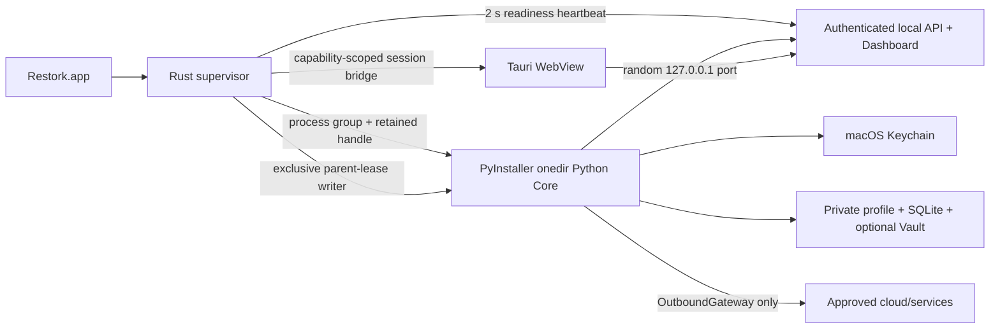

# Restork Step 11 Desktop Shell Specification

> Status: Implemented — macOS internal alpha; protected public release pending credentials | Version: 0.3 | Date: 2026-08-02
>
> Delivery plan: [Step 11 Desktop Shell Plan](../plans/restork-step11-desktop.md)
>
> Governing V1 specification: [Restork V1](restork-v1.md)

## 1. Product contract

The macOS application is a reliable local launcher for the existing Restork product. It is not a
second agent runtime. On launch it shows a native loading surface, starts one packaged Core, waits
for readiness, and displays the same bilingual responsive Dashboard used in a browser. Quitting the
application stops the child Core.

Browser and CLI use remain supported. A user may continue to run `restork serve` without installing
the desktop shell.

## 2. Architecture

### 2.1 Language boundary

Python owns contracts, **agent orchestration**, retrieval, memory, policy, providers, daily context,
and every user-visible agent workflow. Rust owns **process orchestration**: application lifecycle,
one child process group, port selection,
readiness, the window, single-instance behavior, release update integration, and native error
recovery. No Core feature is reimplemented in Rust. Go is not used because it would not remove
Python from the model/research stack and would create a third dependency and IPC boundary.

### 2.2 Packaging boundary

The Core is a PyInstaller `onedir` directory, not `onefile`. Supporting libraries and Dashboard
assets remain beside the executable inside the application resources. This avoids per-launch
archive extraction and makes missing-data failures inspectable. The build always begins from
`uv.lock`; end-user startup never runs `pip`, `uv`, dependency resolution, migration from the source
tree, or a network package download.

The build pipeline owns the compiled Core artifact: `beforeBuildCommand` creates it from the locked
source tree before Tauri bundles it at one fixed resource path. Release Rust code cannot select an
executable from `PATH` or an environment variable. The outer signed and notarized application covers
the nested Core and supporting libraries; checksums and build provenance are published with the
release. Only debug builds permit an explicit absolute Core override.

## 3. Startup protocol

1. Tauri enforces one application instance and shows the bundled loading page.
2. The supervisor binds `127.0.0.1:0`, records the selected port, releases the probe socket, and
   starts Core immediately. A bounded retry handles loss of the port before Core binds it.
3. The supervisor creates a new Core process group plus an anonymous pipe. Rust retains the only
   write end; Core inherits the read end and verifies the parent PID and process-group ownership.
4. The supervisor creates a private temporary directory and passes a random, non-existing bootstrap
   file path through `RESTORK_DESKTOP_BOOTSTRAP_PATH`.
5. Core starts the parent-lease watcher before initializing its stores, then writes a
   schema-versioned bootstrap JSON file atomically
   with mode `0600`. It does not print desktop pairing material to stdout.
6. The supervisor validates owner, permissions, schema, PID, port, and pairing-code shape; reads it
   once; deletes the file and temporary directory; and keeps the code only in process memory.
7. The supervisor polls `GET /v1/readiness` over loopback. That endpoint returns only
   `{"status":"ready","schema":"v1"}` and exposes no data or capability.
8. After readiness the WebView navigates to the exact selected loopback origin.
9. The Dashboard detects the Tauri host and invokes `desktop_session`. On first launch it receives
   the one-time pairing code, pairs through `/v1/pair`, and returns the resulting short-lived token
   to Rust memory. On WebView reload it restores that token without reusing the pairing code.
10. Token rotation remains owned by the existing local API client. Each replacement is copied only
   into native process memory; neither pairing material nor bearer tokens enter a URL, Web Storage,
   disk diagnostics, or the Keychain.
11. If startup fails, the shell terminates the child, removes bootstrap material, and renders a local
   recovery screen. It never falls back to a different executable from `PATH` in a release build.

## 4. Lifecycle and recovery requirements

- The Core is a direct child and process-group leader. Rust retains its live `Child` handle; no
  lookup by process name or stale PID file establishes ownership.
- A metadata-only heartbeat runs every two seconds with 150 ms connect/read/write bounds. The first
  miss records `core_heartbeat_lost`; any later success records `core_heartbeat_recovered`; three
  consecutive misses record `core_heartbeat_failed` and enter native recovery.
- Child exit is checked separately before every heartbeat. Failure clears pairing/session/origin
  state before navigating back to the bundled loader.
- Normal application exit, window close, failed startup, unwind, heartbeat failure, and update
  restart send `TERM` to the retained process group, wait at most one second, then send `KILL` and
  reap the direct child.
- The exclusive parent-lease write descriptor closes in the kernel after Rust crash or `SIGKILL`.
  Core treats EOF as loss of ownership and terminates its process group. Power loss requires no
  process cleanup; user data recovery remains governed by SQLite and write journals.
- The supervisor never kills a process identified only by name or a stale PID file.
- The release app uses the packaged resource path. A development-only environment override may
  select a Core binary and must be ignored by public release builds.
- A failed Core exits to an actionable screen with Retry, Open diagnostics folder, and Quit. Retry
  creates a new port, bootstrap path, and pairing challenge.
- All diagnostics are metadata-only: schema version, timestamp, and a fixed lifecycle event name.
  Pairing material, bearer tokens, API keys, prompts, note bodies, events, locations, and calendar
  entries are forbidden.

## 5. Security and privacy

### 5.1 Tauri capability policy

Two allowlists are generated from the Rust command manifest. The bundled loader may invoke only
status, retry, and quit. The remote capability matches only `http://127.0.0.1:*` and may invoke only
session readback and session storage; Rust then repeats an exact runtime origin, window-label, and
root-path check. Neither surface receives generic shell, filesystem, process, opener, clipboard, or
arbitrary HTTP capability. New windows and external navigation are denied unless separately
reviewed.

### 5.2 Secret boundary

The DeepSeek API key stays behind the existing Core `SecretStore` and macOS Keychain integration.
The Rust shell never reads it. The Dashboard never receives it. Provider checks and model calls
remain Core operations behind `OutboundGateway`.

The desktop bootstrap pairing code is not a long-lived credential. It is single use, expires under
the existing pairing policy, is transferred through an owner-only temporary file and the restricted
session bridge, and is never embedded in a URL. The resulting short-lived bearer token may exist in
Rust and WebView memory solely to support reload and rotation; application quit clears both copies.

### 5.3 User data boundary

PyInstaller does not change runtime data locations. Profile, SQLite state, artifacts, caches, and
the optional external Obsidian Vault remain outside `Restork.app` and outside Git. Updating or
replacing the application must not delete them.

## 6. Dashboard requirements

- The desktop shell reuses the same responsive Dashboard and English/Simplified Chinese switch.
- Supported validation viewports are 390, 768, 1024, 1440, 2048, and 2560 CSS pixels with no
  horizontal document overflow.
- Weather accepts a user-entered city or an explicitly clicked browser/system location request. No
  IP location or launch-time permission prompt is allowed.
- Calendar imports a private local ICS snapshot and filters events using the device IANA time zone,
  matching the local clock.
- Configuration opens in a modal layer so expanding a secondary control does not stretch unrelated
  daily cards or create unexplained grid gaps.
- Long Core/model work continues to use authenticated SSE; the desktop shell adds no polling or
  WebSocket transport for run events. Readiness polling is the only bounded metadata-only poll.

## 7. Updates and macOS distribution

- Internal builds may be ad-hoc signed and are marked as internal alpha.
- Public direct-download builds require Developer ID Application signing, hardened runtime,
  notarization, stapling, and a signed DMG.
- Nested PyInstaller executables and libraries are included before the outer application is signed.
- Updater bundles are signed with a separate Tauri updater key. The public key is compiled into the
  release app; the private key and password exist only in protected release secrets.
- Update checks use HTTPS. Invalid signatures, malformed manifests, downgrade attempts, timeouts,
  and offline state fail safely without preventing normal local use.
- The first update check is delayed ten seconds so optional release networking cannot contend with
  Core readiness, authentication, or first Dashboard data.
- Installation/restart is user-visible; Core is stopped through the normal lifecycle before the app
  restarts into an update.

Required release secrets are documented by name, never by value:

- `APPLE_CERTIFICATE` and `APPLE_CERTIFICATE_PASSWORD`;
- `APPLE_SIGNING_IDENTITY`, `APPLE_ID`, `APPLE_PASSWORD`, and `APPLE_TEAM_ID`;
- `TAURI_SIGNING_PRIVATE_KEY` and `TAURI_SIGNING_PRIVATE_KEY_PASSWORD`;
- `RESTORK_UPDATER_PUBLIC_KEY` and `RESTORK_UPDATER_ENDPOINT`.

## 8. Acceptance tests

### 8.1 Functional

- Launch from Finder with no shell environment and reach the Dashboard.
- Select an occupied default port and still launch on another loopback port.
- Pair automatically without rendering or copying a code.
- Configure/check the provider without the WebView observing the API key.
- Import an ICS file, use a city-name weather configuration, and decline location permission while
  retaining manual city input.
- Quit, relaunch, and retain private data from the platform data directory.

### 8.2 Reliability

- Ten release-build cold launches meet the 2.5-second p95 readiness target. The current local
  ten-launch bundled-app sample reaches authenticated Dashboard session at 791 ms p95; the protected
  release runner remains authoritative for a publishable build.
- Five launch/quit cycles and five injected startup failures leave no child or listener.
- Freezing Core causes exactly the consecutive-heartbeat failure path, bounded group cleanup, and a
  live native retry surface. Killing Rust with `SIGKILL` causes parent-lease EOF and no orphan Core.
- Corrupt/missing bundled Core, malformed bootstrap JSON, wrong bootstrap permissions, readiness
  timeout, and early child exit all reach the recovery screen.
- A second application launch focuses the first instance and starts no second Core.

### 8.3 Release

- Build is reproducible from clean checkout plus locked package managers.
- The frozen Core smoke test runs outside the repository and virtual environment.
- `codesign --verify --deep --strict`, `spctl --assess`, notarization history, and stapler validation
  pass for the public artifact.
- The updater rejects a fixture signed by an untrusted key and accepts the release-key fixture.
- Public-artifact scanning finds no private path, profile, Vault data, API key, pairing code, or
  signing secret.
