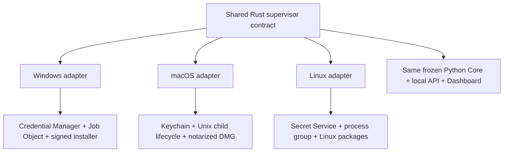

# Restork Step 12 Cross-platform Desktop Specification

> Status: Planned — no Windows or Linux release is supported yet | Version: 0.1 | Date: 2026-08-02
>
> Delivery plan: [Step 12 Cross-platform Desktop Plan](../plans/restork-step12-cross-platform.md)
>
> Base contract: [Step 11 Desktop Shell](restork-step11-desktop.md)

## 1. Product contract

Windows and Linux packages must run the same Restork Core and Dashboard as macOS. They are native
distribution and lifecycle adapters, not new agent implementations. Research, Study, Work, prompts,
memory, retrieval, policy, approvals, and local API behavior remain Python-owned and platform
neutral.

The desktop application must start without a system Python installation, package resolver, shell
configuration, or API key in an environment variable. Browser and CLI workflows remain available.

## 2. Shared and platform-specific boundaries

Shared code owns the state machine, bounded retries, random loopback port, bootstrap schema,
readiness request, exact-origin session bridge, metadata-only diagnostics, and updater states.
Platform code owns only native secret storage, resource/executable validation, user-data paths,
process-tree termination, signing, installation, and updater packaging.

## 3. Security requirements

- **XP-SEC-001:** Desktop provider credentials exist only in macOS Keychain, Windows Credential
  Manager, or Linux Secret Service. A missing native service disables provider setup and does not
  trigger a plaintext fallback.
- **XP-SEC-002:** The Dashboard receives no provider credential. The Tauri session bridge retains
  the Step 11 split capability model and exact runtime origin validation.
- **XP-SEC-003:** Core listens only on an operating-system-resolved loopback address and every data
  route remains authenticated. Readiness remains metadata-only.
- **XP-SEC-004:** Bootstrap material uses the strongest owner-only temporary-file contract available
  on the OS, is schema/PID/port validated, read once, and deleted.
- **XP-SEC-005:** Release builds use only the packaged Core resource and ignore development binary
  overrides and `PATH` lookup.
- **XP-SEC-006:** Updates require the compiled Tauri public key and HTTPS. Signature, downgrade,
  manifest, timeout, and offline failures preserve the currently installed working application.
- **XP-SEC-007:** Logs use fixed event names and non-sensitive platform metadata; prompts, note
  bodies, locations, calendar entries, tokens, pairing codes, and secrets are forbidden.

## 4. Windows requirements

- Initial support target is Windows 11 x86-64.
- Core is a native Windows PyInstaller `onedir` build produced on the release runner.
- The direct Core child is assigned to a Job Object with kill-on-close semantics before normal work
  begins. Quit, crash, failed startup, and update restart leave no child or loopback listener.
- Provider configuration uses Windows Credential Manager through a reviewed native adapter and an
  interactive secret prompt; secret values do not enter command arguments, configuration, or logs.
- Installer and updater artifacts are Authenticode-signed from protected credentials. Install,
  repair, upgrade, and uninstall preserve the external Restork data directory.

## 5. Linux requirements

- Initial support target is x86-64 desktop Linux; the release notes name every validated distro and
  minimum runtime rather than claiming all Linux distributions.
- Core is built natively against the selected compatibility baseline and tested inside every
  supported distro image.
- Provider configuration uses the session's Secret Service. Headless or minimal environments with
  no service receive an explicit unavailable state and may still use credential-free Restork.
- The supervisor owns a separate Core process group and uses bounded graceful then forced cleanup;
  supported kernels also request parent-death termination.
- Packages and updater artifacts include signed update metadata, SHA-256 checksums, SBOM/provenance,
  and an explicit system-library support matrix.

## 6. Data and upgrade compatibility

The logical profile, SQLite, task, memory, and Vault contracts are portable. Default directories
follow each platform's standard per-user data/config locations. Restork must not silently move,
upload, merge, or delete user data. Any schema migration is versioned, backed up first, and remains
readable by the same migration code on all three platforms.

Configuration evolves from the macOS-named `keychain:` reference through a backward-compatible
generic secret-store reference. Existing macOS profiles continue to work without manual edits.

## 7. Acceptance tests

- Install on a clean machine with no Python, Node.js, Rust, `uv`, or shell profile changes.
- Reach the bilingual Dashboard, automatically establish the private session, and pass health checks.
- Store, resolve, rotate, and remove a synthetic provider credential through the native secret store
  without exposing its value to the WebView, process list, environment, logs, SQLite, or package.
- Complete ten cold launches and five quit/failure cycles without an orphan Core or listener.
- Handle spaces, Unicode user names, locked credentials, offline mode, sleep/resume, a second launch,
  and a port race.
- Reject an invalid updater signature and complete a valid upgrade while preserving profile, state,
  Vault selection, calendar, playlist, and memory.
- Pass Dashboard checks at 390, 768, 1024, 1440, 2048, and 2560 CSS pixels with keyboard-only use,
  visible focus, screen-reader names, reduced motion, and no document-level horizontal overflow.
- Public-artifact scanning finds no private path, credential, token, pairing code, bootstrap payload, or
  personal fixture.
