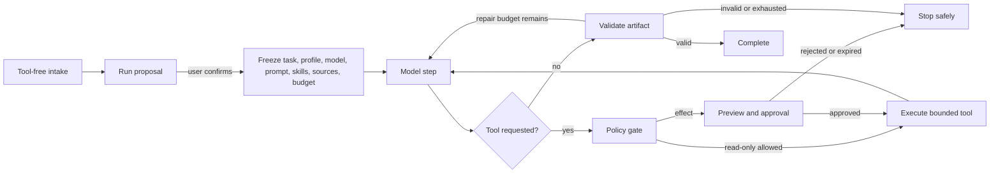
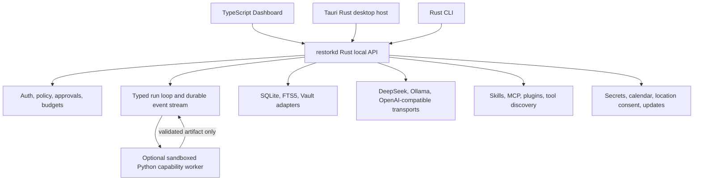

# Restork Rust-first Roadmap Specification — Steps 12–17

> Status: Approved — implementation in progress after Gate 1 and ADR 0002 acceptance
>
> Version: 0.1 | Date: 2026-08-02
>
> Delivery plan: [Steps 12–17 Plan](../plans/restork-steps12-17.md)
>
> Historical baseline: [Restork V1](restork-v1.md), [Step 11 Desktop](restork-step11-desktop.md),
> and [Step 12 Cross-platform Desktop v0.1](restork-step12-cross-platform.md)

## 1. Product direction

Restork remains one local-first, governed Core for Research, Study, and Work. It does not present
three permanent digital employees and does not give several autonomous agents shared ambient
authority. The primary interface becomes a personal conversation workspace backed by explicit
Runs, evidence, approvals, artifacts, and recoverable effects.

The post-V1 runtime is **Rust-first**:

- TypeScript, HTML, and CSS render the bilingual Dashboard in the browser and Tauri WebView.
- Rust owns the long-lived Core, local API, authentication, event stream, storage, policy,
  provider transport, extension runtime, native integration, and desktop lifecycle.
- Python is an optional, short-lived capability worker for ecosystems that materially require it,
  such as model fine-tuning, scientific computing, or a selected presentation renderer.

This direction is governed by
[ADR 0002](../docs/adr/0002-rust-first-core-bounded-agent-loop.md), which supersedes ADR 0001.

## 2. Orchestration decision

### 2.1 One Core, bounded loops

Restork uses a typed, durable run state machine rather than a framework-owned graph. A normal run
may loop, but only inside these explicit phases:

Every loop freezes and enforces:

- maximum model turns, tool calls, retries, tokens, wall time, and output size;
- a data classification and exact source set;
- one provider/model unless the user explicitly configured a compatible fallback;
- a mode and skill set whose permissions can only be narrowed after start;
- cancellation, checkpoint, durable event, and deterministic terminal-state behavior.

There is no unbounded `while true`, silent background continuation, invisible repair pass, or
prompt-controlled permission change.

### 2.2 Not multi-agent by default

Research, Study, and Work are modes and policy boundaries, not independent employees. Conversation
is an intake and explanation surface; structured artifacts remain the source of truth.

Bounded delegation is deferred to Step 17. A parent Run may later create immutable `SubtaskSpec`
records, but each child receives a subset of the parent's sources, tools, data class, and budget.
Children cannot approve effects, share mutable scratch state, write durable memory, or spawn further
children by default. The parent validates child artifacts before synthesis.

### 2.3 No LangGraph dependency

Restork does not adopt LangGraph. LangGraph provides useful durable execution, streaming,
checkpointing, and human-in-the-loop concepts, but adopting its Python or JavaScript runtime would
duplicate Restork's existing event, approval, persistence, and Harness contracts while conflicting
with the Rust-first runtime goal. Restork implements the required primitives as typed Rust state
transitions and keeps its `/v1` protocol framework-neutral.

This is a product-specific rejection, not a claim that LangGraph is unsuitable in general. Its
documented concepts remain useful reference material:
[LangGraph overview](https://docs.langchain.com/oss/javascript/langgraph/overview) and
[persistence](https://docs.langchain.com/oss/python/langgraph/persistence).

## 3. Target architecture

The Rust Core runs as a separately supervised local process so browser, CLI, and desktop use the
same protocol and a Core failure does not have to terminate the WebView. The desktop host owns the
Core process tree and all optional workers. A single domain has exactly one database writer during
migration; Rust and Python never dual-write the same state.

Python workers:

- start only for an explicitly selected capability;
- receive a versioned, size-bounded request over a framed local protocol;
- have no database handle and no secret-store access;
- are network-denied by default and receive an allowlist only when the capability requires it;
- run with a fixed dependency lock, temporary working root, timeout, output cap, and process-tree
  ownership;
- return a schema-validated artifact, never executable model-generated code.

## 4. Step 12 — Rust Runtime Foundation and Cross-platform Desktop

Step 12 re-baselines the previously planned Windows/Linux work after the replacement ADR is
accepted.

Required outcomes:

- establish a Cargo workspace with reusable Core, API, storage, policy, provider, extension, CLI,
  and platform crates without forcing every module into its own crate;
- record cold start, readiness, idle RSS, API p50/p95, SSE dispatch, SQLite pagination, and WebView
  interactive baselines before migration;
- replace the frozen, long-lived Python Core with a native `restorkd` Rust binary through vertical
  slices while preserving `/v1`, fixtures, state transitions, and public privacy gates;
- move SQLite migrations and write ownership to Rust with backups and compatibility fixtures;
- provide native macOS, Windows, and Linux process-tree ownership and native secret storage;
- package one-click desktop installers that need no Python, Node.js, Rust, or package manager on the
  target machine;
- keep optional Python capability packs outside the base startup path.

A feature switches to Rust only after contract, migration, recovery, and parity tests pass. The old
Python route is then removed; production does not keep two implementations selected at runtime.

## 5. Step 13 — Personal Daily Context

Step 13 makes the home screen useful without collecting ambient personal data.

Required outcomes:

- an optional local display name, locale, time zone, week start, and theme;
- semantic time bands (`morning`, `noon`, `afternoon`, `evening`, `late_night`) produced by Core and
  naturally localized by the UI;
- a Roman-numeral clock and calendar that work immediately from system time without an ICS file;
- optional native calendar access only after a user action and OS permission prompt;
- optional local ICS files as a fallback, never a prerequisite;
- optional weather through a manually entered place name, or an explicit one-shot location button;
- no background location collection, IP geolocation, or automatic address-book/calendar upload;
- optional user-imported music preferences and a generic daily recommendation card with a
  reduced-motion-safe rotating-disc treatment.

The display name is not an account identifier and is not sent to a provider unless the user
explicitly includes it in a prompt profile. Calendar defaults expose busy/time only; titles,
attendees, notes, and locations require separate consent.

## 6. Step 14 — Conversation Workspace, Profiles, Models, and Prompts

Step 14 turns conversation into the primary intake without making chat prose authoritative.

Required outcomes:

- global sessions independent of a pre-existing Run, with search, pagination, resume, archive,
  export, and delete;
- a tool-free intake phase that produces a reviewable `RunProposal` before any network, tool, or
  file access;
- a scrollable, cancellable SSE conversation surface with real durable phases and no fake progress;
- artifact cards for research, study, plans, reports, presentations, and approvals;
- `@` references for explicitly selected notes, files, folders, Git diffs, URLs, and artifacts,
  including a context preview, data class, and token estimate;
- SQLite FTS5 session discovery returning match windows plus beginning/end context instead of
  automatically loading whole transcripts;
- configuration Profiles such as Local Private, Research Cloud, Work Restricted, Presentation,
  and Safe Mode; profiles freeze provider, prompt, skills, tool policy, memory namespace, and data
  policy without pretending to be separate employees;
- provider profiles for DeepSeek, local Ollama, and generic OpenAI-compatible endpoints, with
  capability discovery, explicit diagnostics, no silent local-to-cloud fallback, and credentials
  only in native secret storage;
- Prompt Studio with immutable policy, versioned skill prompt, private personal instructions, and
  per-run context layers; user text cannot grant tools or weaken policy;
- a Rust Doctor that tests desktop/Core lifecycle, database, Vault, provider, calendar, MCP,
  packages, and update readiness, then exports a redacted diagnostic bundle;
- local usage and performance views for startup, first event/token, total latency, tokens, estimated
  cost, cache use, retries, tool duration, worker launches, and failures without storing prompt
  bodies in metrics.

The Dashboard information architecture groups Workspace, Activity, Knowledge and Deliverables, and
Settings. Empty, error, waiting, and approval states receive complete English and Simplified Chinese
copy. Security warnings remain precise rather than playful.

## 7. Step 15 — Extension Center and Progressive Tool Discovery

Step 15 adds one Settings entry with separate Skills, MCP Servers, and Plugins tabs.

Definitions:

- a **Skill** is a declarative procedure, prompt reference, schemas, and templates; it cannot grant
  authority;
- an **MCP server** contributes executable tools and therefore adds process, network, file, or
  external-service authority;
- a **Plugin** is a signed or hash-pinned distribution unit that may package declarative Skills,
  MCP definitions, adapters, and declarative UI contributions. It is not an unrestricted second
  runtime.

Required outcomes:

- install from a local directory, reviewed catalog, or pinned repository release/commit;
- show source, version, license, hash/signature, compatibility, required binaries, secrets, data
  destinations, tool scopes, enabled profiles, last use, update diff, and audit events;
- test, enable, disable, update, roll back, and uninstall without deleting generated user artifacts;
- no automatic updates and no trusted default for `curl | sh`, dynamic `npx -y`, shell interpolation,
  or unpinned latest commits;
- stdio MCP uses an exact executable and argument vector; remote MCP uses HTTPS and reviewed OAuth
  where applicable; all tool outputs remain untrusted;
- third-party frontend JavaScript is excluded from the first plugin contract; UI contributions are
  declarative and rendered by Restork;
- progressive `tool_search`, `tool_describe`, and `tool_call` expose only the current session's
  already-granted tools. Approvals and activity feeds unwrap and record the real tool;
- a blank-slate Safe Mode with no third-party extensions;
- an opt-in, pinned, audited Last 30 Days Research Skill with source-specific network grants, no
  browser-cookie import by default, and evidence/date validation;
- post-run Skill improvement proposals generate a diff and tests but never install or activate
  themselves without approval.

The Skill format follows the Agent Skills specification where practical and adds a separate Restork
permission manifest rather than embedding authority in instructions.

## 8. Step 16 — Evidence-backed Reports and Presentations

Step 16 adds deliverables, not a fourth mode.

Required outcomes:

- Daily Report and Weekly Report Skills that use explicitly selected Run events, verified artifacts,
  timestamped tasks, selected Vault notes, calendar intervals, Git summaries, and user assertions;
- every factual entry carries a source reference and verification state; conversation prose and
  memory alone cannot prove completed work;
- Markdown preview, diff, approval, and journaled Vault write;
- a versioned `DeckSpec` containing audience, language, theme, slide roles, claims, citations,
  speaker notes, alt text, and local asset references;
- outline approval before rendering and final approval before writing a PPTX/PDF;
- a local renderer adapter selected through a compatibility and license spike; Rust owns validation,
  orchestration, limits, and export approval even when a Python or Node renderer worker is selected;
- rejection of macros, OLE executables, external relationships, path traversal, ZIP bombs, remote
  asset URLs, unsupported citations, and unsafe templates;
- geometry, overflow, font, contrast, citation, placeholder, and cross-viewer golden-deck checks;
- paginated report, deck, template, and export histories.

No cloud presentation service receives private material by default.

## 9. Step 17 — Recovery, Automation, Evaluation, and Bounded Delegation

Step 17 adds controlled autonomy only after the single-run contract is stable.

Required outcomes:

- optional pre-effect checkpoints with diff preview, single-file or full restore, storage limits,
  retention, and a pre-rollback snapshot;
- restoration coordinates file state, Artifact revision, and conversation/run lineage;
- schedules support one-shot and limited recurrence, pause/resume/edit/run/remove, time zones, DST,
  missed-run policy, and idempotency keys;
- deterministic jobs such as calendar refresh or health checks run in no-model mode;
- model-backed schedules default to creating a draft and never silently write to Vault or deliver
  externally;
- bounded delegation uses immutable `SubtaskSpec`, subset capabilities, per-child budgets, a global
  concurrency cap, structured results, and parent validation;
- no recursive delegation by default and no child approvals or durable-memory writes;
- batch evaluation records model, prompt, skill, tool, policy and fixture versions;
- private trajectories are excluded from public artifacts and fine-tuning exports until the user
  previews and approves a redacted dataset.

## 10. Cross-step security and privacy requirements

- Secrets never enter Dashboard JavaScript, SQLite, logs, command arguments, prompt text, or Git.
- All SQL uses bound parameters; migrations are versioned, transactional, backed up, and tested
  against malformed data.
- External content, Skill text, MCP descriptions/results, calendar text, document contents, and
  model output are untrusted data and cannot modify policy or tool grants.
- Model, prompt, tool, Skill, source, budget, and policy manifests are frozen per Run and recorded by
  identifiers, versions, and hashes.
- Effects require exact previews and single-use, expiring approvals tied to the preview hash.
- Growing histories use server-side keyset pagination or a justified bounded offset query; UI lists
  use virtualization where rendering cost is material.
- Public tests and media use synthetic fixtures. Real names, locations, calendars, playlists,
  conversations, Vault paths, repository paths, keys, and traces stay outside the repository.

## 11. Performance and quality gates

Step 12 registers reference machines and baseline methodology before numeric budgets are frozen.
Every subsequent step reports at least:

- cold and warm time to usable Dashboard;
- Core readiness and idle/active resident memory;
- local API and SQLite p50/p95 under fixed synthetic loads;
- time from durable event creation to visible SSE update;
- time to first model token and non-model overhead separately;
- context/tool-schema tokens, cache behavior, tool latency, retries, and worker startup cost;
- package size and clean-machine first launch for macOS, Windows, and Linux.

A Rust migration is accepted only when behavior and security remain equivalent or improve. A local
optimization must not be presented as reducing remote model generation time. Performance regressions
above the registered tolerance block release.

## 12. Non-goals

- three continuously running digital employees;
- unbounded autonomous loops or background self-improvement;
- LangGraph, LangChain, or a hosted orchestration dependency;
- arbitrary third-party frontend code in the WebView;
- automatic full-Vault, full-calendar, browser-cookie, or location collection;
- silent provider fallback, external delivery, destructive action, or extension permission growth;
- replacing Obsidian Markdown as durable human-readable knowledge and task truth.
