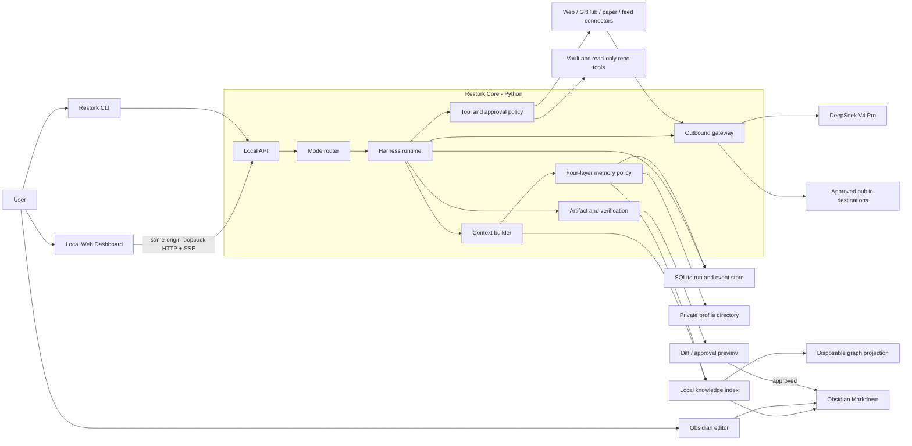

# Restork V1 Product & Technical Specification

> Status: Implemented — V1 | Version: 1.1 | Date: 2026-08-02
>
> Scope: V1 local-first personal agent for Research, Study, and Work
>
> Review: independent adversarial architecture pass completed; blocking findings incorporated
> Implementation blueprint: [plans/restork-v1-implementation.md](../plans/restork-v1-implementation.md)
> Step 6 detail: [specs/restork-step6.md](restork-step6.md)

## 1. Executive summary

Restork is a local-first personal agent for research, study, and work. It uses cloud models for reasoning, but keeps orchestration, permissions, retrieval, task state, approvals, and durable artifacts under the user's local control. Every outbound request initiated by Core, a connector, or any future managed child process is mediated by one outbound policy boundary.

Restork is not three independent agents. It is one shared runtime with three mode profiles:

- **Research** gathers and compares sources, studies papers and open-source projects, and produces evidence-backed research artifacts.
- **Study** builds learning paths, teaches from existing knowledge, generates practice, and tracks review progress.
- **Work** turns goals into tasks, inspects repositories, prepares bounded executor handoffs, and verifies imported results.

The primary interface is a local Web Dashboard served on loopback by the Python Core. It is not a hosted SaaS: the browser is only the local UI. V1 ships no Obsidian plugin and requires none; Core reads a configured Vault directly while Obsidian remains the user's editor. Obsidian Markdown remains the durable human-readable knowledge and task store; SQLite stores operational run state.

## 2. Decision summary

| Decision | V1 choice |
|---|---|
| Code repository | A standalone public-ready `restork` repository |
| Knowledge repository | The user's Obsidian vault, configured at runtime and never vendored into Restork |
| Core language | Python 3.12 |
| Primary UI | Reimplemented local Web Dashboard in TypeScript; no legacy Dashboard source is copied |
| Obsidian integration | Direct configured-Vault access; no V1 plugin shipped or required |
| Agent topology | One Restork Core with Research, Study, and Work profiles |
| Mode routing | Explicit user selection first; inference may recommend but not silently switch |
| Orchestration | Explicit persisted state machine |
| LangGraph | Not a V1 dependency; retained as a replaceable runtime option |
| Harness | Required from the first vertical slice; Restork Core is the harness |
| Outbound network | One `OutboundGateway` for models and every network-enabled connector |
| Durable knowledge | Obsidian Markdown |
| User-facing tasks | Canonical Markdown checkbox grammar with `#todo`, explicit inline fields, and stable `^restork-...` block IDs |
| Core distribution | Python wheel with bundled Dashboard assets; install with `uv tool install restork`, run with `restork serve` |
| Operational state | SQLite outside the repository and vault |
| Memory architecture | Four local layers: ephemeral working context, SQLite episodic memory, Markdown-backed semantic knowledge, and explicit private profiles |
| Conversation cache | In-process sliding window and token budget; no Valkey in single-process V1 |
| Retrieval | Local full-text search, metadata, links, and optional local ranking |
| Vector database | Not required in V1 |
| Graph database / KAG | Not required in V1; build a derived graph projection and evaluate later |
| Model strategy | DeepSeek official API via OpenAI Chat Completions; `deepseek-v4-pro` is the V1 default behind a provider interface |
| Open-source license | MIT |
| Privacy model | Public engine, private runtime profile, mandatory outbound-network policy |
| Write policy | Read-only by default; preview, approve, then apply |
| Work execution | Read-only planning and local handoff in V1; managed execution is post-V1 behind an OS-sandbox gate |
| Daily context | Local clock plus user-configured weather, read-only calendar, and generic daily music recommendation modules |

## 3. Context and current-state constraints

V1 is optimized for a small-to-medium private Obsidian vault with existing wiki links. The private vault is a runtime dependency, not material for this public-ready repository or its documentation.

An existing private Dashboard provides useful product reference material, including note search, activity views, tasks, GitHub feeds, Hacker News, and linting. Restork will reimplement these capabilities from a clean public-safe codebase and will not migrate legacy Dashboard source. The new design must address four architectural gaps:

1. Dashboard tasks and Markdown tasks are separate sources of truth.
2. The GitHub feed is primarily Trending, not the user's starred-project workflow.
3. Multiple local plugin/configuration roots may drift apart.
4. Legacy plugin data may contain credentials; any credential discovered during the private migration audit must be revoked or rotated and must never be migrated into Restork.

Restork must preserve only the approved information architecture and design direction, while reimplementing the Dashboard in this repository and separating UI, runtime state, private data, and secrets.

## 4. Problem statement

The user currently has useful knowledge and several repeatable workflows, but the workflows are fragmented across chat sessions, local repositories, Obsidian notes, Dashboard feeds, and informal checklists.

The system must solve these problems:

- New information arrives faster than it can be evaluated and connected to existing knowledge.
- Learning notes are rich, but there is no consistent path from goal to practice to review.
- Work goals and Markdown tasks are not connected to agent execution and verification.
- Model calls and network-enabled tools can expose private context unless selection and outbound traffic are controlled centrally.
- Agent state, tool use, cost, and completion claims need deterministic governance outside prompts.
- The code should be safe to publish without removing the features used by the owner.

## 5. Goals

### G1. One coherent knowledge-work loop

Support the flow:

```text
capture -> understand -> plan -> act -> verify -> review -> retain
```

### G2. Evidence-backed research

Every externally grounded conclusion must retain source identity, retrieval time, and evidence linkage.

### G3. Active learning rather than passive summarization

Study mode must produce prerequisites, examples, practice, retrieval questions, and review state—not only long notes.

### G4. Controlled work execution

Work mode must separate planning, approval, execution, and verification. A model cannot grant itself additional permissions.

### G5. Local-first privacy with cloud reasoning

Retrieve and filter locally, send only the minimum necessary context, and prevent secret data from entering model calls, tool traffic, URLs, logs, traces, or public Git history.

### G6. Public-ready architecture

All generic functionality can be open sourced. Personalization is injected at runtime through private data, profiles, policies, and credentials.

### G7. Incremental complexity

Adopt LangGraph, a graph database, KAG, Go, or Rust only after a measurable need is demonstrated.

## 6. Non-goals

V1 will not provide:

- Three independent long-lived agent brains or three separate long-term memories.
- Fully autonomous, unattended writes or deployments.
- A generic multi-agent platform or recursive sub-agent hierarchy.
- A distributed queue, microservice architecture, Kubernetes deployment, or Kafka event platform.
- A full project-management replacement.
- A full model-training platform; training is tracked as a workflow and artifact set.
- Local LLM inference as a required runtime.
- A vector database as a baseline dependency.
- A graph database, global ontology, OpenSPG, or production KAG pipeline.
- A native Tauri/Electron desktop wrapper; the V1 local Web Dashboard can be wrapped later without rewriting its UI.
- A native mobile application; the local Dashboard still provides a responsive browser layout.
- Email integration, calendar writes, or OAuth-based account synchronization.

## 7. Product model

### 7.1 Shared Core and mode profiles

All modes share:

- model providers;
- user-approved profile data;
- local knowledge index;
- run and event state;
- cost and token accounting;
- tool runtime;
- privacy and approval policies;
- artifact and verification schemas.
- a policy-controlled four-layer memory service.

Each `ModeProfile` changes only:

- role instructions;
- allowed tools;
- workflow template;
- output contract;
- approval policy;
- default budget.

### 7.2 Research profile

Primary inputs:

- a question;
- a URL;
- a GitHub repository;
- a paper or PDF;
- a feed item;
- an existing note to extend.

Primary outputs:

- source cards;
- claim-evidence matrix;
- comparison or research brief;
- unresolved questions;
- reproduction or experiment plan;
- Obsidian note preview.

Default permissions:

- local reads and public-source retrieval are allowed;
- vault writes require preview and approval;
- shell and repository writes are unavailable; a Work handoff requires a new child run and still does not execute them in V1.

### 7.3 Study profile

Primary inputs:

- a topic or learning objective;
- existing notes;
- a target interview, project, or exam;
- a research artifact.

Primary outputs:

- prerequisite map;
- staged learning path;
- explanations and worked examples;
- practice and active-recall questions;
- error log and review queue;
- learning-record preview.

Default permissions:

- vault reads and safe local computation are allowed;
- no repository mutation or general shell access;
- durable progress updates require approval.

### 7.4 Work profile

Primary inputs:

- a goal;
- an existing Markdown task;
- a repository path;
- a Research or Study artifact.

Primary outputs:

- scoped task specification;
- implementation plan;
- repository-context package;
- bounded Codex handoff package;
- imported change summary and verification report;
- Markdown task updates.

Default permissions:

- repository inspection is read-only;
- V1 does not launch a shell, Codex, Git mutation, deployment, external message, or other executor process;
- the user starts any external coding session independently from the exported handoff package;
- completion requires imported artifacts and independent verification, not model or executor self-report.

Changing from Research or Study to Work always creates a new child run. A run's mode is immutable, permissions never upgrade in place, and the new `TaskSpec`, selected context, and policy are shown again.

## 8. Core user journeys

### UJ-1. Research an open-source project

1. The user selects Research and submits a GitHub URL.
2. Restork searches the vault for related notes and prior decisions.
3. Restork retrieves public primary sources and records source metadata.
4. Restork compares the project against the user's goals and existing stack.
5. Restork produces evidence cards, a conclusion, risks, and next experiments.
6. Restork previews a new or appended note with confirmed backlinks.
7. The user approves, edits, or rejects the write.

### UJ-2. Study a technical or mathematical topic

1. The user selects Study and states the desired outcome.
2. Restork diagnoses prerequisites using existing notes.
3. Restork creates a staged path and a first practice set.
4. The user answers questions or completes a code/math exercise.
5. Restork records errors and proposes the next review—not a false mastery claim.
6. The user approves any durable learning-record update.

### UJ-3. Turn a goal into controlled work

1. The user selects Work and chooses a workspace.
2. Restork reads repository instructions and performs read-only inspection.
3. Restork produces a plan with scope, non-goals, risks, and verification.
4. The user approves the plan or requests changes.
5. Restork exports a bounded, privacy-reviewed handoff package.
6. The user independently starts an external coding session and may import its result manifest.
7. Restork verifies imported evidence and proposes Markdown task and project-note updates.

### UJ-4. Triage the daily radar

1. Dashboard displays separate `My Stars`, `Trending`, `HN`, and later `Papers` lanes.
2. Items are ranked by relevance, novelty, and source quality.
3. The user selects `dismiss`, `read later`, `research`, or `make task`.
4. A `research` action opens UJ-1; a `make task` action produces a Markdown preview.

### UJ-5. Review the daily context

1. Dashboard shows a local Roman-numeral clock without requiring a network request.
2. Restork reads optional weather configuration and a local read-only calendar source.
3. A generic music recommender selects one item from a user-imported private playlist and explains the selection from user-provided metadata or an approved model artifact.
4. Missing providers, location, calendar, playlist, or cover art produce explicit empty states rather than hidden outbound traffic.
5. The Dashboard renders cover art inside a rotating CD treatment, with pause and reduced-motion behavior.
6. Weather location is entered manually or left disabled; Restork does not request browser location or
   infer it from an IP address.

## 9. Functional requirements

### 9.1 Core runtime

- **FR-CORE-001**: The user can explicitly select Research, Study, or Work for every run.
- **FR-CORE-002**: When mode is absent, Restork may recommend a mode with confidence and rationale but cannot silently switch.
- **FR-CORE-003**: Every run is created from a typed `TaskSpec` containing goal, mode, workspace, constraints, completion criteria, and budgets.
- **FR-CORE-004**: Run state follows a persisted state machine.
- **FR-CORE-005**: Every state transition and tool call emits an append-only event.
- **FR-CORE-006**: A run can be cancelled; approval waits can be resumed after process restart.
- **FR-CORE-007**: Step, token, cost, wall-time, retry, and child-task budgets are enforced in code.
- **FR-CORE-008**: Hidden LLM repair passes are prohibited. Any retry or fallback is an explicit event.
- **FR-CORE-009**: A run's mode is immutable. A Research or Study handoff creates a new Work child run with a new policy evaluation and no permission escalation by inheritance.

### 9.2 Model providers

- **FR-MODEL-001**: V1 implements the official DeepSeek API behind a provider-neutral interface using OpenAI Chat Completions at `https://api.deepseek.com` with default model ID `deepseek-v4-pro`.
- **FR-MODEL-002**: The default model ID and exact-origin base URL are shipped as non-secret configuration; the API key is a Keychain reference. Deprecated `deepseek-chat` and `deepseek-reasoner` aliases are not used.
- **FR-MODEL-003**: Internal outputs that drive tools or state use validated structured schemas.
- **FR-MODEL-004**: Provider errors are classified as retryable, terminal, policy-denied, or user-action-required.
- **FR-MODEL-005**: Automatic multi-provider routing is not included in V1.
- **FR-MODEL-006**: V1 does not depend on a Responses API. The adapter implements Chat Completions streaming, JSON output, and tool calls as separate tested capabilities.
- **FR-MODEL-007**: Thinking mode defaults to enabled with `reasoning_effort=high`; `max` is an explicit profile/budget choice. Unsupported sampling controls are not silently treated as effective.
- **FR-MODEL-008**: During thinking-mode tool-call turns, required `reasoning_content` is preserved and replayed exactly through the encrypted TTL transient store, excluded from logs/traces, and deleted at run completion or expiry.
- **FR-MODEL-009**: Empty or schema-invalid JSON output is an explicit failed attempt/retry event and cannot drive state or tools.
- **FR-MODEL-010**: The provider's advertised long context does not relax Restork's local retrieval, minimum-necessary egress, token, cost, or retention budgets.
- **FR-MODEL-011**: `restork provider configure` delegates interactive API-key entry directly to
  macOS Keychain, stores no plaintext credential in configuration, arguments, environment, browser,
  database, event, or log, and creates a missing non-secret configuration with mode `0600`.
- **FR-MODEL-012**: `restork doctor` is local-only by default. Network access requires explicit
  `--connect` or `--smoke`; the former performs one bounded exact-origin `/models` check and the latter
  adds one fixed public completion with thinking disabled and `max_tokens=16`.
- **FR-MODEL-013**: Provider diagnostics expose only status, latency, safe request ID, and token usage.
  They do not expose credentials, authorization headers, model response text, Vault, memory, task,
  Profile, location, calendar, playlist, or daily-context content.

### 9.3 Vault and knowledge

- **FR-KNOW-001**: Restork can search and read an explicitly configured knowledge root.
- **FR-KNOW-002**: Local retrieval occurs before any private content is considered for outbound transfer.
- **FR-KNOW-003**: Search combines titles, headings, Markdown text, aliases when present, and wiki links.
- **FR-KNOW-004**: Restork detects exact and similar note identities before proposing a create.
- **FR-KNOW-005**: Backlinks are suggested only for confirmed notes.
- **FR-KNOW-006**: All writes are deterministic previews with target hash, diff, and approval.
- **FR-KNOW-007**: V1 write transactions modify one Markdown file at a time through a durable journal, same-filesystem staged file, flush, atomic rename, validation, and recoverable preimage.
- **FR-KNOW-008**: Markdown remains the source of truth; local indexes are disposable and rebuildable.
- **FR-KNOW-009**: Rename and delete events remove or tombstone stale chunks and edges. A source-purge operation removes every derived chunk, edge, cache entry, embedding, artifact body/reference, transient payload, and debug capture owned by that source; non-content audit events may retain only an unlinkable opaque tombstone ID, never the path, title, or content hash.
- **FR-KNOW-010**: Note identity and anchors handle Unicode normalization, duplicate headings, block IDs, and path changes without treating line numbers as stable identity.

#### Four-layer memory contract

- **FR-MEM-001**: Layer 0 working context is assembled per run from a token-budgeted sliding window, local retrieval, and an optional encrypted TTL summary; it is not durable knowledge.
- **FR-MEM-002**: Layer 1 episodic memory stores run/session metadata, event references, checkpoints, attempts, and user-approved summaries in SQLite without duplicating source document bodies.
- **FR-MEM-003**: Layer 2 semantic memory is the user's Markdown plus disposable FTS/link indexes. Markdown remains authoritative and every derived record is purgeable by source.
- **FR-MEM-004**: Layer 3 profile memory is explicit user-controlled TOML and optional Markdown stored in the private profile directory. Stable preferences are never inferred into the profile silently.
- **FR-MEM-005**: The user can inspect, correct, export, and delete profile and episodic memory through local authenticated interfaces.
- **FR-MEM-006**: TTL and LRU apply only to transient context, derived caches, downloads, and rebuildable indexes; they cannot evict source notes, approvals, audit events, committed artifacts, or configured preferences.
- **FR-MEM-007**: Every memory record carries provenance, data classification, creation/update time, retention class, and source/run references where applicable.
- **FR-MEM-008**: Context selection is deterministic at the policy boundary, records selected memory IDs and token estimates, and sends only the minimum approved excerpts through `OutboundGateway`.
- **FR-MEM-009**: Secret and credential data are never eligible for memory capture. Confidential memory remains local unless a separate scoped outbound policy explicitly authorizes an excerpt.
- **FR-MEM-010**: V1 uses no Valkey, Memory MCP service, graph database, or mandatory vector store. Interfaces remain replaceable so these can be evaluated later without changing the source-of-truth model.
- **FR-MEM-011**: Optional vector retrieval, including a TurboVec-style adapter, is a derived Layer 2 index and cannot become a truth store or a release dependency without a measured retrieval evaluation.
- **FR-MEM-012**: Temporary Study attempts and model-generated profile suggestions do not become durable semantic or profile memory without an explicit user action.

### 9.4 Tasks

- **FR-TASK-001**: User-facing tasks are canonical Markdown checkboxes.
- **FR-TASK-002**: Dashboard aggregates incomplete Markdown tasks across configured notes.
- **FR-TASK-003**: Quick capture writes to a configured Markdown inbox through preview and approval.
- **FR-TASK-004**: A task can link to a project note, source, due date, priority, and originating run.
- **FR-TASK-005**: Agent run state is not represented as a user task and remains in SQLite.
- **FR-TASK-006**: Plugin settings JSON is not a canonical task store.
- **FR-TASK-007**: Restork-created tasks receive a stable Obsidian block ID. Existing tasks use relative path, normalized text, and surrounding-context hash; a line number is only a current locator.
- **FR-TASK-008**: Applying a stale task preview is rejected and requires a newly generated diff and approval.

#### Canonical Todo syntax

```markdown
- [ ] 实现本地 Dashboard #todo [due:: 2026-08-15] [priority:: P1] [project:: [[Restork]]] [source:: restork:run/01k...] ^restork-01k...
```

Rules:

- the standard Markdown checkbox and task text are required;
- Restork-created tasks include `#todo` and a lowercase stable Obsidian block ID;
- optional inline fields are `due` (`YYYY-MM-DD`), `priority` (`P0`–`P3`), `project` (prefer an Obsidian wiki link), and `source` (local run ID);
- completion changes `[ ]` to `[x]` and may add `[completed:: YYYY-MM-DD]`;
- the fields are Dataview-compatible but Restork parses them itself and does not require Dataview or Obsidian Tasks;
- existing bare Markdown checkboxes remain readable; Restork preserves unknown metadata and adds a stable ID only through an approved write;
- recurrence and dependencies are deferred until real usage establishes their grammar.

### 9.5 Tools and approvals

- **FR-TOOL-001**: Every tool has a typed input schema, output schema, risk class, timeout, and owning capability.
- **FR-TOOL-002**: Mode and run phase determine the tool allowlist.
- **FR-TOOL-003**: Tool availability is code-gated, not enforced only by prompts.
- **FR-TOOL-004**: Tool results contain status, summary, artifacts, evidence, and structured errors.
- **FR-TOOL-005**: Vault writes require explicit policy decisions and single-use approval. Shell, repository mutation, deployment, external messages, production access, and launching external executors are unavailable in V1.
- **FR-TOOL-006**: Approved input, canonical target, source/resource versions, policy version, and action digest are revalidated immediately before execution.
- **FR-TOOL-007**: A child task cannot inherit a higher permission than its parent.
- **FR-TOOL-008**: Every outbound request initiated by Core or a future managed child process—including model, Web, GitHub, paper, feed, and future executor traffic—must pass through `OutboundGateway`.
- **FR-TOOL-009**: Network-capable connectors receive a short-lived, single-purpose capability bound to destination, method, redirect policy, size budget, data class, expiry, and nonce. Query-embedded credentials and unapproved payload-bearing URLs are denied.
- **FR-TOOL-010**: Retrieved Markdown, webpages, repository files, papers, tool output, and model output are untrusted data and cannot alter tool, network, approval, or data policies.

### 9.6 Artifacts and verification

- **FR-ART-001**: Research conclusions retain source references and retrieved-at timestamps.
- **FR-ART-002**: A Work result manifest may retain imported commands, exit status, produced-file hashes, and verification results, but Restork does not execute those commands in V1.
- **FR-ART-003**: A model cannot mark a run complete if required artifacts or validations are missing.
- **FR-ART-004**: Draft artifacts remain local and do not become long-term knowledge automatically.

### 9.7 Dashboard and CLI

- **FR-UI-001**: A reimplemented TypeScript local Web Dashboard is the primary V1 interface, served by Core on loopback and usable without Obsidian running.
- **FR-UI-002**: Dashboard shows active runs, approval requests, Markdown tasks, and radar items.
- **FR-UI-003**: Run detail shows state, events, sources, tool use, cost, artifacts, and verification.
- **FR-UI-004**: V1 ships no Obsidian plugin. Any post-V1 bridge must remain limited to current note/selection, quick mode actions, approval notification, and note/heading/block navigation; it must not hold model credentials, own run state, duplicate Dashboard features, or execute general shell commands.
- **FR-UI-005**: CLI and Dashboard use the same local API and contracts.
- **FR-UI-006**: Streaming delivery must not mutate the structured final artifact.
- **FR-UI-007**: The Core wheel includes the production Dashboard static assets; end users do not need Node.js at runtime.
- **FR-UI-008**: Dashboard includes an accessible Roman-numeral analog clock in the approved old-print/typewriter visual language and honors `prefers-reduced-motion`.
- **FR-UI-009**: Weather is optional, location/provider configuration is private, responses are TTL-cached, and every fetch originates in Core through `OutboundGateway`.
- **FR-UI-010**: Calendar V1 reads local ICS data only. It performs no calendar write, account login, or browser-side file access.
- **FR-UI-011**: Daily music is genre-neutral public functionality driven by a user-imported private playlist/profile. Genre and locale preferences remain private configuration, not repository defaults.
- **FR-UI-012**: Album art is optional and never bundled from a copyrighted catalog. The rotating-CD presentation supports pause, a static fallback, lazy loading, and safe missing-image behavior.
- **FR-UI-013**: The repository offers separate, selectable English and Simplified Chinese READMEs with localized GitHub-safe project-native SVGs plus an HD product demonstration GIF generated only from synthetic public data.
- **FR-UI-014**: Dashboard detects the browser locale, defaults non-Chinese locales to English, and exposes an explicit English/Chinese switch. Only the literal non-sensitive locale preference may be persisted in Web Storage; no canonical or private state may be persisted there.
- **FR-UI-015**: Dashboard follows run events through header-authenticated `fetch` SSE with incremental
  UTF-8 decoding, comment heartbeats, `Last-Event-ID` reconnect, event-ID de-duplication, and terminal
  closure. Tokens never enter the SSE URL; polling and WebSocket are not required.
- **FR-UI-016**: Long-running actions show accessible bounded-context/source/synthesis/validation phases
  in the approved visual language without fabricated percentages or streamed private reasoning.
- **FR-UI-017**: Weather is off by default and accepts only explicit manual label/latitude/longitude
  configuration. Dashboard does not call geolocation or IP-location services; disabling weather clears
  provider and location.
- **FR-UI-018**: The wide Overview uses a balanced two-by-two content matrix and collapses without
  horizontal overflow on narrow screens.
- **FR-UI-019**: The bilingual Overview exposes a discoverable Model access card with the exact secure
  terminal setup command, redacted local provider status, explicit connection/smoke actions, complete
  waiting/success/failure states, and no API-key or password field.
- **FR-UI-020**: Short provider diagnostics use one bounded authenticated POST. SSE remains reserved
  for long-running Core events; diagnostics require neither polling nor WebSocket.

## 10. Knowledge indexing and graph readiness

### 10.1 V1 position

V1 targets vaults that can be served by local full-text retrieval plus explicit Markdown relationships and therefore does not require Neo4j, OpenSPG, a graph service, or KAG.

Obsidian wiki links already form a lightweight graph. Restork will convert this into a disposable **graph projection**, not a second source of truth.

### 10.2 V1 graph projection

Implemented V1 records:

- `Note`: stable ID, relative path, title, content hash, classification;
- `Chunk`: stable ID, note ID, heading/block anchor, offsets, text hash;
- `Source`: stable ID, source URI or relative path, captured-at, content hash;
- `Task` and `Artifact`: links to their source note/run without duplicating their bodies;
- `Relation`: source ID, predicate, target ID, evidence location, assertion kind, and provenance.

Implemented V1 relation types are deterministic: `CONTAINS`, `LINKS_TO`, `TAGGED_WITH`, `DERIVED_FROM`, and `CREATED_BY_RUN`.

Typed entities such as `Concept`, `Project`, `Paper`, and `Repository`, plus semantic relations such as `PREREQUISITE_OF` or `EVIDENCE_FOR`, are reserved for a later evaluated layer. They are not materialized by the baseline index.

Rules:

- Step 4 projects only explicit wiki links, tags, containment, tasks, and user-authored metadata.
- Any later model-inferred relation is a deletable artifact with source location, extractor/model version, confidence, and `inferred` status; it is not part of the baseline index or Markdown truth.
- The projection must be rebuildable from Markdown and operational records.
- Rename, delete, and source-purge operations must not leave ghost nodes or relations.
- SQLite tables or an in-process graph representation are sufficient for V1.

### 10.3 KAG adoption gate

KAG is designed for logical reasoning and factual question answering over professional-domain knowledge bases, not simply for visualizing note links. A graph database alone does not provide KAG.

A KAG or graph-database pilot may begin only when at least two conditions hold:

- a vertical domain has a stable ontology and typed relations;
- sampled user questions frequently require multi-hop or rule-based reasoning;
- the corpus or external domain collection has outgrown simple retrieval;
- entity ambiguity and relation retrieval are measured failure modes;
- evidence-chain or compliance reasoning is a primary product need.

Pilot procedure:

1. The project owner selects one bounded, stable, evidence-heavy vertical domain.
2. Pre-register 30–50 grounded multi-hop questions, with a held-out subset not used during graph/schema tuning.
3. Compare full-text retrieval (`B0`), full-text plus explicit link expansion (`B1`), optional local hybrid retrieval (`B2`), and the graph/KAG candidate (`C1`) on the same data split and model profile.
4. Measure grounded-answer accuracy, citation correctness, unsupported-claim rate, p95 latency, build/update cost, index size, human correction time, and outbound bytes.
5. Adopt only if repeated runs show at least a 10 percentage-point multi-hop accuracy gain or 15% relative weighted-quality gain over `B1`; single-hop accuracy and citation precision each regress no more than 2 points; p95 latency is at most 2x; index size and update time are at most 3x; and no new unauthorized or plaintext outbound transfer is introduced.
6. Record the dataset version, holdout, model, prompts, variance, maintenance estimate, and decision in an ADR. A passing experiment authorizes a separate post-V1 RFC, not production adoption in the evaluation change.

The OpenSPG KAG framework itself targets logical-form-guided retrieval and reasoning for professional-domain knowledge bases: <https://github.com/OpenSPG/KAG>.

## 11. Architecture



## 12. Component boundaries

### 12.1 Local Web Dashboard

Responsibilities:

- presentation;
- English and Simplified Chinese presentation with an explicit locale switch;
- mode selection;
- task and radar views;
- run event rendering;
- approval interaction;
- source, cost, artifact, and verification inspection;
- opening Obsidian links through safe deep links.

The Dashboard is rebuilt as public-safe TypeScript source and production static assets. It is served by Core on loopback, works when Obsidian is closed, and contains no provider credential or canonical state.

### 12.2 Obsidian interoperability

V1 ships no Obsidian plugin. Obsidian remains the editor while Core reads the configured Vault and
serves the Dashboard independently. A future bridge may be considered only as a post-V1 thin client
with these bounded responsibilities:

- send the current note, heading, block, or selection reference to a new Restork run;
- expose small commands such as `Research current note`, `Study selection`, and `Open Restork`;
- show lightweight approval/run notifications;
- opening notes and source links.

Prohibited responsibilities:

- storing model keys;
- direct cloud-model calls;
- general shell execution;
- owning run state;
- duplicating the full Dashboard;
- bypassing Core write policies.

### 12.3 Local API

Responsibilities:

- loopback authentication;
- request validation;
- run lifecycle endpoints;
- SSE event stream;
- approval and cancellation endpoints;
- health and capability reporting.

### 12.4 Harness runtime

Responsibilities:

- task initialization;
- state transitions;
- context and tool selection;
- budget and stop-condition enforcement;
- retry classification;
- explicit fallback events;
- artifact completion checks.

### 12.5 Outbound gateway

Responsibilities:

- source/path/field classification propagation;
- minimal-context selection and secondary secret/identifier scanning;
- destination, method, resolved-IP, redirect, size, and data-class policy;
- model-provider policy and credential injection;
- SSRF, local/private/link-local address, DNS rebinding, unsafe redirect, and URL-payload rejection;
- single-use network capabilities and outbound decision records;
- egress preview for private content.

No model-provider adapter, connector, tool, updater, or future executor may initiate external network traffic outside this component. Connectors receive the gateway client rather than a raw HTTP client. Future executor processes are network-denied by default at the OS boundary.

### 12.6 Knowledge adapter

Responsibilities:

- vault path resolution;
- note identity;
- local retrieval;
- wiki-link graph projection;
- duplicate and backlink analysis;
- deterministic write preview and validation.

### 12.7 Memory and daily-context services

Responsibilities:

- assemble a bounded working context from explicit sources;
- manage inspectable episodic summaries and retention classes;
- read user-authored private profiles without copying them into Git;
- expose purge, export, and correction operations;
- parse local ICS and imported playlist files;
- fetch optional weather and cover art only through scoped outbound capabilities;
- produce deterministic empty states when private configuration is absent.

These services do not own Markdown truth, infer permanent preferences silently, or add a second network path. Valkey and Memory MCP are not V1 runtime dependencies.

### 12.8 Core packaging

The V1 private-alpha and open-source package is a Python wheel named `restork`, installed as an isolated CLI tool:

```bash
uv tool install restork
restork serve
```

`restork serve` runs Core in the foreground on loopback and serves the local Dashboard. The wheel contains the prebuilt Dashboard static files, so Node.js is a build-time dependency only. Configuration, data, Keychain references, indexes, and artifacts remain outside the wheel and Git checkout.

V1 does not install an always-running daemon by default and does not ship a Tauri/Electron wrapper. After the foreground lifecycle is stable, an optional `restork service install` may register a platform service; a native desktop wrapper can later reuse the same Dashboard without changing Core contracts.

## 13. Data ownership

| Data | Source of truth | Public repository? | Cloud eligible? |
|---|---|---:|---:|
| Durable notes | Obsidian Markdown | No | Selected excerpts by policy |
| User tasks | Obsidian Markdown | No | Selected task text by policy |
| Run and step state | Local SQLite | No | No |
| Events and approvals | Local SQLite | No | No |
| Sensitive transient payloads | Encrypted local blob store with TTL | No | No |
| Working context window | In-process plus encrypted TTL summary when required | No | Selected excerpts by policy |
| Episodic memory | Local SQLite metadata and user-approved summaries | No | Selected excerpts by policy |
| Knowledge index | Local rebuildable data | No | No |
| Graph projection | Local rebuildable data | No | No |
| API credentials | OS keychain | No | Exact-origin adapter authentication only |
| Personal profile and skills | External private profile directory | No | Selected by policy |
| Daily context configuration | External private profile directory | No | Weather fields selected by policy |
| Weather and cover cache | Local TTL cache | No | Provider response only |
| Calendar and playlist source | User-selected local files | No | No by default |
| Generic profiles and schemas | Restork repository | Yes | Yes |
| Test knowledge | Synthetic fixtures | Yes | Yes |

## 14. Core domain contracts

### 14.1 TaskSpec

Required fields:

- `task_id`
- `parent_task_id` when handed off from another mode
- `mode`
- `goal`
- `workspace_scope`
- `constraints`
- `completion_criteria`
- `data_policy`
- `tool_policy`
- `budgets`
- `created_at`

### 14.2 RunState

Allowed top-level states:

| From | Allowed next states |
|---|---|
| `created` | `planning`, `cancelled` |
| `planning` | `running`, `failed`, `cancelled` |
| `running` | `awaiting_approval`, `user_action_required`, `verifying`, `failed`, `cancelled` |
| `awaiting_approval` | `running`, `failed`, `cancelled` |
| `user_action_required` | `running`, `failed`, `cancelled` |
| `verifying` | `running`, `user_action_required`, `completed`, `failed`, `cancelled` |
| `completed`, `failed`, `cancelled` | none |

Every transition uses compare-and-swap on a run version and records previous state, next state, reason, actor, timestamp, and related artifact or approval IDs. Terminal states cannot reopen. Cancellation is a request until any active tool reaches a known outcome; a tool with an uncertain external effect moves the run to `user_action_required`, not directly to `cancelled`.

Every side-effecting tool call has a durable intent and one of these phases: `prepared`, `started`, `committed`, `failed`, or `unknown`. A retry contract is declared per tool:

- pure/read-only calls may retry within budget;
- idempotent external calls use an external idempotency key and reconcile before retry;
- local single-file writes reconcile against the journal and content hashes;
- an effect that cannot be queried after a crash becomes `unknown` and is never retried automatically.

### 14.3 ToolResult

Required fields:

- `status`
- `summary`
- `artifacts`
- `evidence`
- `error`
- `retryable`
- `metrics`

### 14.4 Artifact

Required fields:

- `artifact_id`
- `kind`
- `run_id`
- `content_ref`
- `source_refs`
- `validation_status`
- `sensitivity`
- `created_at`

### 14.5 ApprovalRequest

Required fields:

- `approval_id`
- `run_id`
- `action_kind`
- `risk_class`
- `human_summary`
- `action_digest`
- `canonical_scope`
- `resource_versions`
- `policy_version`
- `idempotency_key`
- `preview_ref`
- `nonce`
- `expires_at`
- `decision`
- `decided_by`
- `decided_at`
- `consumed_at`

Decision timestamps/actors are nullable while pending, and `consumed_at` is nullable until use. The canonical action digest covers the exact input hash, destination/target, workspace identity, resource versions, policy version, and nonce. Approval is a single-use capability: execution atomically compare-and-swaps `approved` to `consumed`. Expiry, replay, concurrent consumption, path or symlink changes, resource changes, and policy changes invalidate it and require a fresh preview.

Persisted approvals contain metadata and hashes, not sensitive bodies. A private preview that must survive restart is held in an encrypted local transient blob with a TTL and deletion-on-resolution. `secret` and `credential` data are never eligible for that blob or for an action payload.

### 14.6 OutboundEnvelope

Required fields:

- `destination`
- `resolved_address_class`
- `method`
- `purpose`
- `source_refs`
- `payload_hash`
- `classification`
- `redaction_summary`
- `policy_version`
- `policy_decision`
- `capability_id`
- `approval_ref`

Provider and model profile are optional typed extensions for model calls. The actual selected content is ephemeral and is never written into the envelope row, events, or logs. Classification is propagated from source/path/field labels; pattern scanning and redaction are defense in depth rather than the primary classifier.

### 14.7 RunEvent

Every event has a unique `event_id`, `run_id`, strictly increasing per-run `seq`, schema version, timestamp, kind, and metadata payload. `(run_id, seq)` is unique. Clients reconnect with `Last-Event-ID` or an explicit cursor; the API returns a state snapshot plus events after its cursor, and clients de-duplicate by event ID. Compaction may remove old event bodies only after a durable snapshot records the covered sequence.

## 15. Local API outline

The exact wire schema is versioned under `/v1`.

| Method | Endpoint | Purpose |
|---|---|---|
| `POST` | `/v1/runs` | Create a run from a TaskSpec |
| `GET` | `/v1/runs/{run_id}` | Read current state and summary |
| `GET` | `/v1/runs/{run_id}/events` | Stream ordered, cursor-resumable SSE events |
| `POST` | `/v1/runs/{run_id}/cancel` | Cancel a run |
| `POST` | `/v1/approvals/{approval_id}` | Approve or reject the immutable action digest |
| `POST` | `/v1/approvals/{approval_id}/revision` | Reject the old digest and request a newly previewed action |
| `GET` | `/v1/tasks` | Aggregate Markdown tasks |
| `POST` | `/v1/tasks/preview` | Preview a Markdown task change |
| `GET` | `/v1/radar` | Read ranked feed items |
| `POST` | `/v1/radar/{item_id}/action` | Dismiss, save, research, or create task |
| `GET` | `/v1/capabilities` | Report configured modes, providers, and tools |
| `GET` | `/v1/health` | Local health and readiness |
| `GET` | `/v1/memory` | Inspect memory layers, retention, and provenance metadata |
| `POST` | `/v1/memory/context` | Build a bounded policy-reviewed context selection |
| `DELETE` | `/v1/memory/{memory_id}` | Delete an eligible episodic/profile record or purge a derived source |
| `GET` | `/v1/daily-context` | Read clock-independent weather, calendar, and daily music view data |
| `GET` | `/v1/providers/deepseek` | Read redacted local provider/configuration status |
| `POST` | `/v1/providers/deepseek/diagnostics` | Explicitly run a bounded connection or fixed public smoke check |

Mutation endpoints require a client-generated idempotency key. Repeating an approval decision returns the existing decision and cannot consume or execute the action twice; action consumption occurs separately and atomically at apply time.

SSE event types include:

- `run.created`
- `run.state_changed`
- `model.started`
- `model.completed`
- `tool.requested`
- `tool.started`
- `tool.completed`
- `approval.requested`
- `approval.resolved`
- `artifact.created`
- `verification.completed`
- `budget.updated`
- `run.completed`
- `run.failed`
- `run.cancelled`
- `run.user_action_required`
- `tool.outcome_unknown`

## 16. Privacy and open-source specification

### 16.1 Public/private boundary

The public repository contains all generic functionality. The private runtime contains only user data and configuration.

Public:

- Core source;
- Dashboard source and distributable static assets;
- plugin source;
- generic profiles and tools;
- schemas;
- documentation;
- synthetic fixtures;
- security and privacy tests.

Private:

- vault and work repositories;
- API keys and tokens;
- personal profile, interests, and private skills;
- SQLite, index, graph projection, logs, and cache;
- real prompts, responses, traces, screenshots, and diagnostic bundles.

### 16.2 Runtime locations

Use platform-appropriate directories rather than the Git checkout:

```text
$RESTORK_CONFIG_DIR/
  config.toml
  policies/
  profiles/
  extensions/

$RESTORK_DATA_DIR/
  restork.db
  indexes/
  logs/
  artifacts/
  transient-blobs/

$RESTORK_CACHE_DIR/
  downloads/
  parsed/
```

Secrets are referenced by identifier and stored in the OS keychain. They are never serialized into repository config, vault plugin data, SQLite, logs, or traces.

### 16.3 Data classification

| Class | Default outbound policy |
|---|---|
| `public` | Allowed |
| `personal` | Minimum required excerpts only |
| `confidential` | Denied unless an explicit scoped policy or approval exists |
| `secret` | Always denied |
| `credential` | Injected only by a reviewed gateway adapter into the authentication header for its exact configured origin; never eligible as task payload |

Policy failure is fail-closed.

Classification originates from configured roots, paths, source adapters, and schema fields and propagates into derived chunks, summaries, artifacts, URLs, and tool inputs. Regex/pattern scanners are secondary controls. Attachments, PDFs, images, archives, embeddings, and derived summaries inherit the strongest contributing classification unless an explicit downgrade is approved by policy; `secret` cannot be downgraded.

### 16.4 Local service security

- Bind to loopback only; this protects against network exposure but not malware running as the same OS user.
- Bootstrap each Dashboard browser profile with an interactive, single-use pairing code; the CLI receives a separate audience and code.
- Issue audience- and scope-bound client tokens with TTL, rotation, and revocation; store long-lived material in the OS keychain or a user-only (`0600`) file.
- Send tokens only in an `Authorization` header, never a URL or SSE query parameter.
- Require authentication on every endpoint and SSE connection. Use strict CORS, Origin checks for browser clients, accepted content types, and CSRF-resistant non-cookie authentication.
- Give the CLI its own audience and scopes; non-browser clients do not fabricate an Origin header.
- Resolve real paths and apply workspace allowlists.
- Reject traversal and symlink escapes.
- Do not expose a general unauthenticated local REST API.

### 16.5 Logging and tracing

Default records include only:

- run and step IDs;
- model/provider identifier;
- tool name;
- state and status;
- timestamps and duration;
- token and cost totals;
- content hashes.

Prompt text, response text, source excerpts, command output, email, absolute paths, and document bodies are excluded by default. Debug content capture is explicit, time-limited, encrypted locally, TTL-deleted, never remote, visibly marked, and still prohibited for `secret` content.

### 16.6 Repository leak prevention

- Never copy an existing `.obsidian/plugins/...` directory wholesale.
- Never commit plugin `data.json`, vault data, database files, traces, or caches.
- Run local and CI secret scanning.
- Enable GitHub Secret Scanning and Push Protection.
- Use synthetic test vaults and canary secrets.
- Fork pull requests cannot access release secrets.
- Remove or replace private and copyrighted assets before publication.
- Scan documentation, screenshots, recordings, bug reports, build artifacts, and Git history for personal paths, usernames, credentials, and private incident metadata.

## 17. Non-functional requirements

### NFR-1. Privacy

No task/source-classified `secret` content can reach any outbound request, URL, model call, log, trace, snapshot, transient blob, or test artifact. A `credential` may leave only as an authentication header injected by its reviewed adapter for the exact configured origin and must be absent from URLs, redirects to another origin, bodies, logs, traces, and artifacts. These invariants are tested from raw captured bytes using source-label propagation plus encoded, chunked, Unicode-normalized, archive, and derived-summary mutation cases.

### NFR-2. Recoverability

After an ordinary process restart, a run waiting for approval can be reloaded without automatically repeating a side effect. A side effect whose outcome cannot be reconciled becomes `user_action_required`.

### NFR-3. Auditability

Every external side effect maps to a run, tool call, policy decision, and approval when required.

### NFR-4. Responsiveness

- Step 4 records the target-hardware baseline before locking release budgets.
- Provisional targets are 300 ms p95 for local task/note search on the generated 1,000-note fixture and one second to emit `run.created`, excluding process cold start; Step 10 records and approves the final budgets without silently relaxing a regression.
- Streaming UI must remain responsive during long model or tool operations.

### NFR-5. Portability

Core paths are configuration, never hard-coded user paths. The initial supported platform is macOS desktop; architecture must not preclude Windows or Linux.

### NFR-6. Determinism at boundaries

State transitions, tool inputs, policy decisions, and write plans are typed and replayable even though model prose is non-deterministic.

### NFR-7. Testability

All provider, vault, tool, and executor boundaries support fakes. CI uses synthetic data only.

### NFR-8. Open-source parity

The owner's full feature set runs from the public codebase plus private runtime configuration. No long-lived private feature fork is required.

### NFR-9. Outbound isolation

Direct network clients, sockets, subprocess network access, and provider SDK initialization are forbidden outside `OutboundGateway` and its reviewed adapters. Automated architecture and integration tests must detect bypasses, SSRF, unsafe redirects, DNS rebinding, private-address targets, and URL-based payload exfiltration.

### NFR-10. Untrusted-content isolation

Instructions found in notes, webpages, repositories, papers, tool output, or model output cannot modify policies, capabilities, approval state, or completion criteria.

## 18. V1 acceptance scenarios

### AC-1. Private vault question

Given a question that matches existing notes, Restork retrieves locally, sends only approved excerpts, answers with note references, and does not log note content.

### AC-2. Open-source research

Given a public GitHub repository, Research mode produces source-backed claims, identifies connections to existing notes, and previews a duplicate-safe note update.

### AC-3. Study plan

Given a learning objective and existing notes, Study mode produces prerequisites, a staged plan, practice questions, and a review action without claiming mastery prematurely.

### AC-4. Work plan and handoff gate

Given a repository goal, Work mode inspects the configured workspace read-only, produces a bounded handoff package, and has no code path that launches an executor, shell command, Git mutation, deployment, or external message.

### AC-5. Markdown task truth

A Markdown checkbox added or completed through Dashboard updates one source note through the journaled single-file protocol. Plugin settings do not become a second task store.

### AC-6. Restart recovery

A run paused at approval survives Core restart. Committed calls are not repeated, and an unreconcilable started effect enters `user_action_required` rather than retrying.

### AC-7. Privacy canary

A source-labeled synthetic secret and its encoded, chunked, Unicode, archived, and summary-derived variants are absent from raw outbound bytes, URLs, provider requests, logs, transient blobs, traces, snapshots, and CI artifacts.

### AC-8. Open-source checkout

A new contributor can run all public tests using synthetic fixtures without access to the owner's vault, profile, credentials, or logs.

### AC-9. Graph-ready retrieval

The local index rebuilds explicit wiki-link and user-authored relationships and can answer related-note queries without requiring a graph server.

### AC-10. Memory retention and deletion

A multi-turn run compacts its working window without losing referenced source identity, keeps only user-approved episodic/profile memory, applies TTL/LRU only to eligible derived data, and purges all source-owned derived records on deletion.

### AC-11. Private daily context

With synthetic local configuration, Dashboard renders a Roman-numeral clock, weather, read-only calendar events, and a deterministic daily music recommendation with a reduced-motion CD. With no configuration it renders safe setup states and performs zero outbound requests.

Weather can be enabled only from manually supplied coordinates and can be disabled with both provider
and saved location cleared. The Dashboard never invokes browser/IP geolocation.

### AC-12. One-command first run and live status

A clean source checkout starts with `./scripts/quickstart.sh`, pairs locally without credentials or a
Vault, and stops cleanly on `Ctrl-C`. A long-running synthetic run streams authenticated durable phases,
survives UTF-8 frame splitting and cursor reconnect, and never exposes provider reasoning text.

### AC-13. Secure provider onboarding and diagnostics

From a paired bilingual Dashboard, a user can find the exact `restork provider configure` command
without any browser key field. The interactive command stores the key directly in macOS Keychain.
`restork doctor` performs no network request; `--connect` checks only `/models`; `--smoke` sends only
the fixed public maximum-16-token sentence. CLI and Dashboard reports contain no credential or model
response body and remain responsive without polling or WebSocket.

### 18.1 Automated release-blocking tests

The following are mandatory CI gates; they cannot be replaced by a documented manual test:

| Test ID | Invariant |
|---|---|
| `SEC-NET-001` | No direct network client outside `OutboundGateway`; localhost/private/link-local targets, unsafe redirects, DNS rebinding, and URL-payload exfiltration are denied |
| `SEC-APPROVAL-001` | Expired, replayed, concurrent, policy-stale, resource-stale, and symlink-swapped approvals cannot execute |
| `SEC-AUTH-001` | Every endpoint and SSE stream rejects missing/wrong-audience tokens, hostile Origins, query tokens, and invalid content types |
| `PRIV-LABEL-001` | Labeled secret variants are absent from captured raw outbound bytes and every persisted/exported artifact |
| `REC-EFFECT-001` | Crash before/after each effect boundary yields a reconciled state or `user_action_required`, never an automatic unsafe retry |
| `REL-WRITE-001` | Fault injection at journal, stage, flush, rename, validation, and recovery boundaries preserves either the preimage or the approved new single-file state |
| `REL-EVENT-001` | Authenticated follow SSE, snapshot/cursor reconnect, UTF-8 chunking, and heartbeats lose and duplicate no logical event |
| `OSS-CLEAN-001` | Clean checkout, packages, screenshots, diagnostics, docs, and full Git history contain only synthetic/public data |
| `MEM-RETENTION-001` | Sliding-window compaction, retention, correction, export, deletion, and source purge preserve provenance and never evict protected truth or audit records |
| `UI-CONTEXT-001` | Missing daily-context configuration causes no outbound traffic; weather is manual-only/no-geolocation and uses the gateway; calendar/playlist remain local and read-only |
| `README-ASSET-001` | README SVG/GIF assets are GitHub-safe, legible, HD where rasterized, and contain only synthetic/public content |

Manual release checks are limited to UI usability, platform integration, and visual inspection; they may supplement but not waive these gates.

## 19. Evaluation metrics

| Area | Initial metric |
|---|---|
| Retrieval | relevant-note recall and citation correctness on a private local set |
| Research | supported-claim rate, primary-source ratio, duplicate-note avoidance |
| Study | practice completion, error recurrence, review completion |
| Work | plan acceptance, handoff completeness, imported-result verification pass rate |
| Agent runtime | completion rate, retries, stop reason, cost per successful run |
| Radar | save/research/task action rate versus dismissed items |
| Privacy | zero canary leakage; zero unapproved confidential egress |
| Graph pilot | grounded multi-hop quality gain versus baseline retrieval |
| Memory | context token reduction, referenced-source retention, purge completeness, and correction/deletion success |
| Daily context | configured-widget success, cache hit rate, zero-network empty-state rate, and reduced-motion coverage |

## 20. Deferred-technology gates

### LangGraph

The project owner measures a rolling window of 30 eligible runs or four weeks, whichever is longer. Start an isolated spike only when at least two conditions hold:

- multiple workflows need cycles or fan-out/fan-in;
- runs frequently require precise restart-safe continuation;
- a run contains several human interrupt/resume points;
- checkpoint and retry logic is duplicated across workflows;
- custom recovery causes at least two confirmed defects in the measurement window.

The ADR must pre-register representative workflows, recovery cases, current runtime code/maintenance baseline, a one-week spike budget, and acceptance thresholds. Adoption requires no regression in recovery/security gates, no more than 10% p95 overhead, and a measured reduction in duplicated orchestration code or maintenance effort; otherwise defer.

### Go

Evaluate for a separate gateway only after a benchmark shows the Python component is a top-two latency/throughput bottleneck and a pre-registered Go spike either doubles its p95 throughput or halves distribution/operations effort without weakening policy tests.

### Rust

Evaluate for an isolated indexer only when profiling attributes at least 20% of end-to-end local latency or memory to that component and a pre-registered Rust spike improves the target metric by at least 2x without weakening portability or policy tests. Rust does not replace OS sandboxing.

### Managed executor

V1 remains planning-and-handoff only. A later RFC may allow Restork to launch code execution only after defining and testing an OS-enforced sandbox for filesystem mounts, network, environment, child processes, interpreters, Git hooks, redirects, and resource limits on each supported platform. Approval labels alone are not a sandbox. The RFC must pass adversarial interpreter, hook, redirection, environment-injection, child-process, symlink-swap, and network-bypass tests before any executor is enabled.

### Vector database

Evaluate only when an approved retrieval set shows the lexical/link baseline misses its pre-registered Recall@k target on two consecutive releases. The same holdout and model profile must compare the candidate.

### Graph database / KAG

Evaluate only through the bounded pilot and quality gate in Section 10.3. Do not migrate the entire personal vault as the first experiment.

## 21. Risks and mitigations

| Risk | Mitigation |
|---|---|
| Prompt, URL, tool, or trace leaks private content | Mandatory OutboundGateway; label propagation; metadata-only logging; raw-byte mutation tests |
| Tool policy exists only in prose | Code-gated tool registry and approval policy |
| Approval is replayed after inputs change | Action digest, resource/policy versions, single-use CAS consumption |
| Crash leaves effect outcome unknown | Durable intent, per-tool reconciliation, `user_action_required`; never blind retry |
| Untrusted content requests more privilege | Treat all retrieved/model content as data; capability policy is immutable from content |
| Three modes drift into three products | Shared contracts, state, memory, provider, and tools |
| Framework lock-in | Provider and workflow runtime interfaces; no LangGraph in V1 |
| Dashboard and Core both own state | Dashboard and CLI are thin clients; Core owns runs; Markdown owns tasks |
| Duplicate or low-quality notes | Identity scan, backlink validation, preview, and journaled single-file recovery |
| Agent claims success without proof | Required artifacts and external verification |
| Public repository receives private files | External runtime directories, synthetic fixtures, secret scanning |
| Knowledge graph becomes stale truth | Graph remains a disposable projection with provenance |
| Premature multi-language architecture | Python Core; sidecars require measured adoption gates |

## 22. Decision status

Closed by the owner:

1. Provider: official DeepSeek API, default model `deepseek-v4-pro`, OpenAI Chat Completions protocol.
2. License: MIT.
3. UI: reimplement a local Web Dashboard; do not migrate legacy source. V1 ships no Obsidian plugin and reads a configured Vault directly.
4. Todo grammar: standard Markdown checkbox plus `#todo`, explicit inline fields, and stable `^restork-...` block ID as specified in Section 9.4.
5. Core packaging: Python wheel with bundled Dashboard assets; `uv tool install restork` and foreground `restork serve`; no default daemon or native wrapper in V1.
6. Memory: four local layers; TOML for structured profile values plus optional Markdown instructions, SQLite episodic metadata, and Markdown-backed semantic memory. No Valkey or Memory MCP dependency in V1.
7. Daily context: optional weather, local read-only ICS calendar, and user-imported generic playlist; genre and locale preferences remain private configuration.
8. README: separate selectable English and Simplified Chinese documents with localized project-native GitHub-safe SVGs and an HD synthetic product GIF matching the approved light typewriter UI.

## 23. External references

- OpenAI Agents SDK: <https://openai.github.io/openai-agents-python/>
- LangGraph overview: <https://docs.langchain.com/oss/python/langgraph/overview>
- MCP official SDKs: <https://modelcontextprotocol.io/docs/sdk>
- OpenSPG KAG: <https://github.com/OpenSPG/KAG>
- KAG paper: <https://arxiv.org/abs/2409.13731>
- Microsoft GraphRAG publications: <https://www.microsoft.com/en-us/research/project/graphrag/publications/>
- GitHub secret scanning: <https://docs.github.com/en/code-security/concepts/secret-security/about-alerts>
- DeepSeek model and pricing matrix: <https://api-docs.deepseek.com/quick_start/pricing/>
- DeepSeek thinking mode: <https://api-docs.deepseek.com/guides/thinking_mode/>
- DeepSeek model list: <https://api-docs.deepseek.com/api/list-models/>
- uv tool installation: <https://docs.astral.sh/uv/concepts/tools/>
